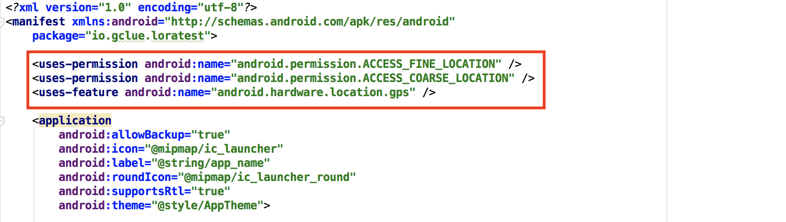

# Google Maps

MapActivityでプロジェクトを新規作成。



manifets/AndroidManifest.xml
```xml
<?xml version="1.0" encoding="utf-8"?>
<manifest xmlns:android="http://schemas.android.com/apk/res/android"
    package="io.gclue.loratest">

    <uses-permission android:name="android.permission.ACCESS_FINE_LOCATION" />
    <uses-permission android:name="android.permission.ACCESS_COARSE_LOCATION" />
    <uses-feature android:name="android.hardware.location.gps" />

    <application
        android:allowBackup="true"
        android:icon="@mipmap/ic_launcher"
        android:label="@string/app_name"
        android:roundIcon="@mipmap/ic_launcher_round"
        android:supportsRtl="true"
        android:theme="@style/AppTheme">
        
        <meta-data
            android:name="com.google.android.geo.API_KEY"
            android:value="@string/google_maps_key" />

        <activity
            android:name=".MapsActivity"
            android:label="@string/title_activity_maps">
            <intent-filter>
                <action android:name="android.intent.action.MAIN" />

                <category android:name="android.intent.category.LAUNCHER" />
            </intent-filter>
        </activity>
    </application>

</manifest>
```


res/values/google_maps_api.xml
```xml
<resources>
    <string name="google_maps_key" templateMergeStrategy="preserve" translatable="false">取得したKeyを記載</string>
</resources>
```


```java
package io.gclue.loratest;

import android.Manifest;
import android.annotation.SuppressLint;
import android.content.pm.PackageManager;
import android.location.Location;
import android.location.LocationListener;
import android.location.LocationManager;
import android.os.Build;
import android.support.annotation.NonNull;
import android.support.v4.app.ActivityCompat;
import android.support.v4.app.FragmentActivity;
import android.os.Bundle;
import android.support.v4.content.ContextCompat;
import android.util.Log;

import com.google.android.gms.maps.CameraUpdateFactory;
import com.google.android.gms.maps.GoogleMap;
import com.google.android.gms.maps.OnMapReadyCallback;
import com.google.android.gms.maps.SupportMapFragment;
import com.google.android.gms.maps.model.LatLng;
import com.google.android.gms.maps.model.MarkerOptions;

public class MapsActivity extends FragmentActivity implements OnMapReadyCallback {

    private GoogleMap mMap;
    private LocationManager locationManager;
    private LocationListener locationListener;
    private static final String TAG = "MAP";

    @SuppressLint("MissingPermission")
    @Override
    protected void onCreate(Bundle savedInstanceState) {
        super.onCreate(savedInstanceState);
        setContentView(R.layout.activity_maps);
        // Obtain the SupportMapFragment and get notified when the map is ready to be used.
        SupportMapFragment mapFragment = (SupportMapFragment) getSupportFragmentManager()
                .findFragmentById(R.id.map);
        mapFragment.getMapAsync(this);

        locationManager = (LocationManager) this.getSystemService(LOCATION_SERVICE);
        locationListener = new LocationListener() {
            @Override
            public void onLocationChanged(Location location) {
                Log.d(TAG, location.toString());

                // 取得した位置情報にMapを移動
                LatLng now = new LatLng(location.getLatitude(), location.getLongitude());
                mMap.moveCamera(CameraUpdateFactory.newLatLngZoom(now, 16));
            }

            @Override
            public void onStatusChanged(String provider, int status, Bundle extras) {
                Log.d(TAG, "onStatusChanged");
            }

            @Override
            public void onProviderEnabled(String provider) {
                Log.d(TAG, "onProviderEnabled");
            }

            @Override
            public void onProviderDisabled(String provider) {
                Log.d("TEST:", "onProviderDisabled");
            }
        };

        if(Build.VERSION.SDK_INT < 23 ) {
            locationManager.requestLocationUpdates(LocationManager.GPS_PROVIDER, 0, 0, locationListener);
        } else {
            if (ActivityCompat.checkSelfPermission(this, Manifest.permission.ACCESS_FINE_LOCATION) != PackageManager.PERMISSION_GRANTED && ActivityCompat.checkSelfPermission(this, Manifest.permission.ACCESS_COARSE_LOCATION) != PackageManager.PERMISSION_GRANTED) {
                // Permissionがない場合は、Permissionを要求する
                ActivityCompat.requestPermissions(this, new String[]{Manifest.permission.ACCESS_FINE_LOCATION}, 1);

            } else {
                // GPSとNETWORKによる位置情報取得開始
                locationManager.requestLocationUpdates(LocationManager.GPS_PROVIDER, 0, 0, locationListener);
                locationManager.requestLocationUpdates(LocationManager.NETWORK_PROVIDER, 0, 0, locationListener);

            }
        }
    }
    
    @Override
    public void onRequestPermissionsResult(int requestCode, @NonNull String[] permissions, @NonNull int[] grantResults) {
        super.onRequestPermissionsResult(requestCode, permissions, grantResults);

        if (grantResults.length > 0 && grantResults[0] == PackageManager.PERMISSION_GRANTED) {

            if(ContextCompat.checkSelfPermission(this, Manifest.permission.ACCESS_FINE_LOCATION) == PackageManager.PERMISSION_GRANTED){
                locationManager.requestLocationUpdates(LocationManager.GPS_PROVIDER, 0, 0, locationListener);
            }
        }
    }
    
    /**
     * Mapの用意ができたら呼び出される
     */
    @Override
    public void onMapReady(GoogleMap googleMap) {
        mMap = googleMap;

        LatLng aizu = new LatLng(37.521359, 139.938603);
        mMap.moveCamera(CameraUpdateFactory.newLatLngZoom(aizu, 16));
    }

}
```

