# 事前準備

### Bluetoothとは

10メートル程度までの距離の機器間で使用できる2.4GHz帯の電波による無線通信です。

スマートフォンやキーボード、マウスなどのパソコンの周辺機器等の音声や文字等の比較的簡単な通信に使用されます。

### 準備するもの

・Android開発環境 (android studio)

・Android端末(スマートフォン)
データ通信ケーブル(USB-USBmini)

・Arduino Uno
 
http://arduino.cc/en/Main/ArduinoBoardUno

・Bluetooth Mate (またはFaBo BrickのBluetooth)
 
https://www.sparkfun.com/products/12580

・ブレッドボード
・ジャンパーワイヤ
・LED
・抵抗

## Bluetoothペアリング設定

連携を行うためには、スマートフォンとBluetoothをペアリングする必要があります。
まずはArduinoの回路を作成してみましょう。
 
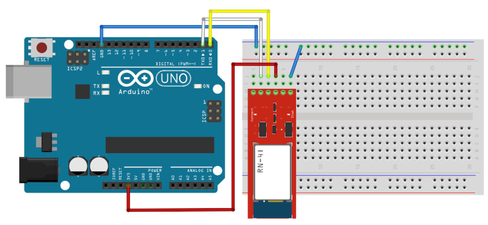

回路ができましたらPCに繋ぎ、Bluetooth Mateを起動します。
起動するとBluetooth Mateのランプが赤く点滅します。
 
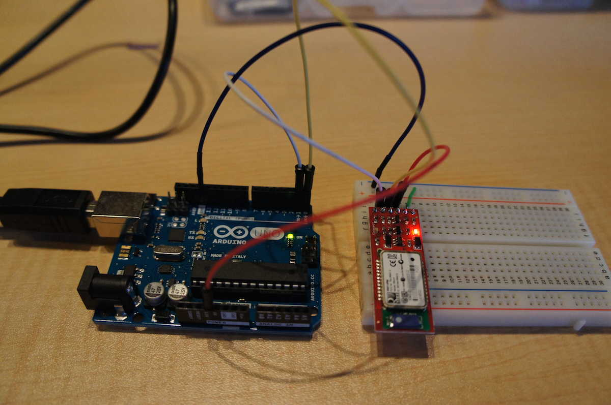

この状態でAndroid端末側でペアリング設定を行います。
 
「設定」の「無線とネットワーク」より「Bluetooth」を選択します。
この時、Bluetoothが無効になっている場合は有効にして下さい。
 
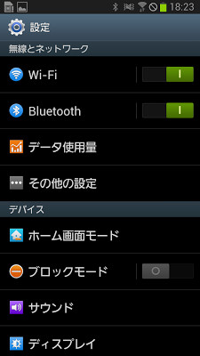
 
 
Bluetoothのスキャンを行い、対象のBluetoothモジュールを選択します。
 
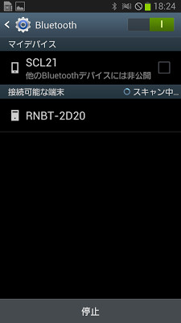

この「RNBT-2D20」というのがBluetooth Mateのデバイス名となります。
 
「RNBT-XXXX」で表示され、この「XXXX」部分はモジュールによって異なります。
 
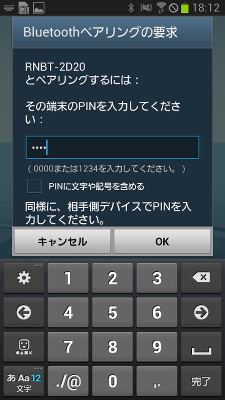

表示されたデバイスを選択します。
 
ペアリングを選択すると機種によってはコード入力が求められる場合があります。(確認のみの場合もあり）
 
その場合は「1234」を入力し「OK」ボタンを押します。
 
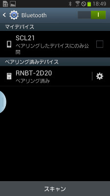

ペアリングが成功すると、デバイス名の下に「ペアリング済み」と表示されます。

この状態では、Bluetooth側のランプは赤く点滅している状態から変化はありません。
 
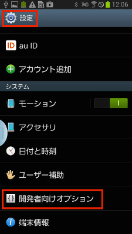

## Android開発者向けオプション設定

Android端末で実行する場合、開発者用オプション設定が必要になります。
 

設定画面を開き、「開発者向けオプション」を選択します。

※機種によっては、この「開発者向けオプション」が非表示になっている場合があります。
 
その場合は、設定画面より、「タブレット情報」を開き、表示された「ビルド番号」という文字を７回タップすると表示されます。

右上の部分が「O」の場合は無効になっているので、タップして「I」に変更します。
 
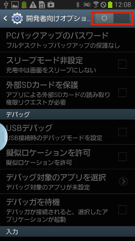

メッセージが表示されますので、「OK」ボタンを押します。
 
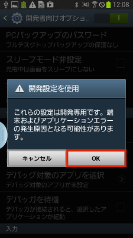

次にUSBデバッグを有効にします。
 
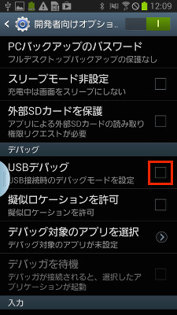

またメッセージが表示されますので「OK」ボタンを押します。
 
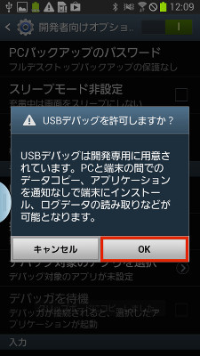

USBデバッグにチェックが付きました。
 
これで開発者向けオプションの設定は完了です。
 
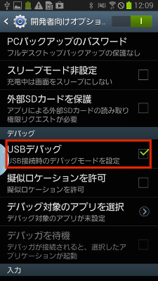

