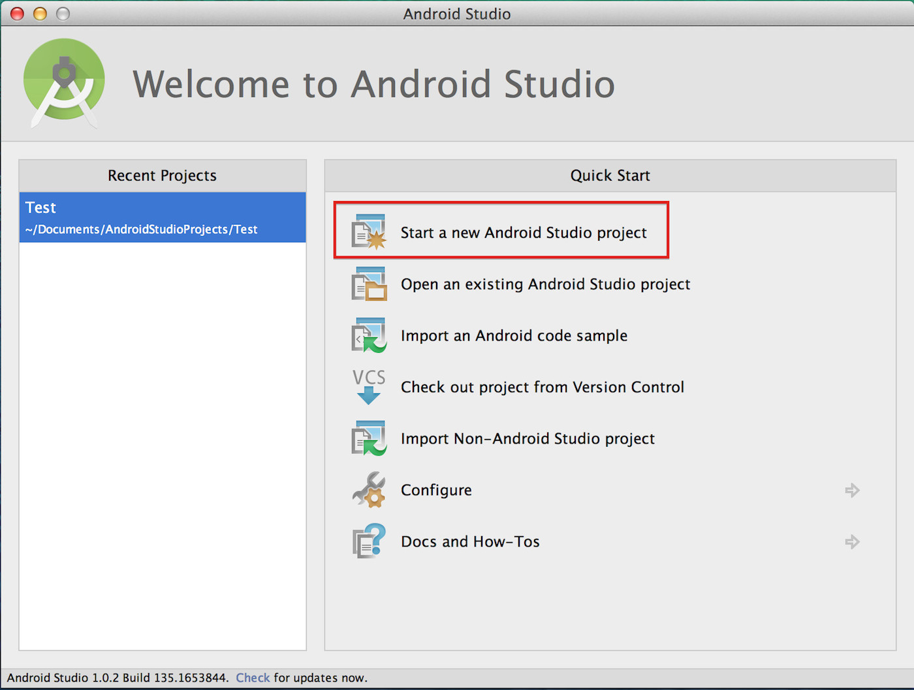
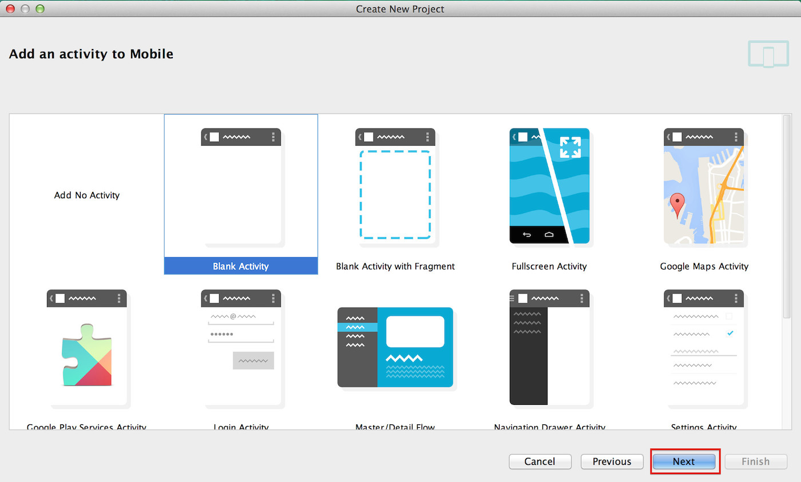
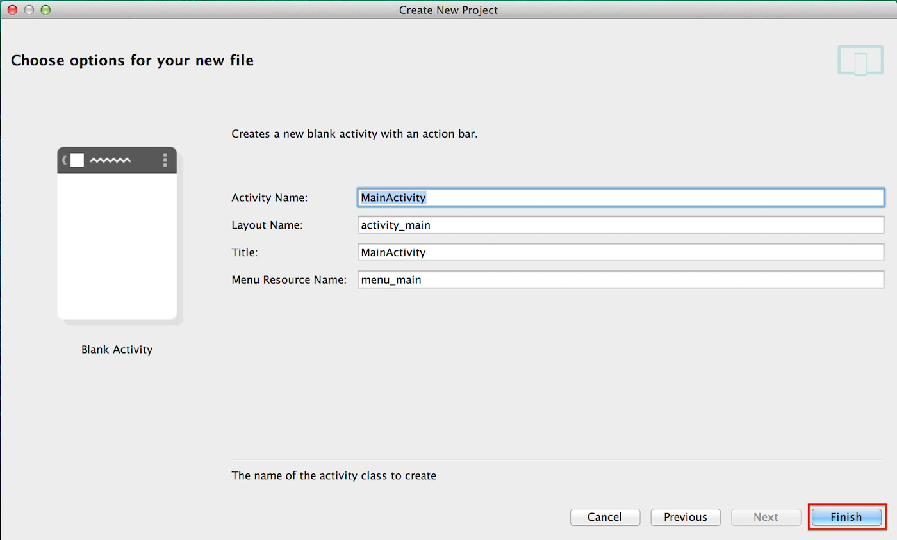
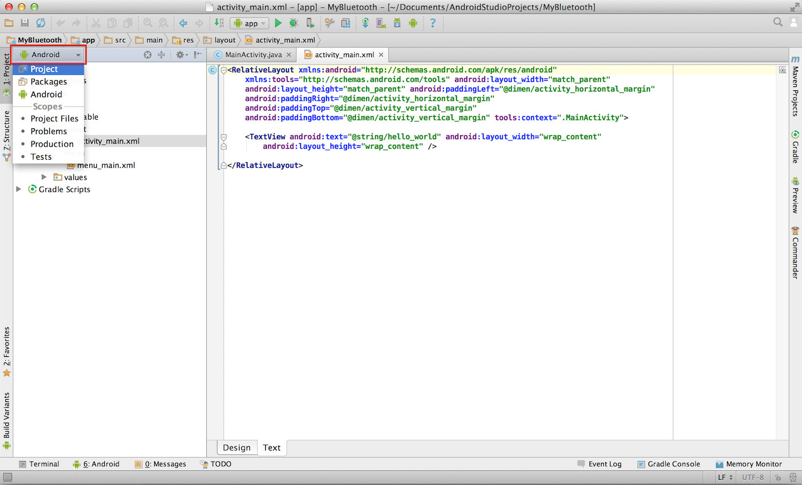
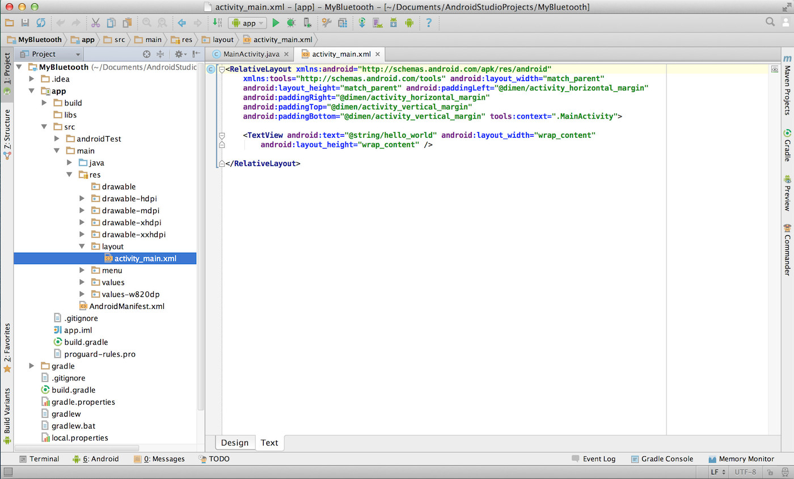
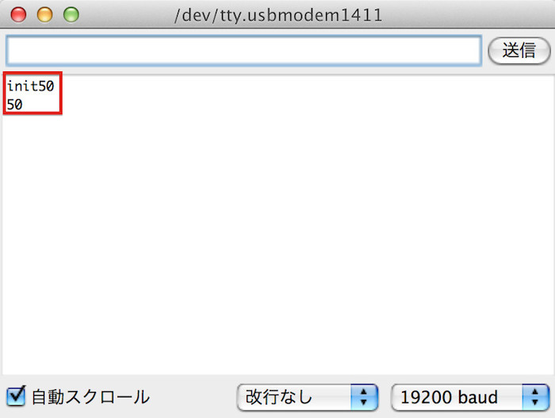
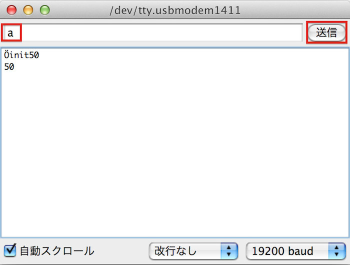

# テキスト送受信

ここではArduinoからデータを送り、Android側でデータを受け取るという形式で連携してみたいと思います。


## Arduino設定


まずはArduino側の設定を行います。
<br>
回路については「１.事前準備」で作成した回路を使用します。
<br>
Arduino UNOとArduino MEGAでは回路とスケッチが異なりますので別々に記載します。

回路ができましたらスケッチを書いてみましょう。
<br>
スケッチはArduino IDEを起動して行います。
<br>


<br>

### Arduino UNO


#### 回路 (Arduino Uno)


#### スケッチ (Arduino UNO)

```c
#include <SoftwareSerial.h>

SoftwareSerial android(2,3);
// SoftwareSerial android(12,13); // Fabo Brick使用時

void setup(){
  // Bluetooth用のシリアルのポートを設定
  android.begin(115200);
  // arduinoのシリアルモニタ用
  Serial.begin(9600); 
  
  Serial.write("init");
}

void loop(){
  
  if(android.available()){
    Serial.println(android.read());
  } 
  
  if(Serial.available()){
    android.write(Serial.read());
  } 
  
}
```

### Arduino Mega

#### 回路 (Arduino Mega)
<br>


### スケッチ (Arduino Mega)

Arduino MegaではSoftserialがうまく動かないので18, 19番ピンを使用します。

18,19番ピンは
```c
Serial1.begin(速度);
```

で呼び出せます。

Bluetoothモジュールと、Android間はデフォルトで、115200の速度なので
```c
Serial1.begin(115200);
```

とします。

変更後はこちら
```c
void setup(){
  // Bluetooth用のシリアルのポートを設定
  Serial1.begin(115200);
  // arduinoのシリアルモニタ用
  Serial.begin(9600); 
  
  Serial.write("init");
}

void loop(){
  
  if(Serial1.available()){
    Serial.println(Serial1.read());
  } 
  
  if(Serial.available()){
    Serial1.write(Serial.read());
  } 
  
}
```

## AndroidのProject作成

次にAndroid側のアプリを作成します。
<br>
Androidのアプリ作成には「Android Studio」を使用します。
<br>
Android Studioを起動し、Quick Startの一番上にある「Start a new Android Studio project」を選択します。
<br>


New Projectのウィンドウが表示されます。
<br>
Application nameにアプリ名「MyBluetooth」を入力し、「Next」ボタンを押下します。
<br>


ここは変更せずに「Next」ボタンを押下します。
<br>


Blank Activityを選択し、「Next」ボタンを押下します。
<br>

 

Activityの名前を入力し、「Finish」ボタンを押下します。
<br>
今回は名前を変更せずに進めます。
<br>


プロジェクトが作成されました。
<br>


ビューの表示形式を変更します。
<br>
画面左上にある「Android」という箇所をクリックすると、すぐ下に「Project」という項目が表示されるので、そちらを選択します。
<br>


ビューの表示形式が変更されました。

 

## Bluetooth認識設定

次にBluetoothの認識設定を行います。
<br>
[app]>[src]>[main]>[res]内のAndroidManifest.xmlを開き、下記の内容を追加します。

```xml
<uses-permission android:name="android.permission.BLUETOOTH" />
<uses-permission android:name="android.permission.BLUETOOTH_ADMIN" />
```
    
#### AndroidManifest.xml
変更後はこのような状態になります。
```xml
<?xml version="1.0" encoding="utf-8"?>
<manifest xmlns:android="http://schemas.android.com/apk/res/android"
    package="gclue.com.mybluetooth" >

    <uses-permission android:name="android.permission.BLUETOOTH" />
    <uses-permission android:name="android.permission.BLUETOOTH_ADMIN" />

    <application
        android:allowBackup="true"
        android:icon="@drawable/ic_launcher"
        android:label="@string/app_name"
        android:theme="@style/AppTheme" >
        <activity
            android:name=".MainActivity"
            android:label="@string/app_name" >
            <intent-filter>
                <action android:name="android.intent.action.MAIN" />

                <category android:name="android.intent.category.LAUNCHER" />
            </intent-filter>
        </activity>
    </application>

</manifest>
```


## プログラム作成

[src]>[main]>[res]>[layout]内にあるactivity_main.xmlを変更します。
<br>
このファイルは画面レイアウトの設定するファイルになります。
<br>
activity_main.xmlファイルを開くとレイアウトが表示されるので、画面右下のタブから「Text」のタブを選択することでコードが入力できる状態になります。


activity_main.xml
```xml
<?xml version="1.0" encoding="utf-8"?>
<LinearLayout xmlns:android="http://schemas.android.com/apk/res/android"
    android:layout_width="fill_parent"
    android:layout_height="fill_parent"
    android:orientation="vertical" >

    <Button android:id="@+id/connectButton"
        android:layout_width="fill_parent"
        android:layout_height="wrap_content"
        android:text="Connect" />

    <TextView
        android:id="@+id/statusValue"
        android:layout_width="fill_parent"
        android:layout_height="wrap_content"
        />

    <TextView
        android:id="@+id/inputValue"
        android:layout_width="fill_parent"
        android:layout_height="wrap_content"
        />

    <Button android:id="@+id/writeButton"
        android:layout_width="fill_parent"
        android:layout_height="wrap_content"
        android:text="Write" />

</LinearLayout>
```

次に[src]にある「MainActivity.java」を開き、プログラムを入力します。
<br>
１行目のpackageの箇所は環境によって異なりますので、初期状態から変更せずそのままの状態にしてください。

また、"RNBT-205F"は「１.BLUETOOTH 事前準備」のペアリング時にでてきたデバイス名となりますので、それに合わせて変更して下さい。

#### MainActivity.java

```java
package gclue.com.mybluetooth;

import android.bluetooth.BluetoothAdapter;
import android.bluetooth.BluetoothDevice;
import android.bluetooth.BluetoothSocket;
import android.os.Bundle;
import android.os.Handler;
import android.os.Message;
//import android.support.v7.app.ActionBarActivity;
import android.support.v7.app.AppCompatActivity;
import android.util.Log;
import android.view.View;
import android.widget.Button;
import android.widget.TextView;

import java.io.IOException;
import java.io.InputStream;
import java.io.OutputStream;
import java.util.Set;
import java.util.UUID;

//public class MainActivity extends ActionBarActivity implements Runnable, View.OnClickListener {
public class MainActivity extends AppCompatActivity implements Runnable, View.OnClickListener {
    /* tag */
    private static final String TAG = "BluetoothSample";

    /* Bluetooth Adapter */
    private BluetoothAdapter mAdapter;

    /* Bluetoothデバイス */
    private BluetoothDevice mDevice;

    /* Bluetooth UUID(固定) */
    private final UUID MY_UUID = UUID.fromString("00001101-0000-1000-8000-00805F9B34FB");

    /* デバイス名 環境に合わせて変更*/
    private final String DEVICE_NAME = "RNBT-205F";

    /* Soket */
    private BluetoothSocket mSocket;

    /* Thread */
    private Thread mThread;

    /* Threadの状態を表す */
    private boolean isRunning;

    /** 接続ボタン. */
    private Button connectButton;

    /** 書込みボタン. */
    private Button writeButton;

    /** ステータス. */
    private TextView mStatusTextView;

    /** Bluetoothから受信した値. */
    private TextView mInputTextView;

    /** Action(ステータス表示). */
    private static final int VIEW_STATUS = 0;

    /** Action(取得文字列). */
    private static final int VIEW_INPUT = 1;

    /** Connect確認用フラグ */
    private boolean connectFlg = false;

    /** BluetoothのOutputStream. */
    OutputStream mmOutputStream = null;

    @Override
    public void onCreate(Bundle savedInstanceState){
        super.onCreate(savedInstanceState);
        // Layoutにて設定したビューを表示
        setContentView(R.layout.activity_main);

        // TextViewの設定(Layoutにて設定したものを関連付け)
        mInputTextView = (TextView)findViewById(R.id.inputValue);
        mStatusTextView = (TextView)findViewById(R.id.statusValue);

        // Buttonの設定(Layoutにて設定したものを関連付け)
        connectButton = (Button)findViewById(R.id.connectButton);
        writeButton = (Button)findViewById(R.id.writeButton);

        // ボタンのイベント設定
        connectButton.setOnClickListener(this);
        writeButton.setOnClickListener(this);

        // Bluetoothのデバイス名を取得
        // デバイス名は、RNBT-XXXXになるため、
        // DVICE_NAMEでデバイス名を定義
        mAdapter = BluetoothAdapter.getDefaultAdapter();
        mStatusTextView.setText("SearchDevice");
        Set< BluetoothDevice > devices = mAdapter.getBondedDevices();
        for ( BluetoothDevice device : devices){

            if(device.getName().equals(DEVICE_NAME)){
                mStatusTextView.setText("find: " + device.getName());
                mDevice = device;
            }
        }
    }

    // 別のアクティビティが起動した場合の処理
    @Override
    protected void onPause(){
        super.onPause();

        isRunning = false;
        connectFlg = false;

        try{
            mSocket.close();
        }
        catch(Exception e){}
    }

    // スレッド処理(connectボタン押下後に実行)
    @Override
    public void run() {
        InputStream mmInStream = null;

        Message valueMsg = new Message();
        valueMsg.what = VIEW_STATUS;
        valueMsg.obj = "connecting...";
        mHandler.sendMessage(valueMsg);

        try{

            // 取得したデバイス名を使ってBluetoothでSocket接続
            mSocket = mDevice.createRfcommSocketToServiceRecord(MY_UUID);
            mSocket.connect();
            mmInStream = mSocket.getInputStream();
            mmOutputStream = mSocket.getOutputStream();

            // InputStreamのバッファを格納
            byte[] buffer = new byte[1024];

            // 取得したバッファのサイズを格納
            int bytes;
            valueMsg = new Message();
            valueMsg.what = VIEW_STATUS;
            valueMsg.obj = "connected.";
            mHandler.sendMessage(valueMsg);

            connectFlg = true;

            while(isRunning){

                // InputStreamの読み込み
                bytes = mmInStream.read(buffer);
                Log.i(TAG,"bytes="+bytes);
                // String型に変換
                String readMsg = new String(buffer, 0, bytes);

                // null以外なら表示
                if(readMsg.trim() != null && !readMsg.trim().equals("")){
                    Log.i(TAG,"value="+readMsg.trim());

                    valueMsg = new Message();
                    valueMsg.what = VIEW_INPUT;
                    valueMsg.obj = readMsg;
                    mHandler.sendMessage(valueMsg);
                }
            }
        }
        // エラー処理
        catch(Exception e){

            valueMsg = new Message();
            valueMsg.what = VIEW_STATUS;
            valueMsg.obj = "Error1:" + e;
            mHandler.sendMessage(valueMsg);

            try{
                mSocket.close();
            }catch(Exception ee){}
            isRunning = false;
            connectFlg = false;
        }
    }

    // ボタン押下時の処理
    @Override
    public void onClick(View v) {
        if(v.equals(connectButton)) {
            // 接続されていない場合のみ
            if (!connectFlg) {
                mStatusTextView.setText("try connect");

                mThread = new Thread(this);
                // Threadを起動し、Bluetooth接続
                isRunning = true;
                mThread.start();
            }
        } else if(v.equals(writeButton)) {
            // 接続中のみ書込みを行う
            if (connectFlg) {
                try {
                    // Writeボタン押下時、'2'を送信
                    mmOutputStream.write("2".getBytes());
                    // 画面上に"Write:"を表示
                    mStatusTextView.setText("Write:");
                } catch (IOException e) {
                    Message valueMsg = new Message();
                    valueMsg.what = VIEW_STATUS;
                    valueMsg.obj = "Error2:" + e;
                    mHandler.sendMessage(valueMsg);
                }
            } else {
                mStatusTextView.setText("Please push the connect button");
            }
        }
    }

    /**
     * 描画処理はHandlerでおこなう
     */
    Handler mHandler = new Handler() {
        @Override
        public void handleMessage(Message msg) {
            int action = msg.what;
            String msgStr = (String)msg.obj;
            if(action == VIEW_INPUT){
                mInputTextView.setText(msgStr);
            }
            else if(action == VIEW_STATUS){
                mStatusTextView.setText(msgStr);
            }
        }
    };
}
```

###Android端末での実行設定
**アプリケーション実行、及び確認**
<br>
準備が完了しましたので、作成したアプリケーションを実行してみましょう。
<br>


AndroidのConnectボタンを押すと、１〜３秒ほどで赤点滅から緑の点灯にかわります。
<br>
これでデータが送受信できる状態になりました。
<br>


Connectが完了しましたら、次にAndroidのWriteボタンを押します。
<br>


Arduino側のシリアルモニタを確認すると、50(2のasciiコード)が転送されます。
<br>
※Arduino側でSerial.write(取得値)とするか、char型の変数に格納してから出力すると「2」が出力されます。
<br>



ArduinoのSerial Consoleで、文字を入力し、送信を押すと、Androidに文字が送られ画面に表示されます。
Arduino側で文字を入力し、送信ボタンを押下します。
<br>



Android側に文字が表示されました。
<br>


