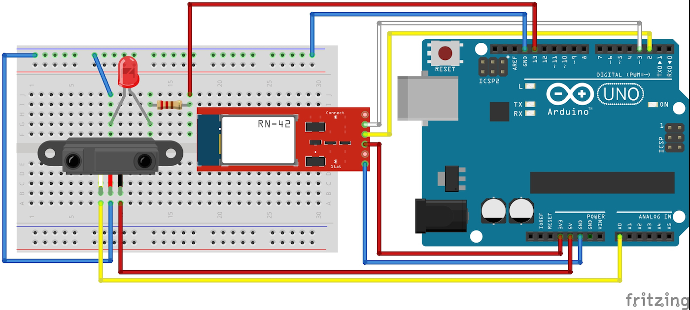

# センサーデータをAndroid端末で表示

今回は使用するセンサーは距離センサーです。
<br>
※FaBo Brickを使用時は他のセンサーをご使用下さい。

## Arduino設定


### Arduino Uno


#### 回路 (Arduino Uno)

<br>



#### スケッチ (Arduino Uno)

```c
#include <SoftwareSerial.h>

#define led 13      // 13番ピンにてLEDを制御
#define sensorPin 0 // センサーを使用するピン

SoftwareSerial android(2,3);
//SoftwareSerial android(12,13); // FaBo Brick使用時

int inByte = 0;    // androidからのテキスト取得用
int getSensor = 0; // センサーデータ取得用

void setup(){
  // Bluetooth用のシリアルのポートを設定
  android.begin(115200);
  // arduinoのシリアルモニタ用
  Serial.begin(9600); 
  // LEDピンの出力設定
  pinMode(led,OUTPUT);
  Serial.write("init");
}

void loop(){
  
  if(android.available()){
    inByte = android.read();
    Serial.println(inByte);

    // 受信データによりLEDの制御を行う
    if(inByte == 49){
      digitalWrite(led,HIGH);
    } else if(inByte == 50){
      // センサーデータ取得
      getSensor = analogRead(sensorPin);
      android.print(getSensor);
    } else {
      digitalWrite(led,LOW);
    }

  } 
  
  if(Serial.available()){
    android.write(Serial.read());
  } 
  
}
```

### Arduino Mega

#### 回路 (Arduino Mega)
<br>


スケッチ (Arduino Mega)
```c
int led = 13;      // 13番ピンにてLEDを制御
int inByte = 0;    // androidからのテキスト取得用
int sensorPin = 0; // センサーを使用するピン
int getSensor = 0; // センサーデータ取得用

void setup(){
  // Bluetooth用のシリアルのポートを設定
  android.begin(115200);
  // arduinoのシリアルモニタ用
  Serial.begin(9600); 
  // LEDピンの出力設定
  pinMode(led,OUTPUT);
  Serial.write("init");
}

void loop(){
  
  if(android.available()){
    inByte = android.read();
    Serial.println(inByte);

    // 受信データによりLEDの制御を行う
    if(inByte == 49){
      digitalWrite(led,HIGH);
    } else if(inByte == 50){
      // センサーデータ取得
      getSensor = analogRead(sensorPin);
      Serial1.print(getSensor);
    } else {
      digitalWrite(led,LOW);
    }

  } 
  
  if(Serial.available()){
    Serial1.write(Serial.read());
  } 
  
}
```

## Android設定

次にAndroid側のコーディングをします。

BluetoothServer.java
```java
package gclue.com.mybluetooth;

import android.bluetooth.BluetoothAdapter;
import android.bluetooth.BluetoothDevice;
import android.bluetooth.BluetoothSocket;
import android.os.Bundle;
import android.os.Handler;
import android.os.Message;
//import android.support.v7.app.ActionBarActivity;
import android.support.v7.app.AppCompatActivity;
import android.util.Log;
import android.view.View;
import android.widget.Button;
import android.widget.TextView;

import java.io.IOException;
import java.io.InputStream;
import java.io.OutputStream;
import java.util.Set;
import java.util.UUID;

//public class MainActivity extends ActionBarActivity implements Runnable, View.OnClickListener {
public class MainActivity extends AppCompatActivity implements Runnable, View.OnClickListener {
    /* tag */
    private static final String TAG = "BluetoothSample";

    /* Bluetooth Adapter */
    private BluetoothAdapter mAdapter;

    /* Bluetoothデバイス */
    private BluetoothDevice mDevice;

    /* Bluetooth UUID */
    private final UUID MY_UUID = UUID.fromString("00001101-0000-1000-8000-00805F9B34FB");

    /* デバイス名 */
    private final String DEVICE_NAME = "RNBT-205F";

    /* Soket */
    private BluetoothSocket mSocket;

    /* Thread */
    private Thread mThread;

    /* Threadの状態を表す */
    private boolean isRunning;

    /** 接続ボタン. */
    private Button connectButton;

    /** LED ONボタン. */
    private Button ledOnButton;

    /** LED OFFボタン. */
    private Button ledOffButton;

    /** Sensorボタン. */
    private Button sensorButton;

    /** ステータス. */
    private TextView mStatusTextView;

    /** Bluetoothから受信した値. */
    private TextView mInputTextView;

    /** Action(ステータス表示). */
    private static final int VIEW_STATUS = 0;

    /** Action(取得文字列). */
    private static final int VIEW_INPUT = 1;

    /** BluetoothのOutputStream. */
    OutputStream mmOutputStream = null;

    private boolean connectFlg = false;

    @Override
    public void onCreate(Bundle savedInstanceState){
        super.onCreate(savedInstanceState);
        // Layoutにて設定したビューを表示
        setContentView(R.layout.activity_main);

        // TextViewの設定(Layoutにて設定したものを関連付け)
        mInputTextView = (TextView)findViewById(R.id.inputValue);
        mStatusTextView = (TextView)findViewById(R.id.statusValue);

        // Buttonの設定(Layoutにて設定したものを関連付け)
        connectButton = (Button)findViewById(R.id.connectButton);
        ledOnButton = (Button)findViewById(R.id.ledOnButton);
        ledOffButton = (Button)findViewById(R.id.ledOffButton);
        sensorButton = (Button)findViewById(R.id.sensorButton);

        // ボタンのイベント取得設定
        connectButton.setOnClickListener(this);
        ledOnButton.setOnClickListener(this);
        ledOffButton.setOnClickListener(this);
        sensorButton.setOnClickListener(this);

        // Bluetoothのデバイス名を取得
        // デバイス名は、RNBT-XXXXになるため、
        // DVICE_NAMEでデバイス名を定義
        mAdapter = BluetoothAdapter.getDefaultAdapter();
        mStatusTextView.setText("SearchDevice");
        Set< BluetoothDevice > devices = mAdapter.getBondedDevices();
        for ( BluetoothDevice device : devices){

            if(device.getName().equals(DEVICE_NAME)){
                mStatusTextView.setText("find: " + device.getName());
                mDevice = device;
            }
        }

    }

    // 別のアクティビティが起動した場合の処理
    @Override
    protected void onPause(){
        super.onPause();

        isRunning = false;
        connectFlg = false;
        
        try{
            mSocket.close();
        }
        catch(Exception e){}
    }

    // スレッド処理(connectボタン押下後に実行)
    @Override
    public void run() {
        InputStream mmInStream = null;

        Message valueMsg = new Message();
        valueMsg.what = VIEW_STATUS;
        valueMsg.obj = "connecting...";
        mHandler.sendMessage(valueMsg);

        try{

            // 取得したデバイス名を使ってBluetoothでSocket接続
            mSocket = mDevice.createRfcommSocketToServiceRecord(MY_UUID);
            mSocket.connect();
            mmInStream = mSocket.getInputStream();
            mmOutputStream = mSocket.getOutputStream();

            // InputStreamのバッファを格納
            byte[] buffer = new byte[1024];

            // 取得したバッファのサイズを格納
            int bytes;
            valueMsg = new Message();
            valueMsg.what = VIEW_STATUS;
            valueMsg.obj = "connected.";
            mHandler.sendMessage(valueMsg);

            connectFlg = true;

            while(isRunning){

                // InputStreamの読み込み
                bytes = mmInStream.read(buffer);
                Log.i(TAG,"bytes="+bytes);
                // String型に変換
                String readMsg = new String(buffer, 0, bytes);

                // null以外なら表示
                if(readMsg.trim() != null && !readMsg.trim().equals("")){
                    Log.i(TAG,"value="+readMsg.trim());

                    valueMsg = new Message();
                    valueMsg.what = VIEW_INPUT;
                    valueMsg.obj = readMsg;
                    mHandler.sendMessage(valueMsg);
                }
            }

        }
        // エラー処理
        catch(Exception e){

            valueMsg = new Message();
            valueMsg.what = VIEW_STATUS;
            valueMsg.obj = "Error1:" + e;
            mHandler.sendMessage(valueMsg);

            try{
                mSocket.close();
            }catch(Exception ee){}
            isRunning = false;
            connectFlg = false;
        }
    }

    @Override
    public void onClick(View v) {
        if(v.equals(connectButton)) {
            if(!connectFlg) {

                mStatusTextView.setText("try connect");

                mThread = new Thread(this);
                // Threadを起動し、Bluetooth接続
                isRunning = true;
                mThread.start();
            }
        } else if(v.equals(ledOnButton)) {
            if(connectFlg) {
                try {
                    mmOutputStream.write("1".getBytes());
                    mStatusTextView.setText("LED ON:");
                } catch (IOException e) {
                    Message valueMsg = new Message();
                    valueMsg.what = VIEW_STATUS;
                    valueMsg.obj = "Error3:" + e;
                    mHandler.sendMessage(valueMsg);
                }
            } else {
                mStatusTextView.setText("Please push the connect button");
            }
        } else if(v.equals(ledOffButton)) {
            if(connectFlg) {
                try {
                    mmOutputStream.write("0".getBytes());
                    mStatusTextView.setText("LED OFF:");
                } catch (IOException e) {
                    Message valueMsg = new Message();
                    valueMsg.what = VIEW_STATUS;
                    valueMsg.obj = "Error4:" + e;
                    mHandler.sendMessage(valueMsg);
                }
            } else {
                mStatusTextView.setText("Please push the connect button");
            }
        } else if(v.equals(sensorButton)) {
            if(connectFlg) {
                try {
                    mmOutputStream.write("2".getBytes());
                    mStatusTextView.setText("Sensor Data:");
                } catch (IOException e) {
                    Message valueMsg = new Message();
                    valueMsg.what = VIEW_STATUS;
                    valueMsg.obj = "Error5:" + e;
                    mHandler.sendMessage(valueMsg);
                }
            } else {
                mStatusTextView.setText("Please push the connect button");
            }
        }
    }

    /**
     * 描画処理はHandlerでおこなう
     */
    Handler mHandler = new Handler() {
        @Override
        public void handleMessage(Message msg) {
            int action = msg.what;
            String msgStr = (String)msg.obj;
            if(action == VIEW_INPUT){
                mInputTextView.setText(msgStr);
            }
            else if(action == VIEW_STATUS){
                mStatusTextView.setText(msgStr);
            }
        }
    };
}
```

activity_main.xml
```xml
<?xml version="1.0" encoding="utf-8"?>
<LinearLayout xmlns:android="http://schemas.android.com/apk/res/android"
    android:layout_width="fill_parent"
    android:layout_height="fill_parent"
    android:orientation="vertical" >

    <Button android:id="@+id/connectButton"
        android:layout_width="fill_parent"
        android:layout_height="wrap_content"
        android:text="Connect" />

    <TextView
        android:id="@+id/statusValue"
        android:layout_width="fill_parent"
        android:layout_height="wrap_content"
        />

    <TextView
        android:id="@+id/inputValue"
        android:layout_width="fill_parent"
        android:layout_height="wrap_content"
        />

    <Button android:id="@+id/ledOnButton"
        android:layout_width="wrap_content"
        android:layout_height="wrap_content"
        android:layout_gravity="center_horizontal"
        android:text="LED ON" />

    <Button android:id="@+id/ledOffButton"
        android:layout_width="wrap_content"
        android:layout_height="wrap_content"
        android:layout_gravity="center_horizontal"
        android:text="LED OFF" />
    <Button android:id="@+id/sensorButton"
        android:layout_width="wrap_content"
        android:layout_height="wrap_content"
        android:layout_gravity="center_horizontal"
        android:text="SENSOR" />
</LinearLayout>
```


### 実行確認
Android端末にボタンが表示されますので、前回と同様「Connect」ボタンを押します。
<br>
Sensorボタンを押して値の確認をしてみましょう。

※ボタンを押すタイミングによっては値の一部のみ表示されてしまいます。
<br>
対応するには終了文字をAndroid側で判断し、終了文字がくるまで格納してから出力する必要があります。


## センサーデータ対応例


### Arduino

loopの処理を以下のように変更します。<br>
変更内容としてはセンサーデータ送信後に'*'の文字を送信しています。
```c
void loop(){

  if(android.available()){
    inByte = android.read();
    Serial.println(inByte);

    // 受信データによりLEDの制御を行う
    if(inByte == 49){
      digitalWrite(led,HIGH);
    } else if(inByte == 50){
      // センサーデータ取得
      getSensor = analogRead(sensorPin);
      android.print(getSensor);
      android.print('*');
    } else {
      digitalWrite(led,LOW);
    }

  } 
```

Android
<br>
受け取った文字を格納し、'*'が入った時点で出力を行うように変更します。

MainActivity.javaのファイルを以下のように変更

MainActivity内で変数定義の追加
```java
    /** 取得データを格納(文字列) */
    private String out_Text ="";
    /** 取得データの終了文字以降(2文字目以降)を格納(文字列) */
    private String out_Text_bk ="";
```

スレッド処理(run)内のループ処理を変更
```java
            while(isRunning){

                // InputStreamの読み込み
                bytes = mmInStream.read(buffer);
                Log.i(TAG,"bytes="+bytes);
                // String型に変換(退避用に文字が存在する場合はそれも含めて設定)
                String readMsg = out_Text_bk + new String(buffer, 0, bytes);
                // 退避用変数の初期化
                out_Text_bk = "";
                // 出力フラグの初期化
                Boolean dataEndFlg = false;

                // 読み込んだ文字列を1文字ずつ取得
                for(int i=0 ; readMsg.length() > i ; i++) {
                    char readChar = readMsg.charAt(i);
                    // 文字判定
                    if (readChar == '*')  {
                        // 終了文字を確認した時点で出力フラグを立てる
                        dataEndFlg = true;
                    // 終了文字以降
                    }else if (dataEndFlg) {
                        // 文字を退避
                        out_Text_bk = out_Text_bk + readChar;
                    // 終了文字以前
                    }else{
                        // 出力用に設定
                        out_Text = out_Text + readChar;
                    }
                }

                // 出力フラグがtrueかつnull(空文字含む)以外なら表示
                if( dataEndFlg && out_Text.trim() != null && !out_Text.trim().equals("")){
                    Log.i(TAG,"value="+out_Text.trim());

                    valueMsg = new Message();
                    valueMsg.what = VIEW_INPUT;
                    valueMsg.obj = out_Text.trim();
                    mHandler.sendMessage(valueMsg);
                    // 出力用変数の初期化
                    out_Text = "";
                }
            }
```