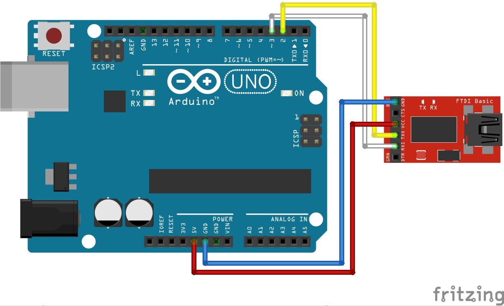
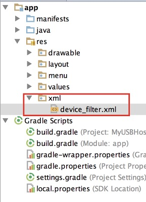
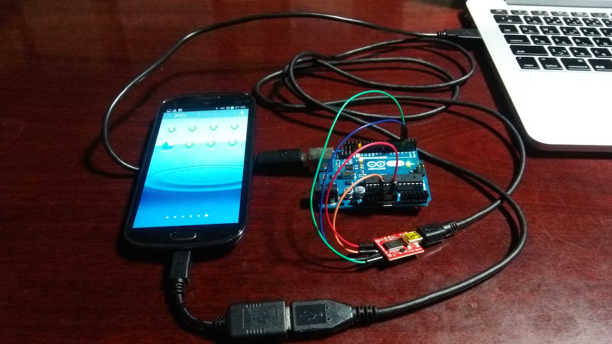
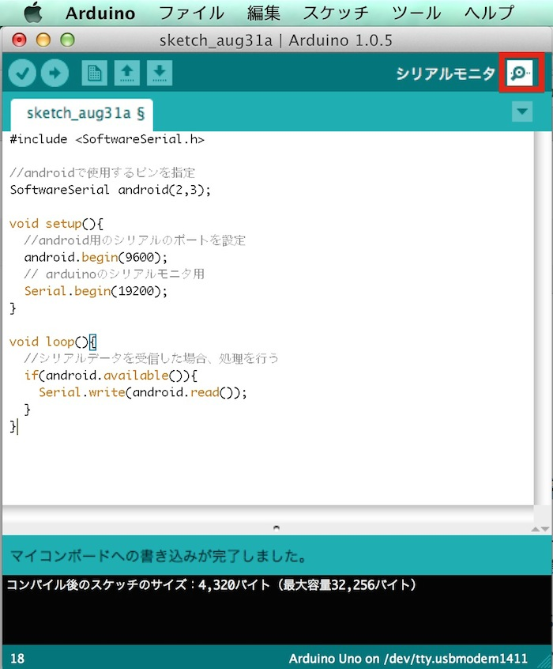

# テキスト送信

## Arduino側の設定


回路を作成し、スケッチの入力を行います。
今回はブレッドボードを使用せず、シリアルアダプタと直接繋げます。
なお、Arduino UnoとArduino Megaでは配線とスケッチが少し異なりますので、別々に記載します。

### Adrduino Uno


#### 回路 (Arduino Uno)

 


#### スケッチ (Arduino Uno)

```
#include <SoftwareSerial.h>

//androidで使用するピンを指定
SoftwareSerial android(2,3);

void setup(){
  //android用のシリアルのポートを設定
  android.begin(9600);
  // arduinoのシリアルモニタ用
  Serial.begin(19200); 
  
  Serial.write("init");
}

void loop(){
  
  if(android.available()){
    Serial.write(android.read());
  } 
  
}
```


### Arduino Mega


#### 回路 (Arduino Mega)

<br>


Arduino 18 TX1  -> USB Serial RXD
<br>
Arduino 19 RX1 ->  USB Serial TXD

参考
<br>
http://arduino.cc/en/Serial/begin

#### スケッチ (Arduino Mega)

18, 19は、TX1, RX1となっており、Arduinoでは Serial1.begin(速度)で設定できる。
```
void setup(){
  //android用のシリアルのポートを設定
  Serial1.begin(9600);
  // arduinoのシリアルモニタ用
  Serial.begin(19200); 
  
  Serial.write("init");
}

void loop(){
  
  if(Serial1.available()){
    Serial.write(Serial1.read());
  } 
  
}
```

## Android側の設定


### Androidコード入力

MainActivity.java
```
package gclue.com.myusbhost;

import android.content.BroadcastReceiver;
import android.content.Context;
import android.content.Intent;
import android.hardware.usb.UsbManager;
import android.os.Bundle;
import android.support.v7.app.ActionBarActivity;
import android.util.Log;
import android.view.Menu;
import android.view.MenuItem;
import android.view.View;
import android.widget.Button;
import android.widget.Toast;

import com.ftdi.j2xx.D2xxManager;
import com.ftdi.j2xx.FT_Device;

public class MainActivity extends ActionBarActivity {

    private FT_Device ftDev = null;
    private static Context mContext;
    private D2xxManager ftdid2xx;
    private static final String TAG = "USB";
    private int iavailable = 0;
    private static final int readLength = 512;
    byte[] readData;
    char[] readDataToText;
    private Button mOutputButton;

    @Override
    protected void onCreate(Bundle savedInstanceState) {
        super.onCreate(savedInstanceState);
        setContentView(R.layout.activity_main);

        try {
            ftdid2xx = D2xxManager.getInstance(this);
        } catch (D2xxManager.D2xxException ex) {
            Log.e(TAG,ex.toString());
        }

        mContext = this.getBaseContext();

        openUsb();

        // ボタンが押されたらUSBに値を送り込む
        mOutputButton = (Button)findViewById(R.id.outputButton);
        mOutputButton.setOnClickListener(new View.OnClickListener() {
            @Override
            public void onClick(View v) {
                SendMessage("1");
            }
        });
    }

    public void openUsb(){
        int devCount = 0;
        devCount = ftdid2xx.createDeviceInfoList(this);
        if (devCount <= 0)
        {
            Toast.makeText(this, "デバイスが発見できません。" + Integer.toString(devCount), Toast.LENGTH_LONG).show();
            Log.i(TAG,"デバイスが発見できましせんでした。");
            return;
        }
        else{
            Toast.makeText(this, "" + devCount + "個のデバイスを発見しました。", Toast.LENGTH_LONG).show();
            Log.i(TAG,"" + devCount + "個のデバイスを発見しました。");
        }

        if(null == ftDev)
        {
            ftDev = ftdid2xx.openByIndex(mContext, 0);
        }
        else
        {
            synchronized(ftDev)
            {
                ftDev = ftdid2xx.openByIndex(mContext, 0);
            }
        }

        //ftDev.setBitMode((byte) 0, D2xxManager.FT_BITMODE_RESET);
        ftDev.setBaudRate(9600);
        ftDev.setDataCharacteristics(D2xxManager.FT_DATA_BITS_8, D2xxManager.FT_STOP_BITS_1, D2xxManager.FT_PARITY_NONE);
        ftDev.setFlowControl(D2xxManager.FT_FLOW_NONE, (byte) 0x0b, (byte) 0x0d);
        ftDev.purge((byte) (D2xxManager.FT_PURGE_TX | D2xxManager.FT_PURGE_RX));
        ftDev.restartInTask();

    }


    @Override
    public boolean onCreateOptionsMenu(Menu menu) {
        // Inflate the menu; this adds items to the action bar if it is present.
        getMenuInflater().inflate(R.menu.menu_main, menu);
        return true;
    }

    @Override
    public boolean onOptionsItemSelected(MenuItem item) {
        // Handle action bar item clicks here. The action bar will
        // automatically handle clicks on the Home/Up button, so long
        // as you specify a parent activity in AndroidManifest.xml.
        int id = item.getItemId();

        //noinspection SimplifiableIfStatement
        if (id == R.id.action_settings) {
            return true;
        }

        return super.onOptionsItemSelected(item);
    }

    public void SendMessage(String msg) {

        if(ftDev == null){
            return;
        }

        synchronized (ftDev) {
            if (ftDev.isOpen() == false) {
                Log.e("j2xx", "SendMessage: device not open");
                return;
            }

            ftDev.setLatencyTimer((byte) 16);

            if (msg != null) {
                byte[] OutData = msg.getBytes();
                ftDev.write(OutData, msg.length());
            }
        }
    }
}
```

activity_main.xml
```
<?xml version="1.0" encoding="utf-8"?>
<LinearLayout xmlns:android="http://schemas.android.com/apk/res/android"
    android:layout_width="fill_parent"
    android:layout_height="fill_parent"
    android:orientation="vertical" >

    <Button android:id="@+id/outputButton"
        android:layout_width="wrap_content"
        android:layout_height="wrap_content"
        android:text="Button"
        android:layout_gravity="center_horizontal" />

</LinearLayout>
```

AndroidManifext.xml
```
<?xml version="1.0" encoding="utf-8"?>
<manifest xmlns:android="http://schemas.android.com/apk/res/android"
    package="gclue.com.myusbhost" >

    <application
        android:allowBackup="true"
        android:icon="@drawable/ic_launcher"
        android:label="@string/app_name"
        android:theme="@style/AppTheme" >
        <activity
            android:name=".MainActivity"
            android:label="@string/app_name" >
            <intent-filter>
                <action android:name="android.intent.action.MAIN" />

                <category android:name="android.intent.category.LAUNCHER" />
            </intent-filter>

            <intent-filter>
                <action android:name="android.hardware.usb.action.USB_DEVICE_ATTACHED" />
            </intent-filter>

            <meta-data android:name="android.hardware.usb.action.USB_DEVICE_ATTACHED"
                android:resource="@xml/device_filter" />

        </activity>
    </application>

</manifest>
```


device_filter.xml

res/xmlフォルダーを新規作成し、device_filter.xmlを作成します。
<br>


作成したdevice_filter.xmlを変更します。
```
<?xml version="1.0" encoding="utf-8"?>
    <resources>
        <usb-device vendor-id="1027"/> 
    </resources>
```


## 実行確認

PCとAndroid端末をUSBケーブルで繋ぎます。

この状態では数秒後に自動的に終了してしまいます。
<br>
次にUSBケーブルを取り外し、下の図のようにArduinoとAndroid端末を繋ぎます。
<br>
順番としましては、以下のようになります。

スマートフォン　→　変換アダプタ　→　USBケーブル　
→　Arduino(USBシリアルアダプタ)　→　USBケーブル　→　PC
<br>



この時、Arduino IDEを起動し、シリアルモニタを起動しておきます。
<br>
シリアルモニタはウィンドウの右上のルーペマークをクリックすると起動します。
<br>



シリアルモニタが表示されました。
<br>
右下の転送レートがスケッチで入力した値と一致していないと正しく表示されないため、同じ値の「19200」にしておきましょう。
<br>


Androidのボタンを押すと1が出力されます。
<br>

