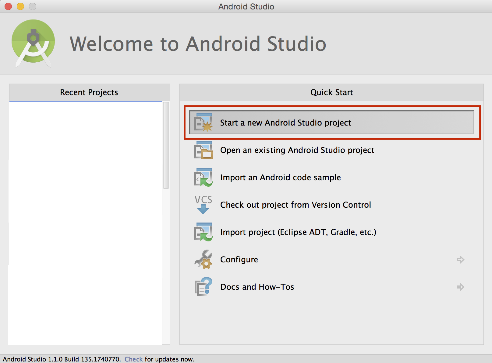
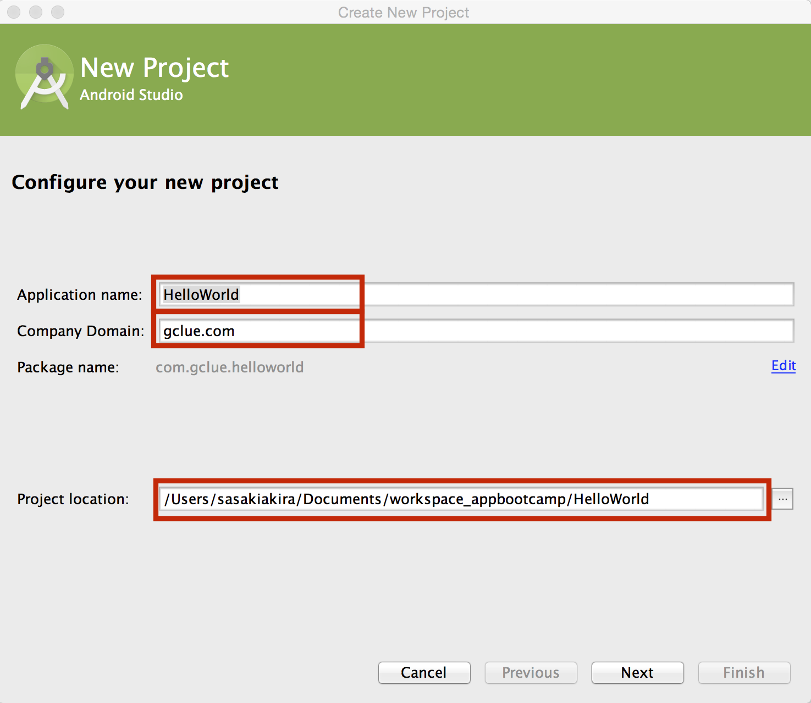
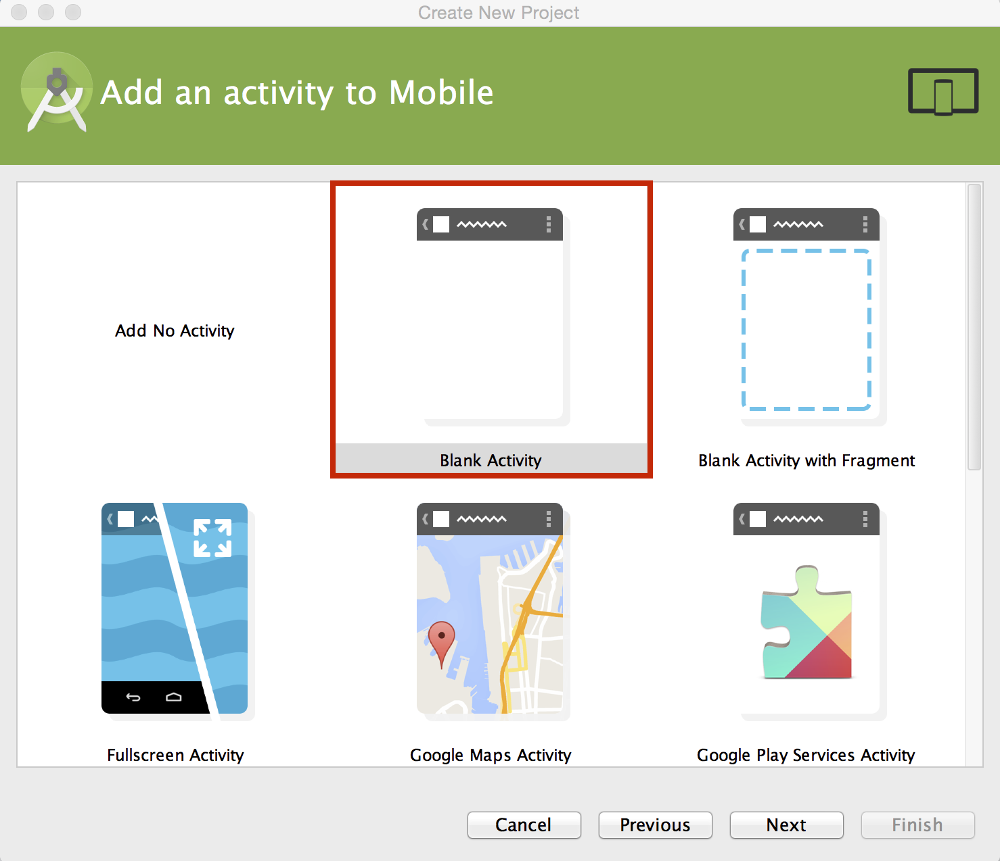
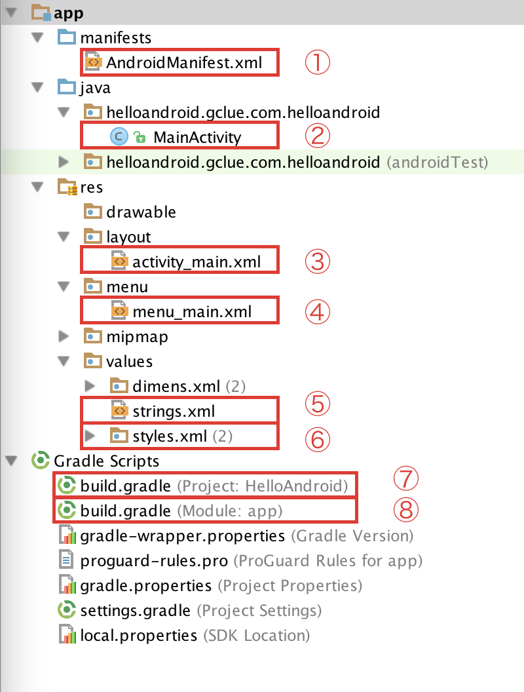
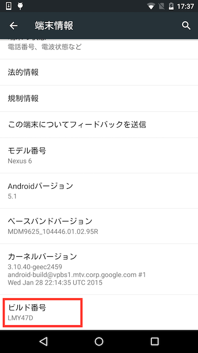
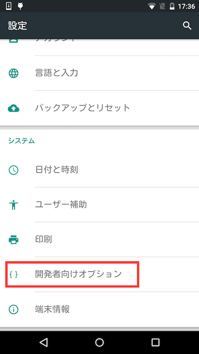

# Hello World

## プロジェクトの作成

Android Studioを起動して、"Start a new Android Studio project"を選択する。



"Create New Project"ダイアログボックスで、Application nameとCompany Domain:を入力する。入力した値は、Package nameの欄にも反映される。

Package nameは、Androidアプリをユニークに識別する値であり、重複すると、Google Playへの登録ができなくなる。

Google Playでは、各アプリの表示はパッケージ名でおこなっている。

[https://play.google.com/store/apps/details?id=***com.gclue.ochineko***](https://play.google.com/store/apps/details?id=com.gclue.ochineko)

また、Project locationでは、プロジェクトを保存する場所を選択する。Macの場合、Document以下にworkspace_プロジェクト名という感じにおくと良い(ここは個人の好み、ルールに従う)。



Phone and TabletnおMinimum SDKでは、サポートする最低レベルのAPIのバージョンを指定する。


どの画面を初期で呼び出すかは、テンプレートから選択する。今回は、Blank Activity を選択する。



最後に、Activity Name等を確認し、[Finish]を押す。

| 項目名 | 内容 |
| -- | -- |
| Activity Name: | Androidアプリの起動時に呼び出されるActivityのクラス名 |
| Layout Name: | Activity Nameで指定したActivityから呼び出されるUIのレイアウトのXMLのファイル名を指定 |
| Title | アプリのタイトルを指定 |
| Menu Resource Name: | Menuで表示するレイアウトのXMLのファイル名を指定


| 番号 | ファイル名 | ファイルの内容 |
| -- | -- | -- |
|①| AndroidManifest.xml | AndroidのManifest情報を記載 |
|②| MainActivity.java | 起動時に呼ばれるActivity |
|③| activity_main.xml | ActivityのUIレイアウト |
|④| menu_main.xml | メニューのUIレイアウト |
|⑤| string.xml | 文字情報のXML |
|⑥| styles.xml | スタイル情報のXML |
|⑦| build.gradle | Build gradle |
|⑧| build.gradle | Build gradle |



AndroidManifext.xml
```XML
<?xml version="1.0" encoding="utf-8"?>
<manifest xmlns:android="http://schemas.android.com/apk/res/android"
    package="com.gclue.helloworld" >

    <application
        android:allowBackup="true"
        android:icon="@mipmap/ic_launcher"
        android:label="@string/app_name"
        android:theme="@style/AppTheme" >
        <activity
            android:name=".MainActivity"
            android:label="@string/app_name" >
            <intent-filter>
                <action android:name="android.intent.action.MAIN" />

                <category android:name="android.intent.category.LAUNCHER" />
            </intent-filter>
        </activity>
    </application>

</manifest>
```

### MainActivity.java
```java
package com.gclue.helloworld;

import android.support.v7.app.ActionBarActivity;
import android.os.Bundle;
import android.view.Menu;
import android.view.MenuItem;


public class MainActivity extends ActionBarActivity {

    @Override
    protected void onCreate(Bundle savedInstanceState) {
        super.onCreate(savedInstanceState);
        setContentView(R.layout.activity_main);
    }


    @Override
    public boolean onCreateOptionsMenu(Menu menu) {
        // Inflate the menu; this adds items to the action bar if it is present.
        getMenuInflater().inflate(R.menu.menu_main, menu);
        return true;
    }

    @Override
    public boolean onOptionsItemSelected(MenuItem item) {
        // Handle action bar item clicks here. The action bar will
        // automatically handle clicks on the Home/Up button, so long
        // as you specify a parent activity in AndroidManifest.xml.
        int id = item.getItemId();

        //noinspection SimplifiableIfStatement
        if (id == R.id.action_settings) {
            return true;
        }

        return super.onOptionsItemSelected(item);
    }
}
```

### res/layout/activity_main.xml
```xml
<RelativeLayout xmlns:android="http://schemas.android.com/apk/res/android"
    xmlns:tools="http://schemas.android.com/tools" android:layout_width="match_parent"
    android:layout_height="match_parent" android:paddingLeft="@dimen/activity_horizontal_margin"
    android:paddingRight="@dimen/activity_horizontal_margin"
    android:paddingTop="@dimen/activity_vertical_margin"
    android:paddingBottom="@dimen/activity_vertical_margin" tools:context=".MainActivity">

    <TextView android:text="@string/hello_world" android:layout_width="wrap_content"
        android:layout_height="wrap_content" />

</RelativeLayout>
```

### res/menu/menu_main.xml
```xml
<menu xmlns:android="http://schemas.android.com/apk/res/android"
    xmlns:app="http://schemas.android.com/apk/res-auto"
    xmlns:tools="http://schemas.android.com/tools" tools:context=".MainActivity">
    <item android:id="@+id/action_settings" android:title="@string/action_settings"
        android:orderInCategory="100" app:showAsAction="never" />
</menu>
```

### res/values/strings.xml
```xml
<resources>
    <string name="app_name">HelloWorld</string>

    <string name="hello_world">Hello world!</string>
    <string name="action_settings">Settings</string>
</resources>
```

### res/values/styles.xml
```xml
<resources>

    <!-- Base application theme. -->
    <style name="AppTheme" parent="Theme.AppCompat.Light.DarkActionBar">
        <!-- Customize your theme here. -->
    </style>

</resources>
```

### build.gradle(Project: HelloWorld)
```
// Top-level build file where you can add configuration options common to all sub-projects/modules.

buildscript {
    repositories {
        jcenter()
    }
    dependencies {
        classpath 'com.android.tools.build:gradle:1.1.0'

        // NOTE: Do not place your application dependencies here; they belong
        // in the individual module build.gradle files
    }
}

allprojects {
    repositories {
        jcenter()
    }
}
```

### build.gradle(Module: app)
```
apply plugin: 'com.android.application'

android {
    compileSdkVersion 21
    buildToolsVersion "21.1.2"

    defaultConfig {
        applicationId "com.gclue.helloworld"
        minSdkVersion 19
        targetSdkVersion 21
        versionCode 1
        versionName "1.0"
    }
    buildTypes {
        release {
            minifyEnabled false
            proguardFiles getDefaultProguardFile('proguard-android.txt'), 'proguard-rules.pro'
        }
    }
}

dependencies {
    compile fileTree(dir: 'libs', include: ['*.jar'])
    compile 'com.android.support:appcompat-v7:21.0.3'
}
```

## デバイスの開発者向けオプションを有効にする

[設定]-[端末情報]を選択する。


ビルド番号を10回クリックするとデバイスが開発モードに変わる。



[設定]-[端末情報]に[開発者向けオプション]の項目が出現するので、選択する。



USBデバックをOnにする。


## Build


<br>
<br>


## メニューからアプリを終了


### MainActivity.java
```java
package com.gclue.helloworld;

import android.support.v7.app.ActionBarActivity;
import android.os.Bundle;
import android.view.Menu;
import android.view.MenuItem;


public class MainActivity extends ActionBarActivity {

    @Override
    protected void onCreate(Bundle savedInstanceState) {
        super.onCreate(savedInstanceState);
        setContentView(R.layout.activity_main);
    }


    @Override
    public boolean onCreateOptionsMenu(Menu menu) {
        // Inflate the menu; this adds items to the action bar if it is present.
        getMenuInflater().inflate(R.menu.menu_main, menu);
        return true;
    }

    @Override
    public boolean onOptionsItemSelected(MenuItem item) {
        // Handle action bar item clicks here. The action bar will
        // automatically handle clicks on the Home/Up button, so long
        // as you specify a parent activity in AndroidManifest.xml.
        int id = item.getItemId();

        //noinspection SimplifiableIfStatement
        if (id == R.id.action_settings) {
            // ① 終了.
            finish();
            return true;
        }

        return super.onOptionsItemSelected(item);
    }
}
```

finish()を呼び出すと、アプリは終了する。

①
```java
        //noinspection SimplifiableIfStatement
        if (id == R.id.action_settings) {
            // ① 終了.
            finish();
            return true;
        }
```

### res/values/strings.xml
```xml
<resources>
    <string name="app_name">HelloWorld</string>

    <string name="hello_world">Hello world!</string>
    <string name="action_settings">Exit</string>
</resources>
```

"action_setting"の項目をSetting→Exitに修正する。


