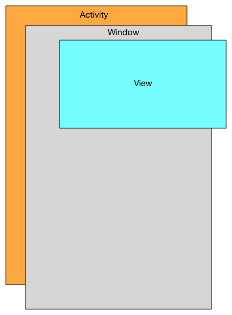
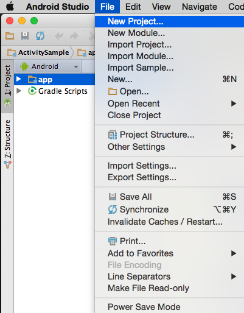
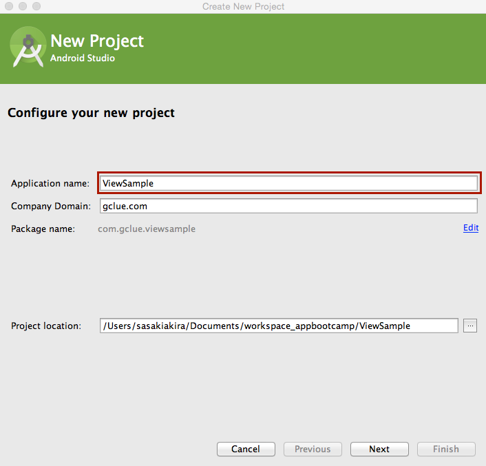
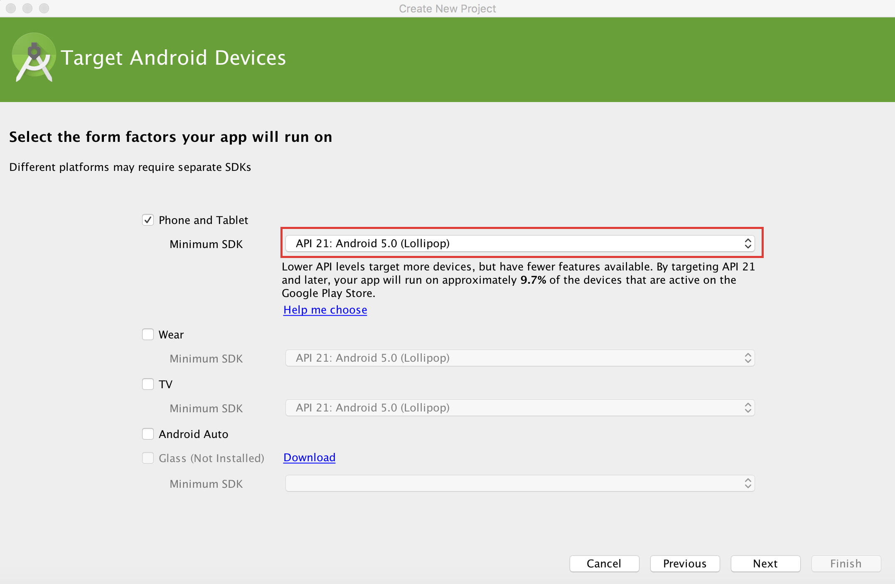
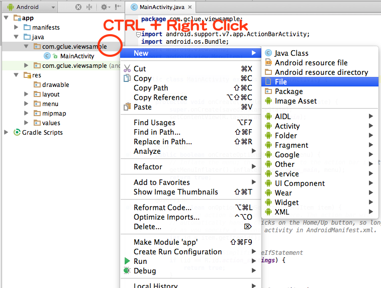
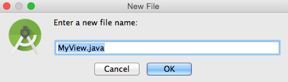
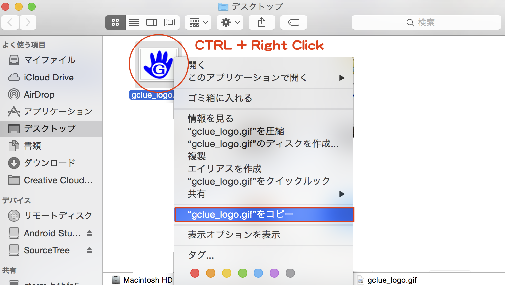
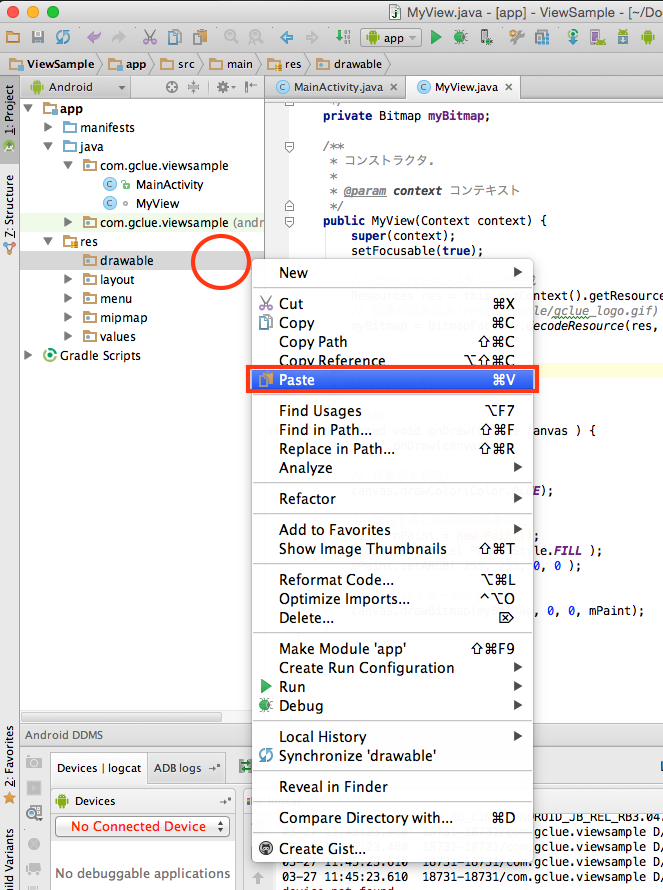
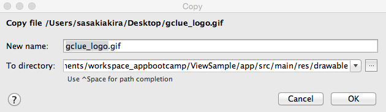

# Viewでの描画処理

## WindowとView

Androidでは、Activityを継承したクラスは、Windoowを保持する。WindowにViewを貼り付ける事で、描画関連の処理をおこなう事ができる。



Viewクラスを継承したクラスは、Window.setContentView() または、Window.addContentView()で、Windowに貼り付けられる。

## 新規プロジェクトの作成

[File]-[New Project]を選択し、新しいプロジェクトを作成する。



Application nameを設定し、[Next]ボタンを押す。



Minimum SDKのAPIバージョンを設定する。



ActivityはBlack Activityを選択する。


## Viewを継承したクラスを定義

パッケージ名の上で、CTRL + 右クリックでショートカットメニューを表示する。





MyView.java
```
package com.gclue.viewsample;

import android.content.Context;
import android.graphics.Canvas;
import android.graphics.Color;
import android.view.View;

/**
 * 描画用のクラス.
 */
class MyView extends View {

    /**
     * コンストラクタ.
     *
     * @param context コンテキスト
     */
    public MyView(Context context) {
        super(context);
        setFocusable(true);

    }

    /**
     * 描画処理を行う.
     */
    @Override
    protected void onDraw(Canvas canvas ) {
        super.onDraw(canvas);

        // 背景色を設定
        canvas.drawColor(Color.BLUE);

    }
}
```

MainActivity.java
```java
package com.gclue.viewsample;

import android.support.v7.app.ActionBarActivity;
import android.os.Bundle;
import android.view.Menu;
import android.view.MenuItem;


public class MainActivity extends ActionBarActivity {

    @Override
    protected void onCreate(Bundle savedInstanceState) {
        super.onCreate(savedInstanceState);

        // ① MyViewのインスタンスを生成.
        MyView mView = new MyView(this);

        // ② mViewをWindowに貼り付け.
        setContentView(mView);
    }


    @Override
    public boolean onCreateOptionsMenu(Menu menu) {
        // Inflate the menu; this adds items to the action bar if it is present.
        getMenuInflater().inflate(R.menu.menu_main, menu);
        return true;
    }

    @Override
    public boolean onOptionsItemSelected(MenuItem item) {
        // Handle action bar item clicks here. The action bar will
        // automatically handle clicks on the Home/Up button, so long
        // as you specify a parent activity in AndroidManifest.xml.
        int id = item.getItemId();

        //noinspection SimplifiableIfStatement
        if (id == R.id.action_settings) {
            return true;
        }

        return super.onOptionsItemSelected(item);
    }
}
```

MyViewのインスタンスを生成して、Windows.setContentView()でWindowに貼り付る。

```java
        // ① MyViewのインスタンスを生成.
        MyView mView = new MyView(this);

        // ② mViewをWindowに貼り付け.
        setContentView(mView);
```

## 線を引く

MyView.java
```java
package com.gclue.viewsample;

import android.content.Context;
import android.graphics.Canvas;
import android.graphics.Color;
import android.graphics.Paint;
import android.view.View;

/**
 * 描画用のクラス.
 */
class MyView extends View {

    /**
     * コンストラクタ.
     *
     * @param context コンテキスト
     */
    public MyView(Context context) {
        super(context);
        setFocusable(true);

    }

    /**
     * 描画処理を行う.
     */
    @Override
    protected void onDraw(Canvas canvas ) {
        super.onDraw(canvas);

        // 背景色を設定.
        canvas.drawColor(Color.BLUE);

        // 描画するための線の色を設定.
        Paint mPaint = new Paint();
        mPaint.setStyle( Paint.Style.FILL );
        mPaint.setARGB( 255, 255, 255, 100 );

        // 線で描画.
        canvas.drawLine( 0, 0, 50, 50, mPaint );

    }
}
```

```java
        // 描画するための線の色を設定.
        Paint mPaint = new Paint();
        mPaint.setStyle( Paint.Style.FILL );
        mPaint.setARGB( 255, 255, 255, 100 );

        // 線で描画.
        canvas.drawLine( 0, 0, 50, 50, mPaint );
```

赤い太線を(0,0)-(500,500)に引く
```java
        // 描画するための線の色を設定.
        Paint mPaint = new Paint();
        mPaint.setStyle( Paint.Style.FILL );
        mPaint.setStrokeWidth(10);
        mPaint.setARGB( 255, 255, 0, 0 );

        // 線で描画.
        canvas.drawLine( 0, 0, 500, 500, mPaint );
```

## 文字列の描画

```java
package com.gclue.viewsample;

import android.content.Context;
import android.graphics.Canvas;
import android.graphics.Color;
import android.graphics.Paint;
import android.view.View;

/**
 * 描画用のクラス.
 */
class MyView extends View {

    /**
     * コンストラクタ.
     *
     * @param context コンテキスト
     */
    public MyView(Context context) {
        super(context);
        setFocusable(true);

    }

    /**
     * 描画処理を行う.
     */
    @Override
    protected void onDraw(Canvas canvas ) {
        super.onDraw(canvas);

        // 背景色を設定.
        canvas.drawColor(Color.BLUE);

        // 描画するための線の色を設定.
        Paint mPaint = new Paint();
        mPaint.setStyle( Paint.Style.FILL );
        mPaint.setTextSize(100);
        mPaint.setARGB( 255, 255, 0, 0 );

        // 文字を描画.
        canvas.drawText( "HELLO ANDROID", 20, 500, mPaint );

    }
}
```


## 四角形の描画

MyView.java
```java
package com.gclue.viewsample;

import android.content.Context;
import android.graphics.Canvas;
import android.graphics.Color;
import android.graphics.Paint;
import android.view.View;

/**
 * 描画用のクラス.
 */
class MyView extends View {

    /**
     * コンストラクタ.
     *
     * @param context コンテキスト
     */
    public MyView(Context context) {
        super(context);
        setFocusable(true);

    }

    /**
     * 描画処理を行う.
     */
    @Override
    protected void onDraw(Canvas canvas ) {
        super.onDraw(canvas);

        // 背景色を設定.
        canvas.drawColor(Color.BLUE);

        // 描画するための線の色を設定.
        Paint mPaint = new Paint();
        mPaint.setStyle( Paint.Style.FILL );
        mPaint.setARGB( 255, 255, 0, 0 );

        // 四角を描画.
        canvas.drawRect(50, 100, 200, 250, mPaint);

    }
}
```

中塗りしない。
```java
        // 描画するための線の色を設定.
        Paint mPaint = new Paint();
        mPaint.setStyle( Paint.Style.STROKE );
        mPaint.setARGB( 255, 255, 0, 0 );

        // 四角を描画.
        canvas.drawRect(50, 100, 200, 250, mPaint);
```

## 円の描画

MyView.java
```
package com.gclue.viewsample;

import android.content.Context;
import android.graphics.Canvas;
import android.graphics.Color;
import android.graphics.Paint;
import android.view.View;

/**
 * 描画用のクラス.
 */
class MyView extends View {

    /**
     * コンストラクタ.
     *
     * @param context コンテキスト
     */
    public MyView(Context context) {
        super(context);
        setFocusable(true);

    }

    /**
     * 描画処理を行う.
     */
    @Override
    protected void onDraw(Canvas canvas ) {
        super.onDraw(canvas);

        // 背景色を設定.
        canvas.drawColor(Color.BLUE);

        // 描画するための線の色を設定.
        Paint mPaint = new Paint();
        mPaint.setStyle( Paint.Style.FILL );
        mPaint.setARGB( 255, 255, 0, 0 );

        // 円を描画.
        canvas.drawCircle( 500, 500, 200, mPaint );

    }
}
```

## 点の描画

MyView.java
```java
package com.gclue.viewsample;

import android.content.Context;
import android.graphics.Canvas;
import android.graphics.Color;
import android.graphics.Paint;
import android.view.View;

/**
 * 描画用のクラス.
 */
class MyView extends View {

    /**
     * コンストラクタ.
     *
     * @param context コンテキスト
     */
    public MyView(Context context) {
        super(context);
        setFocusable(true);

    }

    /**
     * 描画処理を行う.
     */
    @Override
    protected void onDraw(Canvas canvas ) {
        super.onDraw(canvas);

        // 背景色を設定.
        canvas.drawColor(Color.BLUE);

        // 描画するための線の色を設定.
        Paint mPaint = new Paint();
        mPaint.setStyle( Paint.Style.FILL );
        mPaint.setARGB( 255, 255, 0, 0 );

        // 点を描画.
        canvas.drawPoint( 200, 200, mPaint );
    }
}
```

## 画像の描画


gclue.png

ダウンロードした、gclue_logo.gifを選択し、CTRL + 右クリックで表示されるシュートカットメニューで、gclue_logo.gifのコピーを選ぶ。



Studioのdrawableを選択し、その上でCTRL + 右クリックを押して表示されるショートカットメニューからPasteを選択する。



コピー先フォルサを確認し、[OK]でコピーする。



MyView.java
```java
package com.gclue.viewsample;

import android.content.Context;
import android.content.res.Resources;
import android.graphics.Bitmap;
import android.graphics.BitmapFactory;
import android.graphics.Canvas;
import android.graphics.Color;
import android.graphics.Paint;
import android.view.View;

/**
 * 描画用のクラス.
 */
class MyView extends View {

    /**
     * 画像を格納する変数.
     */
    private Bitmap myBitmap;

    /**
     * コンストラクタ.
     *
     * @param context コンテキスト
     */
    public MyView(Context context) {
        super(context);
        setFocusable(true);

        // Resourceインスタンスの生成
        Resources res = this.getContext().getResources();
        // 画像の読み込み(res/drawable/gclue_logo.gif)
        myBitmap = BitmapFactory.decodeResource(res, R.drawable.gclue_logo);
    }

    /**
     * 描画処理を行う.
     */
    @Override
    protected void onDraw(Canvas canvas ) {
        super.onDraw(canvas);

        // 背景色を設定.
        canvas.drawColor(Color.BLUE);

        // 描画するための線の色を設定.
        Paint mPaint = new Paint();
        mPaint.setStyle( Paint.Style.FILL );
        mPaint.setARGB( 255, 255, 0, 0 );

        // Bitmapイメージの描画.
        canvas.drawBitmap(myBitmap, 0, 0, mPaint);
    }
}
```

##  四隅をとる


MyView.java
```java
package com.gclue.viewsample;

import android.content.Context;
import android.content.res.Resources;
import android.graphics.Bitmap;
import android.graphics.BitmapFactory;
import android.graphics.Canvas;
import android.graphics.Color;
import android.graphics.Paint;
import android.util.Log;
import android.view.View;

/**
 * 描画用のクラス.
 */
class MyView extends View {

    /**
     * 画像を格納する変数.
     */
    private Bitmap myBitmap;

    /**
     * ① タグ. 
     */
    private final static String TAG = "DRAW";

    /**
     * コンストラクタ.
     *
     * @param context コンテキスト
     */
    public MyView(Context context) {
        super(context);
        setFocusable(true);

        // Resourceインスタンスの生成
        Resources res = this.getContext().getResources();
        // 画像の読み込み(res/drawable/gclue_logo.gif)
        myBitmap = BitmapFactory.decodeResource(res, R.drawable.gclue_logo);
    }

    /**
     * 描画処理を行う.
     */
    @Override
    protected void onDraw(Canvas canvas ) {
        super.onDraw(canvas);

        // 背景色を設定.
        canvas.drawColor(Color.BLUE);

        // 描画するための線の色を設定.
        Paint mPaint = new Paint();
        mPaint.setStyle( Paint.Style.FILL );
        mPaint.setARGB( 255, 255, 0, 0 );

        // Bitmapイメージの描画.
        canvas.drawBitmap(myBitmap, 0, 0, mPaint);
        
        // ② 四隅をとる.
        int viewWidth = this.getWidth();
        int viewHeight = this.getHeight();
        int imgWidth = myBitmap.getWidth();
        int imgHeight = myBitmap.getHeight();

        Log.i(TAG, "viewWidth:" + viewWidth);
        Log.i(TAG, "viewHeight:" + viewHeight);
        Log.i(TAG, "imgWidth:" + imgWidth);
        Log.i(TAG, "imgHeight:" + imgHeight);

    }
}
```

```java
    /**
     * ① タグ. 
     */
    private final static String TAG = "DRAW";
```

```java
   // ② 四隅をとる.
        int viewWidth = this.getWidth();
        int viewHeight = this.getHeight();
        int imgWidth = myBitmap.getWidth();
        int imgHeight = myBitmap.getHeight();

        Log.i(TAG, "viewWidth:" + viewWidth);
        Log.i(TAG, "viewHeight:" + viewHeight);
        Log.i(TAG, "imgWidth:" + imgWidth);
        Log.i(TAG, "imgHeight:" + imgHeight);
```


