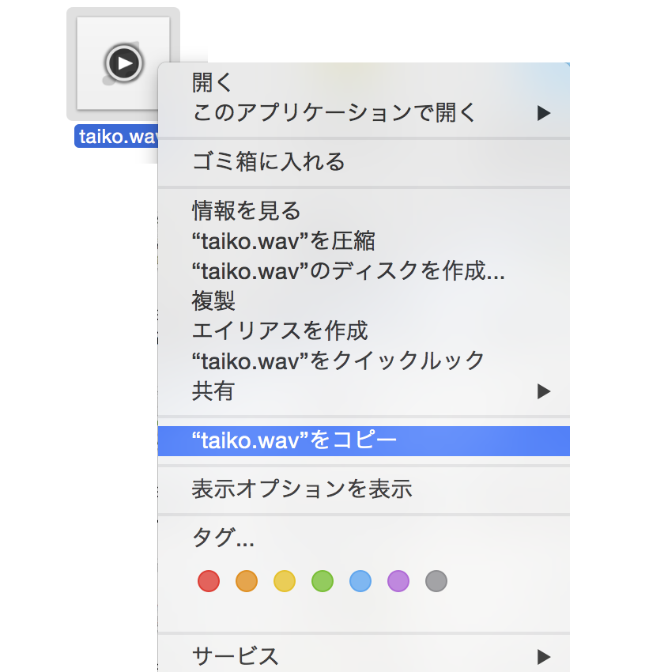
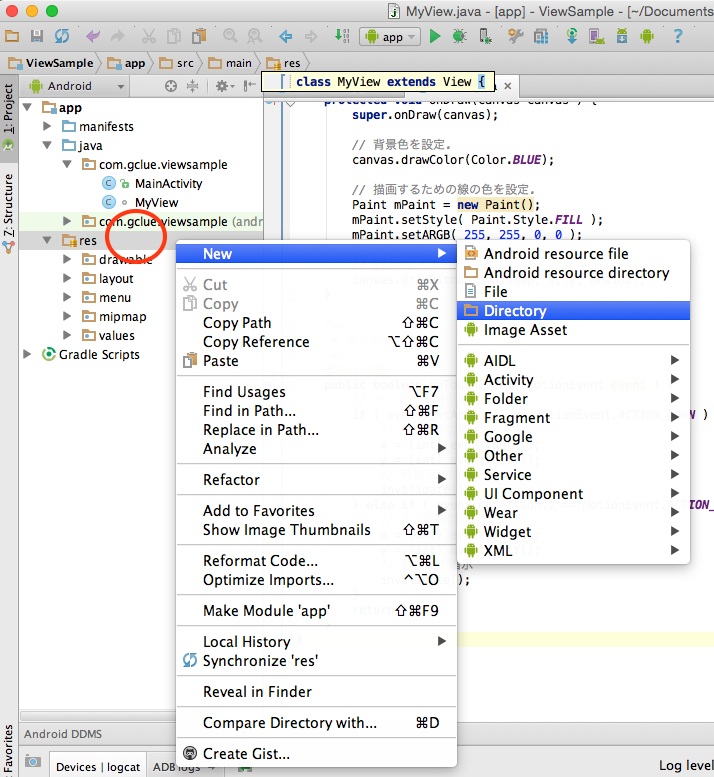
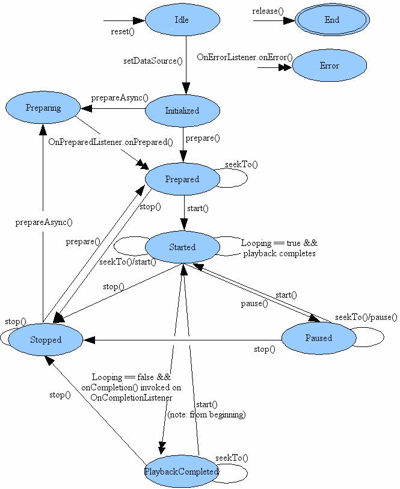

# 音の再生

## 音の用意

Githubより音源をダウンロードしてくる。

[taiko.wav](https://github.com/FabKuraBase/Android-docs/blob/master/res/taiko.wav)

ダウンロードしてきた音声ファイルの上で、CTRL + 右クリックを選択し表示されるショートカットメニューから"taiko.wav"をコピーを選択する。



Android Studioのresフォルダの上で、CTRL + 右クリックを選択し表示されるショートカットメニューから[New]-[Directory]を選択する。



rawという名前のディレクトリを作成する。res/raw


res/rawディレクトリの上で、CTRL + 右クリックで表示されるショートカットメニューで、Pasteを選択する。


移動フォルダを確認し、OKを押して移動が完了する。


# 音の再生(短い音)



MyView.java

```java
package com.gclue.viewsample;

import android.content.Context;
import android.content.res.Resources;
import android.graphics.Bitmap;
import android.graphics.BitmapFactory;
import android.graphics.Canvas;
import android.graphics.Color;
import android.graphics.Paint;
import android.media.MediaPlayer;
import android.view.MotionEvent;
import android.view.View;

/**
 * 描画用のクラス.
 */
class MyView extends View {

    /**
     * 画像を格納する変数.
     */
    private Bitmap myBitmap;

    /**
     * タグ.
     */
    private final static String TAG = "DRAW";

    /**
     * X.
     */
    private int x;

    /**
     * Y.
     */
    private int y;


    /**
     * サウンド再生データを保持する.
     */
    private MediaPlayer mMediaPlayer;

    /**
     * コンストラクタ.
     *
     * @param context コンテキスト
     */
    public MyView(Context context) {
        super(context);
        setFocusable(true);

        // Resourceインスタンスの生成
        Resources res = this.getContext().getResources();
        // 画像の読み込み(res/drawable/gclue_logo.gif)
        myBitmap = BitmapFactory.decodeResource(res, R.drawable.gclue_logo);
        // サウンドデータを読み込む（/res/raw/pon.mp3）
        mMediaPlayer = MediaPlayer.create( context, R.raw.taiko );
    }

    /**
     * 描画処理を行う.
     */
    @Override
    protected void onDraw(Canvas canvas ) {
        super.onDraw(canvas);

        // 背景色を設定.
        canvas.drawColor(Color.BLUE);

        // 描画するための線の色を設定.
        Paint mPaint = new Paint();
        mPaint.setStyle( Paint.Style.FILL );
        mPaint.setARGB( 255, 255, 0, 0 );

        // Bitmapイメージの描画.
        canvas.drawBitmap(myBitmap, x, y, mPaint);
    }

    /**
     * タッチイベント.
     */
    @Override
    public boolean onTouchEvent( MotionEvent event ) {
        // タッチした時に実行
        if ( event.getAction() == MotionEvent.ACTION_DOWN ) {
            // X,Y座標の取得
            x = (int) event.getX();
            y = (int) event.getY();
            // 再描画の指示
            invalidate();

            // 音の再生開始位置を0ミリセカンドの位置に設定する.
            mMediaPlayer.seekTo(0);
            // 音の再生を開始する.
            mMediaPlayer.start();

        } else if ( event.getAction() == MotionEvent.ACTION_MOVE ) {
            // X,Y座標の取得
            x = (int) event.getX();
            y = (int) event.getY();
            // 再描画の指示
            invalidate();
        }
        return true;
    }
}
```
## 音の再生(長い音)

koto.wavをダウンロードし、Android Studioのres/rawフォルダにコピーする。

[koto.wav](https://github.com/FabKuraBase/Android-docs/blob/master/res/koto.wav)

音が長い場合は、音の停止にMediaPlayer.stop()を呼び出す。その際に、MediaPlater.prepare()を行わないと、再び MediaPlayer.play()ができなくなる。


MyView.java
```java
package com.gclue.viewsample;

import android.content.Context;
import android.content.res.Resources;
import android.graphics.Bitmap;
import android.graphics.BitmapFactory;
import android.graphics.Canvas;
import android.graphics.Color;
import android.graphics.Paint;
import android.media.MediaPlayer;
import android.view.MotionEvent;
import android.view.View;

import java.io.IOException;

/**
 * 描画用のクラス.
 */
class MyView extends View {

    /**
     * 画像を格納する変数.
     */
    private Bitmap myBitmap;

    /**
     * タグ.
     */
    private final static String TAG = "DRAW";

    /**
     * X.
     */
    private int x;

    /**
     * Y.
     */
    private int y;


    /**
     * サウンド再生データを保持する.
     */
    private MediaPlayer mMediaPlayer;

    /**
     * コンストラクタ.
     *
     * @param context コンテキスト
     */
    public MyView(Context context) {
        super(context);
        setFocusable(true);

        // Resourceインスタンスの生成
        Resources res = this.getContext().getResources();
        // 画像の読み込み(res/drawable/gclue_logo.gif)
        myBitmap = BitmapFactory.decodeResource(res, R.drawable.gclue_logo);
        // サウンドデータを読み込む（/res/raw/pon.mp3）
        mMediaPlayer = MediaPlayer.create( context, R.raw.koto );
    }

    /**
     * 描画処理を行う.
     */
    @Override
    protected void onDraw(Canvas canvas ) {
        super.onDraw(canvas);

        // 背景色を設定.
        canvas.drawColor(Color.BLUE);

        // 描画するための線の色を設定.
        Paint mPaint = new Paint();
        mPaint.setStyle( Paint.Style.FILL );
        mPaint.setARGB( 255, 255, 0, 0 );

        // Bitmapイメージの描画.
        canvas.drawBitmap(myBitmap, x, y, mPaint);
    }

    /**
     * タッチイベント.
     */
    @Override
    public boolean onTouchEvent( MotionEvent event ) {
        // タッチした時に実行
        if ( event.getAction() == MotionEvent.ACTION_DOWN ) {
            // X,Y座標の取得
            x = (int) event.getX();
            y = (int) event.getY();
            // 再描画の指示
            invalidate();

            // 音の再生開始位置を0ミリセカンドの位置に設定する.
            mMediaPlayer.seekTo(0);
            // 音の再生を開始する.
            mMediaPlayer.start();

        } else if ( event.getAction() == MotionEvent.ACTION_MOVE ) {
            // X,Y座標の取得
            x = (int) event.getX();
            y = (int) event.getY();
            // 再描画の指示
            invalidate();
        } else if ( event.getAction() == MotionEvent.ACTION_UP ) {

            // ACTION_UPは指が離れた時.
            // 音を停止する.
            mMediaPlayer.stop();

            // 一度再生をstop()してから再び音を再生する場合は、prepare()を呼び出す必要がある
            try {
                mMediaPlayer.prepare();
            } catch ( IllegalStateException e ) {
                e.printStackTrace();
            } catch ( IOException e ) {
                e.printStackTrace();
            }
        }

        return true;
    }
}
```

