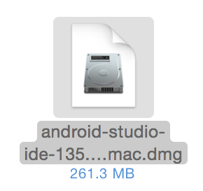
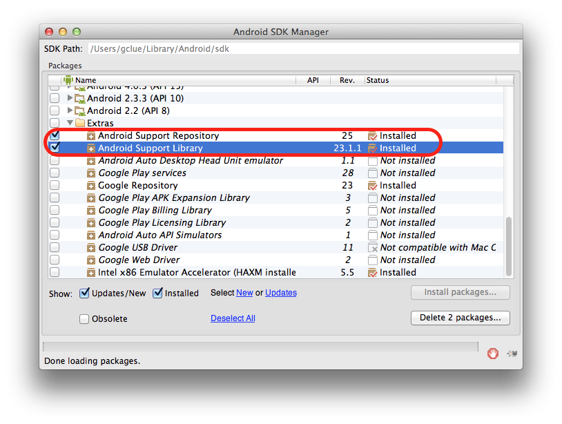

# 環境設定

## JDKのインストール

下記のサイトより環境にあった「Java SE Development Kit 7u79」をダウンロードする。
<br>
http://www.oracle.com/technetwork/jp/java/javase/downloads/jdk7-downloads-1880260.html

ダウンロードしたファイルを実行し、インストールする。
<br>
なお、インストール時の設定は初期状態から変更せず行う。


## Android Studioのインストール

Android Studioをダウンロードする。
<br>
https://developer.android.com/sdk/index.html

ダウンロードした、ファイルを実行する。



※インストール時、PC名やユーザ名に日本語やハイフンなどを使用している場合、「your project location contains non-ascii characters」というエラーメッセージが表示されることがあります。
<br>
その場合はパスに日本語が含まれない場所にフォルダを作成し、そちらを使用してすすめるようにしてください。

Macの場合、Android Studio 1.0のインストール画面が表示されるので、Android StudioアイコンをApplicationsにドラッグ&ドロップする。


/Applicationフォルダにインストールされる。


##環境変数の設定
インストールしたJDKを探す場合に環境変数「JAVA_HOME」を使用する場合がある。
<br>
必要な場合は以下の手順で環境変数の設定を行う。
<br>

###Windowsの場合
1.コントロールパネルを開く

2.システムを選択（表示されていない場合は表示形式を小さいアイコンに変更）

3.詳細設定タブの一番下にある「環境変数」ボタンを押下

4.システム環境変数に「JAVA_HOME」があるかを確認し、ある場合は変更、ない場合は新規を選択

5.変数名にJAVA_HOMEを設定し、変数値にJDKのバージョンが設定されているフォルダのパスを設定

6.設定が終わったら「OK」ボタンを押下

これで設定は完了です。
<br>
コマンドプロンプトにて、下記を入力後enterキー押下で設定したパス名が表示されれば成功です。
```
set JAVA_HOME
```

### Macの場合
Macの場合、JAVA_HOMEが設定されていない場合、下記のコマンドにて表示されたパスが設定されるので、そちらで取得できれば問題ない

```
/usr/libexec/java_home
```
<br>

## ADBドライバについて(Windowsのみ)
WindowsではAndroid端末をPCで認識させるためにADBドライバというものをインストールする必要があります。

ご利用の端末のメーカー、機種を確認し、対象のドライバをダウンロードして下さい。

下記に一部のメーカーについて記載します。

・NEC
<br>
「USBドライバ（Android 開発者向け含む）」から対象の機種を選択し、ダウンロード
<br>
http://www.n-keitai.com/guide/download/

・SHARP
<br>
http://k-tai.sharp.co.jp/support/developers/driver/

・Fujitsu
<br>
「ADB用USBドライバ」より対象の機種を選択し、ダウンロード
<br>
http://spf.fmworld.net/fujitsu/c/develop/sp/android/

・sony
<br>
http://developer.sonymobile.com/downloads/drivers/

・Google(Nexus)
<br>
「DOWNLOAD GOOGLE USB DRIVER」からダウンロード
<br>
http://developer.android.com/sdk/win-usb.html

一部の機種はこちらからインストールする必要があります。
<br>
http://www.samsung.com/us/support/downloads/SPH-M920ZKASPR

ダウンロードが終わったらAndroid端末をUSBケーブルにてPCと接続し、デバイスマネージャーを開きます。

ほかのデバイス（OSのバージョンによって異なる可能性あり）内に「Android ADB〜」というものが！マークがついた状態で表示されますので、これを選択し、ドライバの更新を行います。

ドライバの参照はコンピュータを参照とし、先ほどダウンロードしたフォルダを参照し、更新を行います。


## Android SDKについて

<br>
設定されているSDKで不足しているものがある場合、SDK Managerよりインストールを行います。

Android Studioの上のメニューより、[Tools]->[Android]->[SDK Manager]を選択します。
<br>


画面中央の下にある「Launch Standalone SDK Manager」を選択します。
<br>


SDK Managerが表示されるのでここで必要なものをインストールして下さい。<br>
なお、Android 7.0などの項目があり、デフォルトでチェックが付いた状態ではありますが、容量が大きいため、今回はチェックを外して下さい。




### ※Android.Supportファイルが見つからない場合の対処法
Android Studioインストール後、プログラム作成でAndroid.Supportファイルが見つからずエラーとなることがあります。

この場合、SDK Managerの最後の方にあるExtrasの「Android Support Repository」と「Android Support Library」を確認します。

ここが最新でない場合はまず最新にして下さい。
<br>
最新の状態でエラーとなる場合、一度削除し、再度インストールすることで正常に動作するようになる場合があります。

## SourceTreeのインストール

SourceTreeをダウンロードする。
https://www.atlassian.com/ja/software/sourcetree/overview

ダウンロードしたdmgファイルを実行する。


SourceTreeのインストール画面がでるので、SourceTreeアイコンをドラック&ドロップする。


