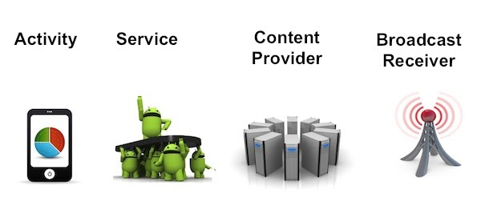

# アプリの種類

Androidでは、画面のあるアプリケーションを開発する場合は、Activityで開発する。Acivity以外に、画面のない常駐型のアプリケーションを開発可能なServiceや、データへのアクセス用のContentsProvider、AndroidからのBroadcastを取得するためのBroadcast Recieverが存在しています。



## Activity


### AndroidManifest.xml

AndroidManifest.xml
```
<?xml version="1.0" encoding="utf-8"?>
<manifest xmlns:android="http://schemas.android.com/apk/res/android"
    package="com.gclue.activitysample" >

    <application
        android:allowBackup="true"
        android:icon="@mipmap/ic_launcher"
        android:label="@string/app_name"
        android:theme="@style/AppTheme" >
        <activity
            android:name=".MainActivity"
            android:label="@string/app_name" >
            <intent-filter>
                <action android:name="android.intent.action.MAIN" />

                <category android:name="android.intent.category.LAUNCHER" />
            </intent-filter>
        </activity>
    </application>

</manifest>

```

activityタグで、囲われた部分に、起動Javaクラス名等を記載する。
```xml
        <activity
            android:name=".MainActivity"
            android:label="@string/app_name" >
            <intent-filter>
                <action android:name="android.intent.action.MAIN" />

                <category android:name="android.intent.category.LAUNCHER" />
            </intent-filter>
        </activity>
```

### MainActivity.java

MainActivity.java
```java
package com.gclue.activitysample;

import android.os.Bundle;
import android.support.v7.app.ActionBarActivity;
import android.view.Menu;
import android.view.MenuItem;


public class MainActivity extends Activity {

    @Override
    protected void onCreate(Bundle savedInstanceState) {
        super.onCreate(savedInstanceState);
        setContentView(R.layout.activity_main);
    }
}
```

```
public class MainActivity extends Activity {
```


## Service


AndroidManifest.xml
```
<?xml version="1.0" encoding="utf-8"?>
<manifest xmlns:android="http://schemas.android.com/apk/res/android"
    package="com.example.service"
    android:versionCode="1"
    android:versionName="1.0" >

    <uses-sdk android:minSdkVersion="10" />

    <application
        android:icon="@drawable/ic_launcher"
        android:label="@string/app_name" >
        <activity
            android:label="@string/app_name"
            android:name=".MainActivity" >
            <intent-filter >
                <action android:name="android.intent.action.MAIN" />
                <category android:name="android.intent.category.LAUNCHER" />
            </intent-filter>
        </activity>
        
        <service android:name="MainService">
        </service>
    
    </application>

</manifest>
```

MainService.java
```java 
package com.example.service;
 
import android.app.Service;
import android.content.Intent;
import android.os.IBinder;
import android.util.Log;
 
public class MainService extends Service {
 
  @Override
	public IBinder onBind(Intent intent) {
		return null;
	}
 
	@Override
	public void onCreate() {
		super.onCreate();
		Log.i("SERVICE", "onCreate()");
	}
 
	@Override
	public void onDestroy() {
		super.onDestroy();
		Log.i("SERVICE", "onDestroy()");
	}
 
	@Override
	public void onStart(Intent intent, int startId) {
		Log.i("SERVICE", "onStart");
	}
}
```

```
public class MainService extends Service {

```

## Broadcast Receiver


AndroidManifest.xml
```
<?xml version="1.0" encoding="utf-8"?>
<manifest xmlns:android="http://schemas.android.com/apk/res/android"
    package="com.example.service"
    android:versionCode="1"
    android:versionName="1.0" >

    <uses-sdk android:minSdkVersion="10" />

    <application
        android:icon="@drawable/ic_launcher"
        android:label="@string/app_name" >
        
        <receiver android:name="MainReceiver">
            <intent-filter>
                <action android:name="com.example.TEST" />
            </intent-filter>
        </receiver>
    </application>

</manifest>
```

MainReceiver.java
```java
package com.example.service;
 
import android.content.BroadcastReceiver;
import android.content.Context;
import android.content.Intent;
import android.widget.Toast;
 
/**
 * Broadcast Receiver
 */
public class MainReceiver extends BroadcastReceiver {
  
	@Override
	public void onReceive(Context context,Intent intent) {				
	}
}
```

```
public class MainReceiver extends BroadcastReceiver {
```


