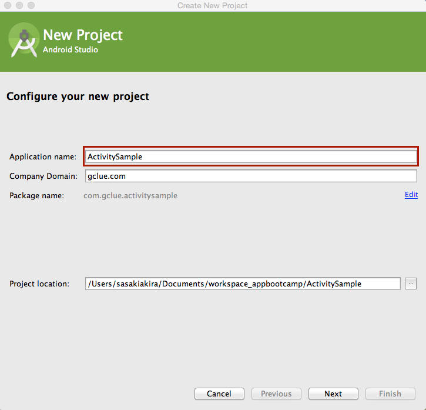
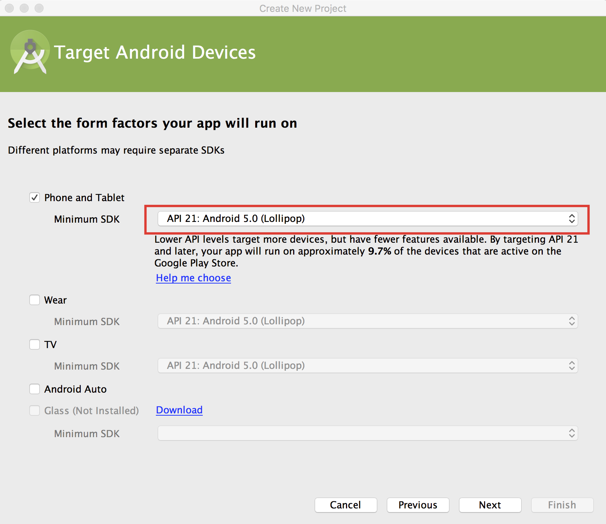
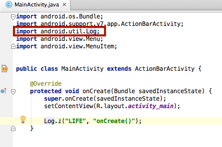
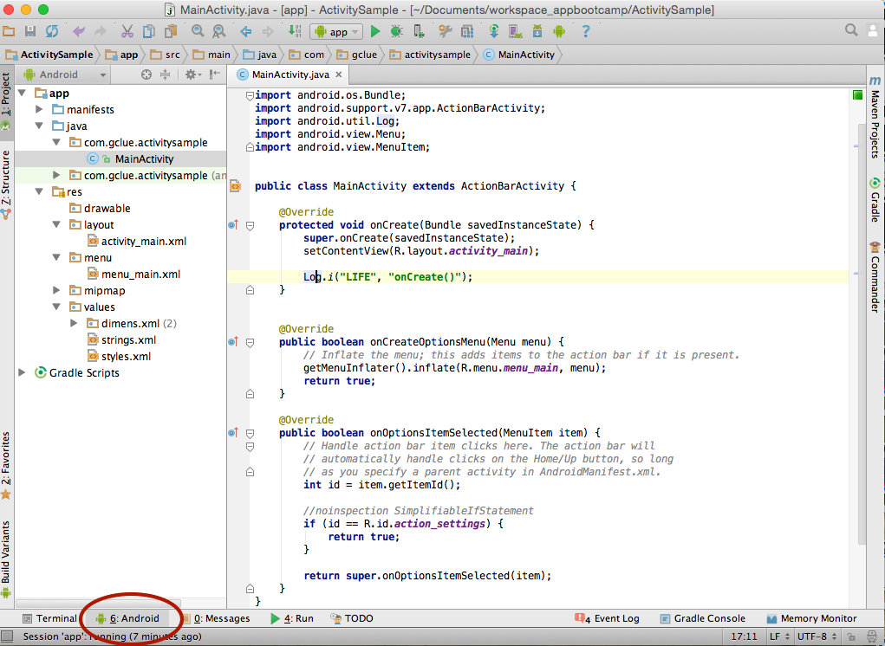
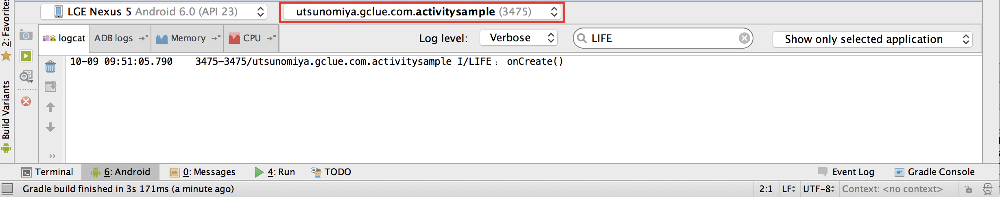
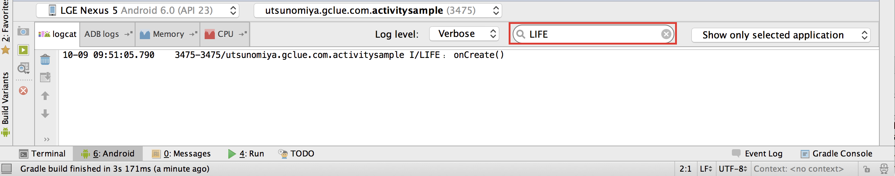
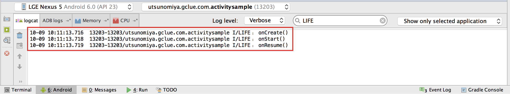
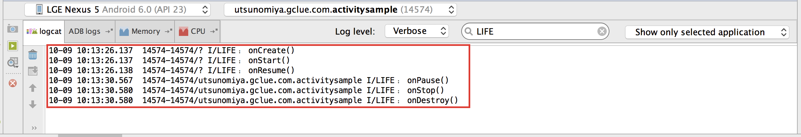

# Activityのライフサイクル

Activityの始まりから終わりまでの、ライフサイクルの解説をおこなう。


## 新規プロジェクトの作成

[File]-[New Project]を選択し、新しいプロジェクトを作成する。


Application nameを設定し、[Next]ボタンを押す。



Minimum SDKのAPIバージョンを設定する。



ActivityはBlack Activityを選択する。


## onCreate() 省略不可

onCreate()は、Activityが生成されると一番最初に呼び出される。

```java
package com.gclue.activitysample;

import android.os.Bundle;
import android.support.v7.app.ActionBarActivity;
import android.util.Log;
import android.view.Menu;
import android.view.MenuItem;


public class MainActivity extends ActionBarActivity {

    @Override
    protected void onCreate(Bundle savedInstanceState) {
        super.onCreate(savedInstanceState);
        setContentView(R.layout.activity_main);

        // ① Logを出力
        Log.i("LIFE", "onCreate()");
    }


    @Override
    public boolean onCreateOptionsMenu(Menu menu) {
        // Inflate the menu; this adds items to the action bar if it is present.
        getMenuInflater().inflate(R.menu.menu_main, menu);
        return true;
    }

    @Override
    public boolean onOptionsItemSelected(MenuItem item) {
        // Handle action bar item clicks here. The action bar will
        // automatically handle clicks on the Home/Up button, so long
        // as you specify a parent activity in AndroidManifest.xml.
        int id = item.getItemId();

        //noinspection SimplifiableIfStatement
        if (id == R.id.action_settings) {
            return true;
        }

        return super.onOptionsItemSelected(item);
    }
}

```

Logクラスを用いてログを出力する。1つ目の引数にキーワード、2つ目の引数に出力する値を指定する。

```java
    @Override
    protected void onCreate(Bundle savedInstanceState) {
        super.onCreate(savedInstanceState);
        setContentView(R.layout.activity_main);

        // ① Logを出力
        Log.i("LIFE", "onCreate()");
    }
```

Log.iと記載すると、Logの下に赤線が出力され、エラーが発生する。これはLogクラスがImportされていない事に起因するエラーであるLogの赤線の上に、マウスポインタを移動する。


Logにマウスポインタを移動している状態で、 alt + Enterを押すと、Logクラスのimport文が自動的に追加される。

```
 alt + Enter
```


ログの出力を確認する。ログはAndroid DDMSを用いて表示する。Studioの下に表示されているAndroidタブを選択する。



表示するログを今起動中のアプリだけにするために、Filterで自分のアプリのパッケージ名を選択する。



キーワードにLIFEといれ、表示するログを絞る。



## onCreate()以外も実装する

```java
package com.gclue.activitysample;

import android.os.Bundle;
import android.support.v7.app.ActionBarActivity;
import android.util.Log;
import android.view.Menu;
import android.view.MenuItem;


public class MainActivity extends ActionBarActivity {

    @Override
    protected void onCreate(Bundle savedInstanceState) {
        super.onCreate(savedInstanceState);
        setContentView(R.layout.activity_main);

        // ① Logを出力
        Log.i("LIFE", "onCreate()");
    }

    // ② 他のActivityをOverrideする。
    @Override
    public void onStart() {
        super.onStart();

        Log.i("LIFE", "onStart()" );
    }

    @Override
    public void onResume() {
        super.onResume();

        Log.i("LIFE", "onResume()" );
    }

    @Override
    public void onPause() {
        super.onPause();

        Log.i("LIFE", "onPause()" );
    }

    @Override
    public void onStop() {
        super.onStop();

        Log.i("LIFE", "onStop()" );
    }

    @Override
    public void onRestart() {
        super.onRestart();

        Log.i("LIFE", "onRestart()" );
    }

    @Override
    public void onDestroy() {
        super.onDestroy();

        Log.i("LIFE", "onDestroy()" );
    }

    @Override
    public boolean onCreateOptionsMenu(Menu menu) {
        // Inflate the menu; this adds items to the action bar if it is present.
        getMenuInflater().inflate(R.menu.menu_main, menu);
        return true;
    }

    @Override
    public boolean onOptionsItemSelected(MenuItem item) {
        // Handle action bar item clicks here. The action bar will
        // automatically handle clicks on the Home/Up button, so long
        // as you specify a parent activity in AndroidManifest.xml.
        int id = item.getItemId();

        //noinspection SimplifiableIfStatement
        if (id == R.id.action_settings) {
            return true;
        }

        return super.onOptionsItemSelected(item);
    }
}
```

```java

    // ② 他のActivityをOverrideする。
    @Override
    public void onStart() {
        super.onStart();

        Log.i("LIFE", "onStart()" );
    }

    @Override
    public void onResume() {
        super.onResume();

        Log.i("LIFE", "onResume()" );
    }

    @Override
    public void onPause() {
        super.onPause();

        Log.i("LIFE", "onPause()" );
    }

    @Override
    public void onStop() {
        super.onStop();

        Log.i("LIFE", "onStop()" );
    }

    @Override
    public void onRestart() {
        super.onRestart();

        Log.i("LIFE", "onRestart()" );
    }

    @Override
    public void onDestroy() {
        super.onDestroy();

        Log.i("LIFE", "onDestroy()" );
    }
```

起動すると、


終了すると、


