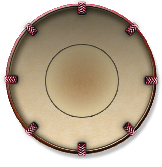
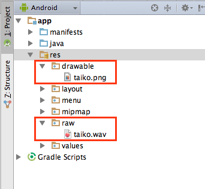
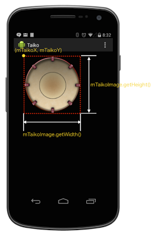
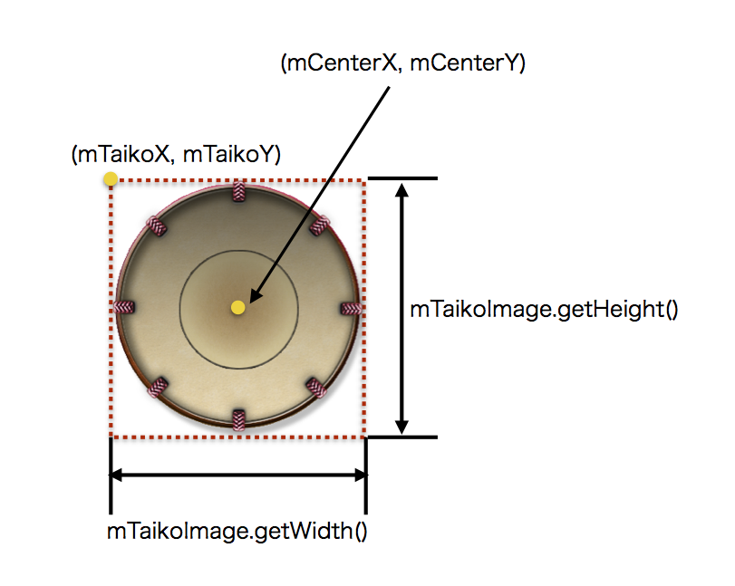
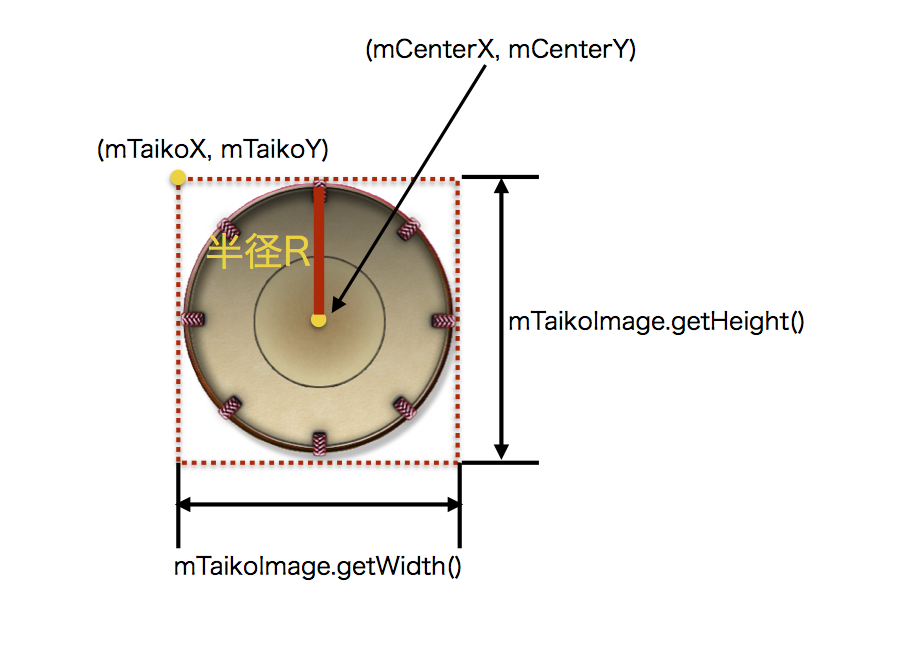

# 太鼓アプリの作成

## 開発するアプリ


## 開発で必要な素材
太鼓の画像



太鼓の音
[taiko.wav](https://github.com/FabKuraBase/Android-docs/blob/master/res/taiko.wav)

## 新規プロジェクトの立ち上げ

TaikoAppというプロジェクト名のアプリを作成する。

taiko.pngをres/drawableに、pon.wavをres/rawにコピーする。



MainActivity.java
```java
package com.gclue.taicoapp;

import android.app.Activity;
import android.os.Bundle;
import android.view.Menu;
import android.view.MenuItem;

public class MainActivity extends Activity {

    @Override
    protected void onCreate(Bundle savedInstanceState) {
        super.onCreate(savedInstanceState);

        // TaikoViewのインスタンス化.
        TaikoView mTaikoView = new TaikoView(this);

        // TaikoViewを画面に設定.
        setContentView(mTaikoView);
    }


    @Override
    public boolean onCreateOptionsMenu(Menu menu) {
        // Inflate the menu; this adds items to the action bar if it is present.
        getMenuInflater().inflate(R.menu.menu_main, menu);
        return true;
    }

    @Override
    public boolean onOptionsItemSelected(MenuItem item) {
        /*
        Handle action bar item clicks here. The action bar will
        automatically handle clicks on the Home/Up button, so long
        as you specify a parent activity in AndroidManifest.xml.
        */
        int id = item.getItemId();
        if (id == R.id.action_settings) {
            return true;
        }
        return super.onOptionsItemSelected(item);
    }
}


```

TaikoView.java
```java
package com.gclue.taicoapp;

import android.content.Context;
import android.content.res.Resources;
import android.graphics.Bitmap;
import android.graphics.BitmapFactory;
import android.graphics.Canvas;
import android.graphics.Color;
import android.graphics.Paint;
import android.view.View;

/**
 * 太鼓の画像を表示するView.
 */
class TaikoView extends View {

    /** 太鼓画像データを保持する. */
    private Bitmap mTaikoImage;

    /** 太鼓画像の原点（左上）のx座標を保持する. */
    private int mTaikoX = 100;

    /** 太鼓画像の原点（左上）のy座標を保持する. */
    private int mTaikoY = 50;

    /**
     * コンストラクタ.
     * @param context コンテキスト
     */
    public TaikoView( Context context ) {
        super(context);

        // イベント取得できるようにFocusを有効にする.
        setFocusable( true );

        // Resourceインスタンスの生成.
        Resources res = this.getContext().getResources();

        // 画像の読み込み（/res/drawable/taiko.png）.
        mTaikoImage = BitmapFactory.decodeResource(res, R.drawable.taiko);
    }

    /**
     * 描画処理.
     */
    @Override
    protected void onDraw( Canvas canvas ) {

        // 背景色を設定する.
        canvas.drawColor( Color.BLACK );

        // Bitmapイメージの描画.
        Paint mPaint = new Paint();
        canvas.drawBitmap( mTaikoImage, mTaikoX, mTaikoY, mPaint );
    }
}
```





## あたり判定
太鼓の中心点を求める数式
```
int mCenterX = mTaikoX + mTaikoImage.getWidth()/2;
int mCenterY = mTaikoY + mTaikoImage.getHeight()/2;
```


半径Rを求める数式
```
int mTaikoR = taikoImage.getWidth() / 2;
```


太鼓の中心点とタッチした座標の距離を求める数式
```
double distance = Math.sqrt( Math.pow( (mCenterX - mTouchX), 2 ) + Math.pow( (mCenterY - mTouchY), 2 ));
```
太鼓に手があたっていない場合の条件


太鼓に手があたっている場合の条件


## あたり判定の実装

TaikoView.java
```java
package com.gclue.taicoapp;

import android.content.Context;
import android.content.res.Resources;
import android.graphics.Bitmap;
import android.graphics.BitmapFactory;
import android.graphics.Canvas;
import android.graphics.Color;
import android.graphics.Paint;
import android.media.MediaPlayer;
import android.view.MotionEvent;
import android.view.View;

/**
 * 太鼓の画像を表示するView.
 */
class TaikoView extends View {

    /** 太鼓画像データを保持する. */
    private Bitmap mTaikoImage;

    /** 太鼓画像の原点（左上）のx座標を保持する. */
    private int mTaikoX = 100;

    /** 太鼓画像の原点（左上）のy座標を保持する. */
    private int mTaikoY = 50;

    /** サウンド再生データを保持する. */
    private MediaPlayer mMediaPlayer;

    /**
     * コンストラクタ.
     * @param context コンテキスト
     */
    public TaikoView( Context context ) {
        super(context);

        // イベント取得できるようにFocusを有効にする.
        setFocusable( true );

        // Resourceインスタンスの生成.
        Resources res = this.getContext().getResources();

        // 画像の読み込み（/res/drawable-hdpi/taiko.png）.
        mTaikoImage = BitmapFactory.decodeResource(res, R.drawable.taiko);

        // サウンドデータを読み込む(/res/raw/pon.mp3)
        mMediaPlayer = MediaPlayer.create( context, R.raw.taiko );
    }

    /**
     * 描画処理.
     */
    @Override
    protected void onDraw( Canvas canvas ) {

        // 背景色を設定する.
        canvas.drawColor( Color.BLACK );

        // Bitmapイメージの描画.
        Paint mPaint = new Paint();
        canvas.drawBitmap( mTaikoImage, mTaikoX, mTaikoY, mPaint );
    }

    /**
     * タッチイベント.
     *
     * @param event モーションイベント
     */
    @Override
    public boolean onTouchEvent( MotionEvent event ) {

        // 指が押された場合の処理.
        if ( event.getAction() == MotionEvent.ACTION_DOWN ) {

            // 指がタッチされたx,y座標の取得.
            int mTouchX = (int) event.getX();
            int mTouchY = (int) event.getY();

            // 太鼓の中心座標を計算
            int mCenterX = mTaikoX + mTaikoImage.getWidth()/2;
            int mCenterY = mTaikoY + mTaikoImage.getHeight()/2;

            // 太鼓の中心座標と指の距離を計算
            double mDistance = Math.sqrt(Math.pow( (mCenterX - mTouchX),2)+ Math.pow( (mCenterY - mTouchY),2));

            // 太鼓画像の半径
            int mTaikoR = mTaikoImage.getWidth()/2;

            // あたり判定
            if ( mDistance < mTaikoR ) {
                // サウンド再生
                mMediaPlayer.start();
            }
        }

        return true;
    }
}
```
