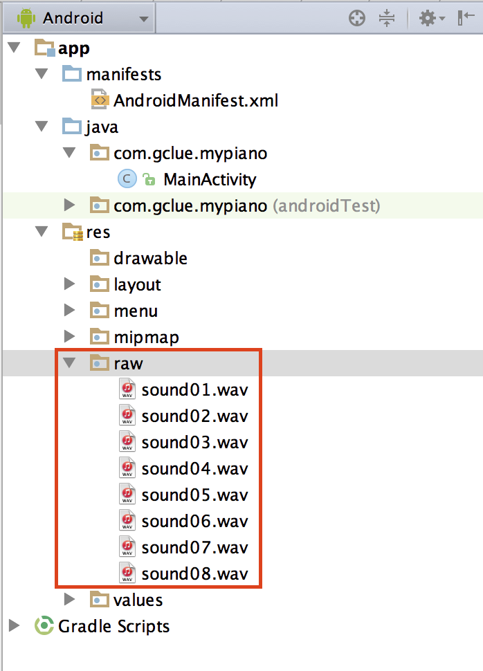
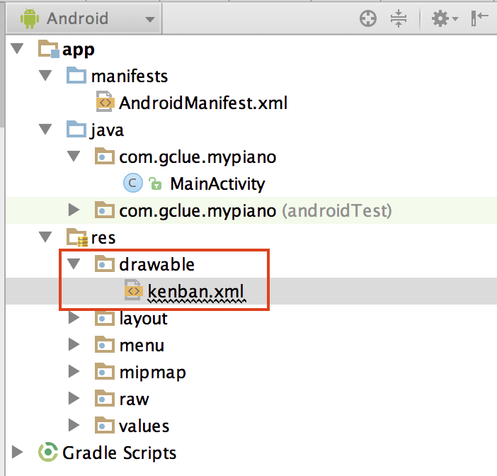

# ピアノアプリの作成1

## 音データ

Pianoの音
[piano.zip](https://github.com/FabKuraBase/Android-docs/blob/master/img-chapter09/sound.zip)


## 新規プロジェクトの作成

MyPianoという名前で、新規プロジェクトを作成する。

## ボタンイベントの実装

MainActivity.java
```java
package com.gclue.mypiano;

import android.app.Activity;
import android.os.Bundle;
import android.view.Menu;
import android.view.MenuItem;
import android.view.View;
import android.view.Window;
import android.widget.Button;
import android.widget.Toast;

public class MainActivity extends Activity implements View.OnClickListener {

    /** Button1の定義. */
    private Button mButton1;

    @Override
    public void onCreate( Bundle savedInstanceState ) {
        super.onCreate( savedInstanceState );
        requestWindowFeature( Window.FEATURE_NO_TITLE );

        setContentView( R.layout.activity_main );

        // Buttonの取り込み
        mButton1 = (Button) findViewById( R.id.button1 );
        mButton1.setOnClickListener( this );
    }

    @Override
    public void onClick(View v) {
        // クリックされたViewがmButtonの場合.
        if ( v.equals( mButton01 ) ) {
            Toast.makeText( this, "Buttonがクリックされました。", Toast.LENGTH_LONG ).show();
        }
    }
}
```

activity_main.xml
```java
<RelativeLayout xmlns:android="http://schemas.android.com/apk/res/android"
    xmlns:tools="http://schemas.android.com/tools" android:layout_width="match_parent"
    android:layout_height="match_parent" android:paddingLeft="@dimen/activity_horizontal_margin"
    android:paddingRight="@dimen/activity_horizontal_margin"
    android:paddingTop="@dimen/activity_vertical_margin"
    android:paddingBottom="@dimen/activity_vertical_margin" tools:context=".MainActivity">

    <Button
        android:id="@+id/button1"
        android:layout_width="fill_parent"
        android:layout_height="55dp"
        android:layout_alignParentLeft="true"
        android:layout_alignParentTop="true"
        android:layout_marginLeft="0dp"
        android:layout_marginTop="1dp"
        android:text="" />

</RelativeLayout>
```

## ボタンを配置

MainActivity.java
```java
package com.gclue.mypiano;

import android.app.Activity;
import android.os.Bundle;
import android.view.Menu;
import android.view.MenuItem;
import android.view.View;
import android.view.Window;
import android.widget.Button;
import android.widget.Toast;

public class MainActivity extends Activity implements View.OnClickListener {

    /** Button1の定義. */
    private Button mButton01;

    /** Button1の定義。 */
    private Button mButton1;
    /** Button2の定義。 */
    private Button mButton2;
    /** Button3の定義。 */
    private Button mButton3;
    /** Button4の定義。 */
    private Button mButton4;
    /** Button5の定義。 */
    private Button mButton5;
    /** Button6の定義。 */
    private Button mButton6;
    /** Button7の定義。 */
    private Button mButton7;
    /** Button8の定義。 */
    private Button mButton8;

    @Override
    public void onCreate( Bundle savedInstanceState ) {
        super.onCreate( savedInstanceState );
        requestWindowFeature( Window.FEATURE_NO_TITLE );
        setContentView( R.layout.activity_main );

        // /res/layout/pianosample_layout.xml に記述したボタンを読み込む
        mButton1 = (Button) findViewById( R.id.button1 );
        mButton2 = (Button) findViewById( R.id.button2 );
        mButton3 = (Button) findViewById( R.id.button3 );
        mButton4 = (Button) findViewById( R.id.button4 );
        mButton5 = (Button) findViewById( R.id.button5 );
        mButton6 = (Button) findViewById( R.id.button6 );
        mButton7 = (Button) findViewById( R.id.button7 );
        mButton8 = (Button) findViewById( R.id.button8 );

        mButton1.setOnClickListener( this );
        mButton2.setOnClickListener( this );
        mButton3.setOnClickListener( this );
        mButton4.setOnClickListener( this );
        mButton5.setOnClickListener( this );
        mButton6.setOnClickListener( this );
        mButton7.setOnClickListener( this );
        mButton8.setOnClickListener( this );
    }

    @Override
    public boolean onCreateOptionsMenu(Menu menu) {
        // Inflate the menu; this adds items to the action bar if it is present.
        getMenuInflater().inflate(R.menu.menu_main, menu);
        return true;
    }

    @Override
    public boolean onOptionsItemSelected(MenuItem item) {
        // Handle action bar item clicks here. The action bar will
        // automatically handle clicks on the Home/Up button, so long
        // as you specify a parent activity in AndroidManifest.xml.
        int id = item.getItemId();

        //noinspection SimplifiableIfStatement
        if (id == R.id.action_settings) {
            return true;
        }

        return super.onOptionsItemSelected(item);
    }

    /**
     * コンポーネントがクリックされると呼び出される.
     */
    @Override
    public void onClick( View mView ) {
        // クリックされたViewがmButtonの場合.
        if ( mView.equals( mButton1 ) ) {
            Toast.makeText( this, "Button1がクリックされました。", Toast.LENGTH_SHORT ).show();
        }
        else if ( mView.equals( mButton2 ) ) {
            Toast.makeText( this, "Button2がクリックされました。", Toast.LENGTH_SHORT ).show();
        }
        else if ( mView.equals( mButton3 ) ) {
            Toast.makeText( this, "Button3がクリックされました。", Toast.LENGTH_SHORT ).show();
        }
        else if ( mView.equals( mButton4 ) ) {
            Toast.makeText( this, "Button4がクリックされました。", Toast.LENGTH_SHORT ).show();
        }
        else if ( mView.equals( mButton5 ) ) {
            Toast.makeText( this, "Button5がクリックされました。", Toast.LENGTH_SHORT ).show();
        }
        else if ( mView.equals( mButton6 ) ) {
            Toast.makeText( this, "Button6がクリックされました。", Toast.LENGTH_SHORT ).show();
        }
        else if ( mView.equals( mButton7 ) ) {
            Toast.makeText( this, "Button7がクリックされました。", Toast.LENGTH_SHORT ).show();
        }
        else if ( mView.equals( mButton8 ) ) {
            Toast.makeText( this, "Button8がクリックされました。", Toast.LENGTH_SHORT ).show();
        }
    }
}
```

activity_main.xml
```java
<RelativeLayout xmlns:android="http://schemas.android.com/apk/res/android"
    xmlns:tools="http://schemas.android.com/tools" android:layout_width="match_parent"
    android:layout_height="match_parent" android:paddingLeft="@dimen/activity_horizontal_margin"
    android:paddingRight="@dimen/activity_horizontal_margin"
    android:paddingTop="@dimen/activity_vertical_margin"
    android:paddingBottom="@dimen/activity_vertical_margin" tools:context=".MainActivity">

    <Button
        android:id="@+id/button1"
        android:layout_width="fill_parent"
        android:layout_height="55dp"
        android:layout_alignParentLeft="true"
        android:layout_alignParentTop="true"
        android:layout_marginLeft="0dp"
        android:layout_marginTop="1dp"
        android:text="" />

    <Button
        android:id="@+id/button2"
        android:layout_width="fill_parent"
        android:layout_height="55dp"
        android:layout_alignParentLeft="true"
        android:layout_alignParentRight="true"
        android:layout_below="@+id/button1"
        android:layout_marginTop="1dp"
        android:text="" />

    <Button
        android:id="@+id/button3"
        android:layout_width="fill_parent"
        android:layout_height="55dp"
        android:layout_alignParentLeft="true"
        android:layout_alignParentRight="true"
        android:layout_below="@+id/button2"
        android:text="" />

    <Button
        android:id="@+id/button4"
        android:layout_width="fill_parent"
        android:layout_height="55dp"
        android:layout_alignParentLeft="true"
        android:layout_alignParentRight="true"
        android:layout_below="@+id/button3"
        android:text="" />

    <Button
        android:id="@+id/button5"
        android:layout_width="fill_parent"
        android:layout_height="55dp"
        android:layout_alignParentLeft="true"
        android:layout_alignParentRight="true"
        android:layout_below="@+id/button4"
        android:text="" />

    <Button
        android:id="@+id/button6"
        android:layout_width="fill_parent"
        android:layout_height="55dp"
        android:layout_alignParentLeft="true"
        android:layout_alignParentRight="true"
        android:layout_below="@+id/button5"
        android:text="" />

    <Button
        android:id="@+id/button7"
        android:layout_width="fill_parent"
        android:layout_height="55dp"
        android:layout_alignParentLeft="true"
        android:layout_alignParentRight="true"
        android:layout_below="@+id/button6"
        android:text="" />

    <Button
        android:id="@+id/button8"
        android:layout_width="fill_parent"
        android:layout_height="55dp"
        android:layout_alignParentLeft="true"
        android:layout_alignParentRight="true"
        android:layout_below="@+id/button7"
        android:text="" />
</RelativeLayout>
```

## 音の組み込みと鍵盤の配色





MainActivty.java
```java
package com.gclue.mypiano;

import android.app.Activity;
import android.media.MediaPlayer;
import android.os.Bundle;
import android.view.Menu;
import android.view.MenuItem;
import android.view.View;
import android.view.Window;
import android.widget.Button;

public class MainActivity extends Activity implements View.OnClickListener {

    /** Button1の定義. */
    private Button mButton01;

    /** Button1の定義。 */
    private Button mButton1;
    /** Button2の定義。 */
    private Button mButton2;
    /** Button3の定義。 */
    private Button mButton3;
    /** Button4の定義。 */
    private Button mButton4;
    /** Button5の定義。 */
    private Button mButton5;
    /** Button6の定義。 */
    private Button mButton6;
    /** Button7の定義。 */
    private Button mButton7;
    /** Button8の定義。 */
    private Button mButton8;

    /** サウンド1の定義。 */
    private MediaPlayer sound1;
    /** サウンド2の定義。 */
    private MediaPlayer sound2;
    /** サウンド3の定義。 */
    private MediaPlayer sound3;
    /** サウンド4の定義。 */
    private MediaPlayer sound4;
    /** サウンド5の定義。 */
    private MediaPlayer sound5;
    /** サウンド6の定義。 */
    private MediaPlayer sound6;
    /** サウンド7の定義。 */
    private MediaPlayer sound7;
    /** サウンド8の定義。 */
    private MediaPlayer sound8;

    @Override
    public void onCreate( Bundle savedInstanceState ) {
        super.onCreate( savedInstanceState );
        requestWindowFeature( Window.FEATURE_NO_TITLE );
        setContentView( R.layout.activity_main );

        // /res/layout/pianosample_layout.xml に記述したボタンを読み込む
        mButton1 = (Button) findViewById( R.id.button1 );
        mButton2 = (Button) findViewById( R.id.button2 );
        mButton3 = (Button) findViewById( R.id.button3 );
        mButton4 = (Button) findViewById( R.id.button4 );
        mButton5 = (Button) findViewById( R.id.button5 );
        mButton6 = (Button) findViewById( R.id.button6 );
        mButton7 = (Button) findViewById( R.id.button7 );
        mButton8 = (Button) findViewById( R.id.button8 );

        mButton1.setOnClickListener( this );
        mButton2.setOnClickListener( this );
        mButton3.setOnClickListener( this );
        mButton4.setOnClickListener( this );
        mButton5.setOnClickListener( this );
        mButton6.setOnClickListener( this );
        mButton7.setOnClickListener( this );
        mButton8.setOnClickListener( this );

        // サウンドを読み込む.
        sound1 = MediaPlayer.create( this, R.raw.sound01 );
        sound2 = MediaPlayer.create( this, R.raw.sound02 );
        sound3 = MediaPlayer.create( this, R.raw.sound03 );
        sound4 = MediaPlayer.create( this, R.raw.sound04 );
        sound5 = MediaPlayer.create( this, R.raw.sound05 );
        sound6 = MediaPlayer.create( this, R.raw.sound06 );
        sound7 = MediaPlayer.create( this, R.raw.sound07 );
        sound8 = MediaPlayer.create( this, R.raw.sound08 );
    }

    @Override
    public boolean onCreateOptionsMenu(Menu menu) {
        // Inflate the menu; this adds items to the action bar if it is present.
        getMenuInflater().inflate(R.menu.menu_main, menu);
        return true;
    }

    @Override
    public boolean onOptionsItemSelected(MenuItem item) {
        // Handle action bar item clicks here. The action bar will
        // automatically handle clicks on the Home/Up button, so long
        // as you specify a parent activity in AndroidManifest.xml.
        int id = item.getItemId();

        //noinspection SimplifiableIfStatement
        if (id == R.id.action_settings) {
            return true;
        }

        return super.onOptionsItemSelected(item);
    }

    /**
     * コンポーネントがクリックされると呼び出される.
     */
    @Override
    public void onClick( View mView ) {
        // クリックされたViewがmButtonの場合
        if ( mView.equals( mButton1 ) ) {
            sound1.seekTo( 0 );
            sound1.start();
        }
        else if ( mView.equals( mButton2 ) ) {
            sound2.seekTo( 0 );
            sound2.start();
        }
        else if ( mView.equals( mButton3 ) ) {
            sound3.seekTo( 0 );
            sound3.start();
        }
        else if ( mView.equals( mButton4 ) ) {
            sound4.seekTo( 0 );
            sound4.start();
        }
        else if ( mView.equals( mButton5 ) ) {
            sound5.seekTo( 0 );
            sound5.start();
        }
        else if ( mView.equals( mButton6 ) ) {
            sound6.seekTo( 0 );
            sound6.start();
        }
        else if ( mView.equals( mButton7 ) ) {
            sound7.seekTo( 0 );
            sound7.start();
        }
        else if ( mView.equals( mButton8 ) ) {
            sound8.seekTo( 0 );
            sound8.start();
        }
    }
}
```

activity_main.xml
```java
<RelativeLayout xmlns:android="http://schemas.android.com/apk/res/android"
    xmlns:tools="http://schemas.android.com/tools"
    android:layout_width="match_parent"
    android:layout_height="match_parent"
    android:background="#000000"
    tools:context=".PianoSample001" >

    <Button
        android:id="@+id/button1"
        android:layout_width="fill_parent"
        android:layout_height="55dp"
        android:layout_alignParentLeft="true"
        android:layout_alignParentTop="true"
        android:layout_marginLeft="0dp"
        android:layout_marginTop="1dp"
        android:background="@drawable/kenban"
        android:text="" />

    <Button
        android:id="@+id/button2"
        android:layout_width="fill_parent"
        android:layout_height="55dp"
        android:layout_alignParentLeft="true"
        android:layout_alignParentRight="true"
        android:layout_below="@+id/button1"
        android:layout_marginTop="1dp"
        android:background="@drawable/kenban"
        android:text="" />

    <Button
        android:id="@+id/button3"
        android:layout_width="fill_parent"
        android:layout_height="55dp"
        android:layout_alignParentLeft="true"
        android:layout_alignParentRight="true"
        android:layout_below="@+id/button2"
        android:layout_marginTop="1dp"
        android:background="@drawable/kenban"
        android:text="" />

    <Button
        android:id="@+id/button4"
        android:layout_width="fill_parent"
        android:layout_height="55dp"
        android:layout_alignParentLeft="true"
        android:layout_alignParentRight="true"
        android:layout_below="@+id/button3"
        android:layout_marginTop="1dp"
        android:background="@drawable/kenban"
        android:text="" />

    <Button
        android:id="@+id/button5"
        android:layout_width="fill_parent"
        android:layout_height="55dp"
        android:layout_alignParentLeft="true"
        android:layout_alignParentRight="true"
        android:layout_below="@+id/button4"
        android:layout_marginTop="1dp"
        android:background="@drawable/kenban"
        android:text="" />

    <Button
        android:id="@+id/button6"
        android:layout_width="fill_parent"
        android:layout_height="55dp"
        android:layout_alignParentLeft="true"
        android:layout_alignParentRight="true"
        android:layout_below="@+id/button5"
        android:layout_marginTop="1dp"
        android:background="@drawable/kenban"
        android:text="" />

    <Button
        android:id="@+id/button7"
        android:layout_width="fill_parent"
        android:layout_height="55dp"
        android:layout_alignParentLeft="true"
        android:layout_alignParentRight="true"
        android:layout_below="@+id/button6"
        android:layout_marginTop="1dp"
        android:background="@drawable/kenban"
        android:text="" />

    <Button
        android:id="@+id/button8"
        android:layout_width="fill_parent"
        android:layout_height="55dp"
        android:layout_alignParentLeft="true"
        android:layout_alignParentRight="true"
        android:layout_below="@+id/button7"
        android:layout_marginTop="1dp"
        android:background="@drawable/kenban"
        android:text="" />

</RelativeLayout>
```




res/drawable/kenban.xml
```java
<?xml version="1.0" encoding="utf-8" ?>
<selector xmlns:android="http://schemas.android.com/apk/res/android">
    <item android:state_pressed="false">
        <color android:color="#ffffffff" />
    </item>

    <item android:state_pressed="true">
        <color android:color="#ff555555" />
    </item>
</selector>
```

## 配列を使ってわかりやすくする

MainActivity.java
```java
package com.gclue.mypiano;

import android.app.Activity;
import android.media.MediaPlayer;
import android.os.Bundle;
import android.util.Log;
import android.view.View;
import android.view.Window;
import android.widget.Button;

import java.util.ArrayList;

public class MainActivity extends Activity implements View.OnClickListener {

    /** Button配列の定義。 */
    private ArrayList< Button > buttons = new ArrayList< Button >();
    /** サウンド配列の定義。 */
    private ArrayList< MediaPlayer > sounds = new ArrayList< MediaPlayer >();
    /** 記述したボタンの数。 */
    private int howManyButtons = 8;

    @Override
    public void onCreate( Bundle savedInstanceState ) {
        super.onCreate( savedInstanceState );
        requestWindowFeature( Window.FEATURE_NO_TITLE );
        setContentView( R.layout.activity_main );

        // /res/layout/pianosample_layout.xml に記述したボタンを読み込む
        addButtonAndSound( howManyButtons );
    }

    /**
     * ボタンをボタン配列に、サウンドをサウンド配列に格納する。
     * @param num ボタンの数
     */
    private void addButtonAndSound( int num ) {
        for ( int i = 0; i < num; i++ ) {
            String n = Integer.toString( i + 1 );

            // ボタンをボタン配列に格納する
            int buttonId = getResources().getIdentifier( "button" + n, "id", getPackageName() );
            Button mButton = (Button) findViewById( buttonId );
            mButton.setOnClickListener( this );
            buttons.add( mButton );

            // サウンドをサウンド配列に格納する
            // サウンドファイルがsound01のように、0が付いた2桁表示になっているため、数値の頭に0を付けた文字列を作成する
            if ( i < 10 ) {
                n = "0" + n;
            }
            int soundId = getResources().getIdentifier( "sound" + n, "raw", getPackageName() );

            MediaPlayer sound = MediaPlayer.create( this, soundId );
            sounds.add( sound );
        }
    }

    /**
     * コンポーネントがクリックされると呼び出される。
     */
    @Override
    public void onClick( View mView ) {
        // button配列に格納してあるButtonを一つずつ取り出し、クリックされたView(mView)とButtonが一致した場合、音を再生する。
        for ( int i = 0; i < howManyButtons; i++ ) {
            if ( mView.equals( buttons.get( i ) ) ) {
                Log.i("PianoSample001", "Button" + Integer.toString(i + 1) + "がクリックされました。");
                sounds.get( i ).seekTo( 0 );
                sounds.get( i ).start();
                return;
            }
        }
    }
}
```

## 自動演奏機能


MainActivity.java
```java
package com.gclue.mypiano;

import android.app.Activity;
import android.media.MediaPlayer;
import android.os.Bundle;
import android.util.Log;
import android.view.View;
import android.view.Window;
import android.widget.Button;

import java.util.ArrayList;


public class MainActivity  extends Activity implements View.OnClickListener {

    /** Button配列の定義。 */
    private ArrayList<Button> buttons = new ArrayList< Button >();
    /** サウンド配列の定義。 */
    private ArrayList<MediaPlayer> sounds = new ArrayList< MediaPlayer >();
    /** /res/layout/pianosample001_layout.xmlに記述したボタンの数。 */
    private int howManyButtons = 8;

    /** Data. */
    private int[] mMerody = {0,1,2,1,2,3,1,2,3,1,2,3};
    /** Button play. */
    private Button mButtonPlay;

    @Override
    public void onCreate( Bundle savedInstanceState ) {
        super.onCreate( savedInstanceState );
        requestWindowFeature( Window.FEATURE_NO_TITLE );
        setContentView( R.layout.activity_main );

        // Play Button
        mButtonPlay = (Button)findViewById(R.id.buttonPlay);
        mButtonPlay.setOnClickListener( this );

        // /res/layout/pianosample_layout.xml に記述したボタンを読み込む
        addButtonAndSound(howManyButtons);
    }

    /**
     * ボタンをボタン配列に、サウンドをサウンド配列に格納する。
     * @param num ボタンの数
     */
    private void addButtonAndSound( int num ) {
        for ( int i = 0; i < num; i++ ) {
            String n = Integer.toString( i + 1 );

            // ボタンをボタン配列に格納する
            int buttonId = getResources().getIdentifier( "button" + n, "id", getPackageName() );
            Button mButton = (Button) findViewById( buttonId );
            mButton.setOnClickListener( this );
            buttons.add( mButton );

            // サウンドをサウンド配列に格納する
            // サウンドファイルがsound01のように、0が付いた2桁表示になっているため、数値の頭に0を付けた文字列を作成する
            if ( i < 10 ) {
                n = "0" + n;
            }
            int soundId = getResources().getIdentifier( "sound" + n, "raw", getPackageName() );

            MediaPlayer sound = MediaPlayer.create( this, soundId );
            sounds.add( sound );
        }
    }

    /**
     * コンポーネントがクリックされると呼び出される。
     */
    @Override
    public void onClick( View mView ) {
        if(mView.equals(mButtonPlay)) {

            for(int i = 0; i < mMerody.length; i++) {
                int onkai = mMerody[i];
                sounds.get(onkai).seekTo(0);
                sounds.get(onkai).start();

                try {
                    Thread.sleep(500);
                } catch (InterruptedException e) {
                    e.printStackTrace();
                }
            }

        } else {
            // button配列に格納してあるButtonを一つずつ取り出し、クリックされたView(mView)とButtonが一致した場合、音を再生する。
            for (int i = 0; i < howManyButtons; i++) {
                if (mView.equals(buttons.get(i))) {
                    Log.i("PIANO", "Button" + Integer.toString(i + 1) + "がクリックされました。");
                    sounds.get(i).seekTo(0);
                    sounds.get(i).start();
                    return;
                }
            }
        }
    }
}
```

activity_main.xml
```java
<RelativeLayout xmlns:android="http://schemas.android.com/apk/res/android"
    xmlns:tools="http://schemas.android.com/tools"
    android:layout_width="match_parent"
    android:layout_height="match_parent"
    android:background="#000000"
    tools:context=".PianoSample001" >

    <Button
        android:id="@+id/button1"
        android:layout_width="fill_parent"
        android:layout_height="55dp"
        android:layout_alignParentLeft="true"
        android:layout_alignParentTop="true"
        android:layout_marginLeft="0dp"
        android:layout_marginTop="1dp"
        android:background="@drawable/kenban"
        android:text="" />

    <Button
        android:id="@+id/button2"
        android:layout_width="fill_parent"
        android:layout_height="55dp"
        android:layout_alignParentLeft="true"
        android:layout_alignParentRight="true"
        android:layout_below="@+id/button1"
        android:layout_marginTop="1dp"
        android:background="@drawable/kenban"
        android:text="" />

    <Button
        android:id="@+id/button3"
        android:layout_width="fill_parent"
        android:layout_height="55dp"
        android:layout_alignParentLeft="true"
        android:layout_alignParentRight="true"
        android:layout_below="@+id/button2"
        android:layout_marginTop="1dp"
        android:background="@drawable/kenban"
        android:text="" />

    <Button
        android:id="@+id/button4"
        android:layout_width="fill_parent"
        android:layout_height="55dp"
        android:layout_alignParentLeft="true"
        android:layout_alignParentRight="true"
        android:layout_below="@+id/button3"
        android:layout_marginTop="1dp"
        android:background="@drawable/kenban"
        android:text="" />

    <Button
        android:id="@+id/button5"
        android:layout_width="fill_parent"
        android:layout_height="55dp"
        android:layout_alignParentLeft="true"
        android:layout_alignParentRight="true"
        android:layout_below="@+id/button4"
        android:layout_marginTop="1dp"
        android:background="@drawable/kenban"
        android:text="" />

    <Button
        android:id="@+id/button6"
        android:layout_width="fill_parent"
        android:layout_height="55dp"
        android:layout_alignParentLeft="true"
        android:layout_alignParentRight="true"
        android:layout_below="@+id/button5"
        android:layout_marginTop="1dp"
        android:background="@drawable/kenban"
        android:text="" />

    <Button
        android:id="@+id/button7"
        android:layout_width="fill_parent"
        android:layout_height="55dp"
        android:layout_alignParentLeft="true"
        android:layout_alignParentRight="true"
        android:layout_below="@+id/button6"
        android:layout_marginTop="1dp"
        android:background="@drawable/kenban"
        android:text="" />


    <Button
        android:id="@+id/button8"
        android:layout_width="fill_parent"
        android:layout_height="55dp"
        android:layout_alignParentLeft="true"
        android:layout_alignParentRight="true"
        android:layout_below="@+id/button7"
        android:layout_marginTop="1dp"
        android:background="@drawable/kenban"
        android:text="" />


    <Button
        android:id="@+id/buttonPlay"
        android:layout_width="fill_parent"
        android:layout_height="55dp"
        android:layout_alignParentLeft="true"
        android:layout_alignParentRight="true"
        android:layout_below="@+id/button8"
        android:layout_marginTop="10dp"
        android:text="play" />

</RelativeLayout>
```

## JSON配列による演奏

JSON Format
```
{"title" : "MySound",
"data" : [
 {"merody" : 0, "time" : 500},
     {"merody" : 1, "time" : 500},
        {"merody" : 2, "time" : 500},
        {"merody" : 1, "time" : 500},
        {"merody" : 2, "time" : 300},
        {"merody" : 3, "time" : 100},
        {"merody" : 1, "time" : 500},
        {"merody" : 2, "time" : 300},
        {"merody" : 3, "time" : 100},
        {"merody" : 1, "time" : 500},
        {"merody" : 2, "time" : 300},
        {"merody" : 3, "time" : 100},
]}
```

### 基本構文
```
{"項目名":"項目"}

{"項目名1":"項目1",
"項目名2":"項目2"}

{"項目名1":"項目1",
"項目名2":[ {"項目名":"項目2-1"},{"項目名":"項目2-2"}]
}
```

### for example
```
{"title":"myJsonData"}

{"title":"myJsonData",
"update":"2015-03-31"}

{"title":"myJsonData",
"data": [ {"value":"data of value1"},{"value":"data of value2"}]
}
```

### 数値と文字列

```
{"項目名":"文字列"}
{"項目名":数値}
```

### for example
```
{"title":"myJsonData",
"data":"文字列"}

{"title":"myJsonData",
"data":111}
```

### JSON Objectの扱い
```
String jsonData = "{\"title\":\"myJsonData\",
\"data\":\"文字列\"}";

JSON Object mJson = new JSONObject(jsonData);
String mTitle = mJson.get("title");
String mData = "mJson.get("data");
```

### JSON Objectの配列の扱い
```
String jsonData = "\"title\":\"myJsonData\",
\"data\": [ {\"value\":\"data of value1\"},{\"value\":\"data of value2\"}]}";

JSON Object mJson = new JSONObject(jsonData);

String mTitle = mJson.get("title");

JSONArray datas = mJson.getJSONArray("data");
    for(int i = 0; i < datas.length(); i++) {
       String mValue = datas.getJSONObject(i).getString("value");
       Log.i(TAG,"value:"+mValue);
    }
}
```

MainActivity.java
```java
package com.gclue.mypiano;

import android.app.Activity;
import android.media.MediaPlayer;
import android.os.Bundle;
import android.util.Log;
import android.view.View;
import android.view.Window;
import android.widget.Button;

import org.json.JSONArray;
import org.json.JSONException;
import org.json.JSONObject;

import java.util.ArrayList;


public class MainActivity  extends Activity implements View.OnClickListener {

    /** Button配列の定義。 */
    private ArrayList<Button> buttons = new ArrayList< Button >();
    /** サウンド配列の定義。 */
    private ArrayList<MediaPlayer> sounds = new ArrayList< MediaPlayer >();
    /** /res/layout/pianosample001_layout.xmlに記述したボタンの数。 */
    private int howManyButtons = 8;

    /** Data. */
    private String mMerodyData = "{\"title\" : \"MySound\",\"data\" : [" +
            "{\"merody\" : 0,\"time\" : 500}," +
            "{\"merody\" : 1,\"time\" : 500}," +
            "{\"merody\" : 2,\"time\" : 500}," +
            "{\"merody\" : 1,\"time\" : 500}," +
            "{\"merody\" : 2,\"time\" : 300}," +
            "{\"merody\" : 3,\"time\" : 100}," +
            "{\"merody\" : 1,\"time\" : 500}," +
            "{\"merody\" : 2,\"time\" : 300}," +
            "{\"merody\" : 3,\"time\" : 100}," +
            "{\"merody\" : 1,\"time\" : 500}," +
            "{\"merody\" : 2,\"time\" : 300}," +
            "{\"merody\" : 3,\"time\" : 100},]}";

    /** Button play. */
    private Button mButtonPlay;

    @Override
    public void onCreate( Bundle savedInstanceState ) {
        super.onCreate( savedInstanceState );
        requestWindowFeature( Window.FEATURE_NO_TITLE );
        setContentView( R.layout.activity_main );
        mButtonPlay = (Button)findViewById(R.id.buttonPlay);
        mButtonPlay.setOnClickListener( this );

        // /res/layout/pianosample_layout.xml に記述したボタンを読み込む
        addButtonAndSound(howManyButtons);
    }

    /**
     * ボタンをボタン配列に、サウンドをサウンド配列に格納する。
     * @param num ボタンの数
     */
    private void addButtonAndSound( int num ) {
        for ( int i = 0; i < num; i++ ) {
            String n = Integer.toString( i + 1 );

            // ボタンをボタン配列に格納する
            int buttonId = getResources().getIdentifier( "button" + n, "id", getPackageName() );
            Button mButton = (Button) findViewById( buttonId );
            mButton.setOnClickListener( this );
            buttons.add( mButton );

            // サウンドをサウンド配列に格納する
            // サウンドファイルがsound01のように、0が付いた2桁表示になっているため、数値の頭に0を付けた文字列を作成する
            if ( i < 10 ) {
                n = "0" + n;
            }
            int soundId = getResources().getIdentifier( "sound" + n, "raw", getPackageName() );

            MediaPlayer sound = MediaPlayer.create( this, soundId );
            sounds.add( sound );
        }
    }

    /**
     * コンポーネントがクリックされると呼び出される。
     */
    @Override
    public void onClick( View mView ) {
        if(mView.equals(mButtonPlay)) {

            JSONObject mMerodyJson = null;
            try {
                mMerodyJson = new JSONObject(mMerodyData);

                Log.i("PIANO", "title:" + mMerodyJson.get("title"));

                JSONArray datas = mMerodyJson.getJSONArray("data");

                for(int i = 0; i < datas.length(); i++) {
                    int onkai = datas.getJSONObject(i).getInt("merody");
                    sounds.get(onkai).seekTo(0);
                    sounds.get(onkai).start();

                    int sleepTime = datas.getJSONObject(i).getInt("time");
                    try {
                        Thread.sleep(sleepTime);
                    } catch (InterruptedException e) {
                        e.printStackTrace();
                    }
                }

            } catch (JSONException e) {
                e.printStackTrace();
            }

        } else {
            // button配列に格納してあるButtonを一つずつ取り出し、クリックされたView(mView)とButtonが一致した場合、音を再生する。
            for (int i = 0; i < howManyButtons; i++) {
                if (mView.equals(buttons.get(i))) {
                    Log.i("PIANO", "Button" + Integer.toString(i + 1) + "がクリックされました。");
                    sounds.get(i).seekTo(0);
                    sounds.get(i).start();
                    return;
                }
            }
        }
    }
}
```

## ボタン押下をシミュレーション

```java
package com.gclue.mypiano;

import android.app.Activity;
import android.media.MediaPlayer;
import android.os.Bundle;
import android.util.Log;
import android.view.View;
import android.view.Window;
import android.widget.Button;

import org.json.JSONArray;
import org.json.JSONException;
import org.json.JSONObject;

import java.util.ArrayList;


public class MainActivity  extends Activity implements View.OnClickListener {

    /** Button配列の定義。 */
    private ArrayList<Button> buttons = new ArrayList< Button >();
    /** サウンド配列の定義。 */
    private ArrayList<MediaPlayer> sounds = new ArrayList< MediaPlayer >();
    /** /res/layout/pianosample001_layout.xmlに記述したボタンの数。 */
    private int howManyButtons = 8;

    /** Data. */
    private String mMerodyData = "{\"title\" : \"MySound\",\"data\" : [" +
            "{\"merody\" : 0,\"time\" : 500}," +
            "{\"merody\" : 1,\"time\" : 500}," +
            "{\"merody\" : 2,\"time\" : 500}," +
            "{\"merody\" : 1,\"time\" : 500}," +
            "{\"merody\" : 2,\"time\" : 300}," +
            "{\"merody\" : 3,\"time\" : 100}," +
            "{\"merody\" : 1,\"time\" : 500}," +
            "{\"merody\" : 2,\"time\" : 300}," +
            "{\"merody\" : 3,\"time\" : 100}," +
            "{\"merody\" : 1,\"time\" : 500}," +
            "{\"merody\" : 2,\"time\" : 300}," +
            "{\"merody\" : 3,\"time\" : 100},]}";

    /** Button play. */
    private Button mButtonPlay;

    @Override
    public void onCreate( Bundle savedInstanceState ) {
        super.onCreate( savedInstanceState );
        requestWindowFeature( Window.FEATURE_NO_TITLE );
        setContentView( R.layout.activity_main );
        mButtonPlay = (Button)findViewById(R.id.buttonPlay);
        mButtonPlay.setOnClickListener( this );

        // /res/layout/pianosample_layout.xml に記述したボタンを読み込む
        addButtonAndSound(howManyButtons);
    }

    /**
     * ボタンをボタン配列に、サウンドをサウンド配列に格納する。
     * @param num ボタンの数
     */
    private void addButtonAndSound( int num ) {
        for ( int i = 0; i < num; i++ ) {
            String n = Integer.toString( i + 1 );

            // ボタンをボタン配列に格納する
            int buttonId = getResources().getIdentifier( "button" + n, "id", getPackageName() );
            Button mButton = (Button) findViewById( buttonId );
            mButton.setOnClickListener( this );
            buttons.add( mButton );

            // サウンドをサウンド配列に格納する
            // サウンドファイルがsound01のように、0が付いた2桁表示になっているため、数値の頭に0を付けた文字列を作成する
            if ( i < 10 ) {
                n = "0" + n;
            }
            int soundId = getResources().getIdentifier( "sound" + n, "raw", getPackageName() );

            MediaPlayer sound = MediaPlayer.create( this, soundId );
            sounds.add( sound );
        }
    }

    /**
     * コンポーネントがクリックされると呼び出される。
     */
    @Override
    public void onClick( View mView ) {
        if(mView.equals(mButtonPlay)) {

            JSONObject mMerodyJson = null;
            try {
                mMerodyJson = new JSONObject(mMerodyData);

                Log.i("PIANO", "title:" + mMerodyJson.get("title"));

                JSONArray datas = mMerodyJson.getJSONArray("data");

                for(int i = 0; i < datas.length(); i++) {
                    int onkai = datas.getJSONObject(i).getInt("merody");

                    buttons.get(onkai).performClick();

                    int sleepTime = datas.getJSONObject(i).getInt("time");
                    try {
                        Thread.sleep(sleepTime);
                    } catch (InterruptedException e) {
                        e.printStackTrace();
                    }
                }

            } catch (JSONException e) {
                e.printStackTrace();
            }

        } else {
            // button配列に格納してあるButtonを一つずつ取り出し、クリックされたView(mView)とButtonが一致した場合、音を再生する。
            for (int i = 0; i < howManyButtons; i++) {
                if (mView.equals(buttons.get(i))) {
                    Log.i("PIANO", "Button" + Integer.toString(i + 1) + "がクリックされました。");
                    sounds.get(i).seekTo(0);
                    sounds.get(i).start();
                    return;
                }
            }
        }
    }
}
```


