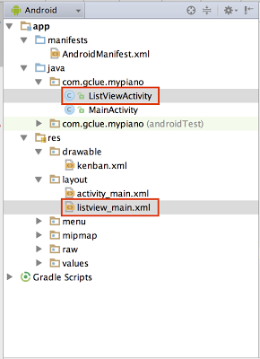

# ピアノアプリの作成(2)

## 曲選択画面用Activityの作成


listview_main.xml
```xml
<?xml version="1.0" encoding="utf-8"?>
<LinearLayout xmlns:android="http://schemas.android.com/apk/res/android"
    android:orientation="vertical"
    android:layout_width="fill_parent"
    android:layout_height="fill_parent"
    >
    <ListView
        android:layout_height="wrap_content"
        android:layout_width="fill_parent"
        android:id="@+id/listView1"
        >
    </ListView>
</LinearLayout>
```

ListViewActivity.java
```java
package com.gclue.mypiano;

import android.app.Activity;
import android.os.Bundle;
import android.view.View;
import android.widget.AdapterView;
import android.widget.ArrayAdapter;
import android.widget.ListView;
import android.widget.Toast;

public class ListViewActivity extends Activity {

    /**
     * ListView
     */
    private ListView mListView;

    /** Called when the activity is first created. */
    @Override
    public void onCreate(Bundle savedInstanceState) {
        super.onCreate(savedInstanceState);
        setContentView(R.layout.listview_main);
        // Adapterの作成
        ArrayAdapter<String> mAdapter = new ArrayAdapter<String>(this, android.R.layout.simple_list_item_1);

        // 値を追加
        mAdapter.add("曲A");
        mAdapter.add("曲B");
        mAdapter.add("曲C");

        // ListViewの取り込み
        mListView = (ListView)findViewById(R.id.listView1);

        // アダプターをセット
        mListView.setAdapter(mAdapter);

        // クリックされた時のイベントを追加
        mListView.setOnItemClickListener(new AdapterView.OnItemClickListener() {
            @Override
            public void onItemClick(AdapterView<?> parent, View view, int position, long id) {
                String selectList = (String) parent.getItemAtPosition(position);
                Toast.makeText(ListViewActivity.this, "pos="+position+":"+selectList, Toast.LENGTH_LONG).show();
            }
        });
    }
}
```

AndroidManifest.xml
```xml
<?xml version="1.0" encoding="utf-8"?>
<manifest xmlns:android="http://schemas.android.com/apk/res/android"
    package="com.gclue.mypiano" >

    <application
        android:allowBackup="true"
        android:icon="@mipmap/ic_launcher"
        android:label="@string/app_name"
        android:theme="@style/AppTheme" >
        <activity
            android:name=".MainActivity"
            android:label="@string/app_name" >
            <intent-filter>
                <action android:name="android.intent.action.MAIN" />

                <category android:name="android.intent.category.LAUNCHER" />
            </intent-filter>
        </activity>

        <activity
            android:name=".ListViewActivity">
        </activity>
        
    </application>

</manifest>
```

activity_main.xml
```xml
<RelativeLayout xmlns:android="http://schemas.android.com/apk/res/android"
    xmlns:tools="http://schemas.android.com/tools"
    android:layout_width="match_parent"
    android:layout_height="match_parent"
    android:background="#000000"
    tools:context=".PianoSample001" >

    <Button
        android:id="@+id/button1"
        android:layout_width="fill_parent"
        android:layout_height="55dp"
        android:layout_alignParentLeft="true"
        android:layout_alignParentTop="true"
        android:layout_marginLeft="0dp"
        android:layout_marginTop="1dp"
        android:background="@drawable/kenban"
        android:text="" />

    <Button
        android:id="@+id/button2"
        android:layout_width="fill_parent"
        android:layout_height="55dp"
        android:layout_alignParentLeft="true"
        android:layout_alignParentRight="true"
        android:layout_below="@+id/button1"
        android:layout_marginTop="1dp"
        android:background="@drawable/kenban"
        android:text="" />

    <Button
        android:id="@+id/button3"
        android:layout_width="fill_parent"
        android:layout_height="55dp"
        android:layout_alignParentLeft="true"
        android:layout_alignParentRight="true"
        android:layout_below="@+id/button2"
        android:layout_marginTop="1dp"
        android:background="@drawable/kenban"
        android:text="" />

    <Button
        android:id="@+id/button4"
        android:layout_width="fill_parent"
        android:layout_height="55dp"
        android:layout_alignParentLeft="true"
        android:layout_alignParentRight="true"
        android:layout_below="@+id/button3"
        android:layout_marginTop="1dp"
        android:background="@drawable/kenban"
        android:text="" />

    <Button
        android:id="@+id/button5"
        android:layout_width="fill_parent"
        android:layout_height="55dp"
        android:layout_alignParentLeft="true"
        android:layout_alignParentRight="true"
        android:layout_below="@+id/button4"
        android:layout_marginTop="1dp"
        android:background="@drawable/kenban"
        android:text="" />

    <Button
        android:id="@+id/button6"
        android:layout_width="fill_parent"
        android:layout_height="55dp"
        android:layout_alignParentLeft="true"
        android:layout_alignParentRight="true"
        android:layout_below="@+id/button5"
        android:layout_marginTop="1dp"
        android:background="@drawable/kenban"
        android:text="" />

    <Button
        android:id="@+id/button7"
        android:layout_width="fill_parent"
        android:layout_height="55dp"
        android:layout_alignParentLeft="true"
        android:layout_alignParentRight="true"
        android:layout_below="@+id/button6"
        android:layout_marginTop="1dp"
        android:background="@drawable/kenban"
        android:text="" />


    <Button
        android:id="@+id/button8"
        android:layout_width="fill_parent"
        android:layout_height="55dp"
        android:layout_alignParentLeft="true"
        android:layout_alignParentRight="true"
        android:layout_below="@+id/button7"
        android:layout_marginTop="1dp"
        android:background="@drawable/kenban"
        android:text="" />


    <Button
        android:id="@+id/buttonPlay"
        android:layout_width="fill_parent"
        android:layout_height="55dp"
        android:layout_alignParentLeft="true"
        android:layout_alignParentRight="true"
        android:layout_below="@+id/button8"
        android:layout_marginTop="10dp"
        android:text="play" />

    <Button
        android:id="@+id/buttonGet"
        android:layout_width="fill_parent"
        android:layout_height="55dp"
        android:layout_alignParentLeft="true"
        android:layout_alignParentRight="true"
        android:layout_below="@+id/buttonPlay"
        android:layout_marginTop="2dp"
        android:text="get Data" />

</RelativeLayout>
```

MainActivity.java
```java
package com.gclue.mypiano;

import android.app.Activity;
import android.content.Intent;
import android.media.MediaPlayer;
import android.os.Bundle;
import android.util.Log;
import android.view.View;
import android.view.Window;
import android.widget.Button;

import org.json.JSONArray;
import org.json.JSONException;
import org.json.JSONObject;

import java.util.ArrayList;


public class MainActivity  extends Activity implements View.OnClickListener {

    /** Button配列の定義。 */
    private ArrayList<Button> buttons = new ArrayList< Button >();
    /** サウンド配列の定義。 */
    private ArrayList<MediaPlayer> sounds = new ArrayList< MediaPlayer >();
    /** /res/layout/pianosample001_layout.xmlに記述したボタンの数。 */
    private int howManyButtons = 8;

    /** Data. */
    private String mMerodyData = "{\"title\" : \"MySound\",\"data\" : [" +
            "{\"merody\" : 0,\"time\" : 500}," +
            "{\"merody\" : 1,\"time\" : 500}," +
            "{\"merody\" : 2,\"time\" : 500}," +
            "{\"merody\" : 1,\"time\" : 500}," +
            "{\"merody\" : 2,\"time\" : 300}," +
            "{\"merody\" : 3,\"time\" : 100}," +
            "{\"merody\" : 1,\"time\" : 500}," +
            "{\"merody\" : 2,\"time\" : 300}," +
            "{\"merody\" : 3,\"time\" : 100}," +
            "{\"merody\" : 1,\"time\" : 500}," +
            "{\"merody\" : 2,\"time\" : 300}," +
            "{\"merody\" : 3,\"time\" : 100},]}";

    /** Button play. */
    private Button mButtonPlay;

    /** Button get. */
    private Button mButtonGet;

    @Override
    public void onCreate( Bundle savedInstanceState ) {
        super.onCreate( savedInstanceState );
        requestWindowFeature( Window.FEATURE_NO_TITLE );
        setContentView( R.layout.activity_main );
        mButtonPlay = (Button)findViewById(R.id.buttonPlay);
        mButtonPlay.setOnClickListener( this );
        mButtonGet = (Button)findViewById(R.id.buttonGet);
        mButtonGet.setOnClickListener( this );

        // /res/layout/pianosample_layout.xml に記述したボタンを読み込む
        addButtonAndSound(howManyButtons);
    }

    /**
     * ボタンをボタン配列に、サウンドをサウンド配列に格納する。
     * @param num ボタンの数
     */
    private void addButtonAndSound( int num ) {
        for ( int i = 0; i < num; i++ ) {
            String n = Integer.toString( i + 1 );

            // ボタンをボタン配列に格納する
            int buttonId = getResources().getIdentifier( "button" + n, "id", getPackageName() );
            Button mButton = (Button) findViewById( buttonId );
            mButton.setOnClickListener( this );
            buttons.add( mButton );

            // サウンドをサウンド配列に格納する
            // サウンドファイルがsound01のように、0が付いた2桁表示になっているため、数値の頭に0を付けた文字列を作成する
            if ( i < 10 ) {
                n = "0" + n;
            }
            int soundId = getResources().getIdentifier( "sound" + n, "raw", getPackageName() );

            MediaPlayer sound = MediaPlayer.create( this, soundId );
            sounds.add( sound );
        }
    }

    /**
     * コンポーネントがクリックされると呼び出される。
     */
    @Override
    public void onClick( View mView ) {
        if(mView.equals(mButtonPlay)) {

            JSONObject mMerodyJson = null;
            try {
                mMerodyJson = new JSONObject(mMerodyData);

                Log.i("PIANO", "title:" + mMerodyJson.get("title"));

                JSONArray datas = mMerodyJson.getJSONArray("data");

                for(int i = 0; i < datas.length(); i++) {
                    int onkai = datas.getJSONObject(i).getInt("merody");

                    buttons.get(onkai).performClick();

                    int sleepTime = datas.getJSONObject(i).getInt("time");
                    try {
                        Thread.sleep(sleepTime);
                    } catch (InterruptedException e) {
                        e.printStackTrace();
                    }
                }

            } catch (JSONException e) {
                e.printStackTrace();
            }

        } else if(mView.equals(mButtonGet)) {
            Intent selectIntent = new Intent();
            selectIntent.setClassName("com.gclue.mypiano","com.gclue.mypiano.ListViewActivity");
            startActivity(selectIntent);
        } else {
            // button配列に格納してあるButtonを一つずつ取り出し、クリックされたView(mView)とButtonが一致した場合、音を再生する。
            for (int i = 0; i < howManyButtons; i++) {
                if (mView.equals(buttons.get(i))) {
                    Log.i("PIANO", "Button" + Integer.toString(i + 1) + "がクリックされました。");
                    sounds.get(i).seekTo(0);
                    sounds.get(i).start();
                    return;
                }
            }
        }
    }
}
```

## SharedPreferenceにデータを保存

MainAxctivity.java
```java
package com.gclue.mypiano;

import android.app.Activity;
import android.content.Intent;
import android.content.SharedPreferences;
import android.media.MediaPlayer;
import android.os.Bundle;
import android.util.Log;
import android.view.View;
import android.view.Window;
import android.widget.Button;

import org.json.JSONArray;
import org.json.JSONException;
import org.json.JSONObject;

import java.util.ArrayList;


public class MainActivity  extends Activity implements View.OnClickListener {

    /** Button配列の定義。 */
    private ArrayList<Button> buttons = new ArrayList< Button >();
    /** サウンド配列の定義。 */
    private ArrayList<MediaPlayer> sounds = new ArrayList< MediaPlayer >();
    /** /res/layout/pianosample001_layout.xmlに記述したボタンの数。 */
    private int howManyButtons = 8;

    /** Button play. */
    private Button mButtonPlay;

    /** Button get. */
    private Button mButtonGet;

    @Override
    public void onCreate( Bundle savedInstanceState ) {
        super.onCreate( savedInstanceState );
        requestWindowFeature( Window.FEATURE_NO_TITLE );
        setContentView( R.layout.activity_main );
        mButtonPlay = (Button)findViewById(R.id.buttonPlay);
        mButtonPlay.setOnClickListener( this );
        mButtonGet = (Button)findViewById(R.id.buttonGet);
        mButtonGet.setOnClickListener( this );

        // /res/layout/pianosample_layout.xml に記述したボタンを読み込む
        addButtonAndSound(howManyButtons);
    }

    /**
     * ボタンをボタン配列に、サウンドをサウンド配列に格納する。
     * @param num ボタンの数
     */
    private void addButtonAndSound( int num ) {
        for ( int i = 0; i < num; i++ ) {
            String n = Integer.toString( i + 1 );

            // ボタンをボタン配列に格納する
            int buttonId = getResources().getIdentifier( "button" + n, "id", getPackageName() );
            Button mButton = (Button) findViewById( buttonId );
            mButton.setOnClickListener( this );
            buttons.add( mButton );

            // サウンドをサウンド配列に格納する
            // サウンドファイルがsound01のように、0が付いた2桁表示になっているため、数値の頭に0を付けた文字列を作成する
            if ( i < 10 ) {
                n = "0" + n;
            }
            int soundId = getResources().getIdentifier( "sound" + n, "raw", getPackageName() );

            MediaPlayer sound = MediaPlayer.create( this, soundId );
            sounds.add( sound );
        }
    }

    /**
     * コンポーネントがクリックされると呼び出される。
     */
    @Override
    public void onClick( View mView ) {
        if(mView.equals(mButtonPlay)) {

            JSONObject mMerodyJson = null;
            try {
                // MYDATAという名前のSharedPreference
                SharedPreferences settings = this.getSharedPreferences("MYDATA", this.MODE_PRIVATE);
                String mMerodyData = settings.getString("DATA","");

                mMerodyJson = new JSONObject(mMerodyData);

                Log.i("PIANO", "title:" + mMerodyJson.get("title"));

                JSONArray datas = mMerodyJson.getJSONArray("data");

                for(int i = 0; i < datas.length(); i++) {
                    int onkai = datas.getJSONObject(i).getInt("merody");

                    buttons.get(onkai).performClick();

                    int sleepTime = datas.getJSONObject(i).getInt("time");
                    try {
                        Thread.sleep(sleepTime);
                    } catch (InterruptedException e) {
                        e.printStackTrace();
                    }
                }

            } catch (JSONException e) {
                e.printStackTrace();
            }

        } else if(mView.equals(mButtonGet)) {
            Intent selectIntent = new Intent();
            selectIntent.setClassName("com.gclue.mypiano","com.gclue.mypiano.ListViewActivity");
            startActivity(selectIntent);
        } else {
            // button配列に格納してあるButtonを一つずつ取り出し、クリックされたView(mView)とButtonが一致した場合、音を再生する。
            for (int i = 0; i < howManyButtons; i++) {
                if (mView.equals(buttons.get(i))) {
                    Log.i("PIANO", "Button" + Integer.toString(i + 1) + "がクリックされました。");
                    sounds.get(i).seekTo(0);
                    sounds.get(i).start();
                    return;
                }
            }
        }
    }
}
```

ListViewActivity.java
```java
package com.gclue.mypiano;

import android.app.Activity;
import android.content.Context;
import android.content.SharedPreferences;
import android.os.Bundle;
import android.view.View;
import android.widget.AdapterView;
import android.widget.ArrayAdapter;
import android.widget.ListView;

public class ListViewActivity extends Activity {

    /**
     * ListView
     */
    private ListView mListView;

    /** Data. */
    private String mMerodyData[];

    /** Called when the activity is first created. */
    @Override
    public void onCreate(Bundle savedInstanceState) {
        super.onCreate(savedInstanceState);
        setContentView(R.layout.listview_main);
        // Adapterの作成
        ArrayAdapter<String> mAdapter = new ArrayAdapter<String>(this, android.R.layout.simple_list_item_1);

        // 値を追加
        mAdapter.add("曲A");
        mAdapter.add("曲B");
        mAdapter.add("曲C");

        mMerodyData = new String[3];
        // 曲Aデータ
        mMerodyData[0]
                = "{\"title\" : \"MySound\",\"data\" : [" +
                "{\"merody\" : 0,\"time\" : 500}," +
                "{\"merody\" : 1,\"time\" : 500}," +
                "{\"merody\" : 2,\"time\" : 500}," +
                "{\"merody\" : 1,\"time\" : 500}," +
                "{\"merody\" : 2,\"time\" : 300}," +
                "{\"merody\" : 3,\"time\" : 100}," +
                "{\"merody\" : 1,\"time\" : 500}," +
                "{\"merody\" : 2,\"time\" : 300}," +
                "{\"merody\" : 3,\"time\" : 100}," +
                "{\"merody\" : 1,\"time\" : 500}," +
                "{\"merody\" : 2,\"time\" : 300}," +
                "{\"merody\" : 3,\"time\" : 100},]}";

        // 曲Bデータ
        mMerodyData[1]
                = "{\"title\" : \"MySound\",\"data\" : [" +
                "{\"merody\" : 6,\"time\" : 500}," +
                "{\"merody\" : 5,\"time\" : 500}," +
                "{\"merody\" : 4,\"time\" : 500}," +
                "{\"merody\" : 3,\"time\" : 500}," +
                "{\"merody\" : 2,\"time\" : 300}," +
                "{\"merody\" : 2,\"time\" : 100}," +
                "{\"merody\" : 2,\"time\" : 500}," +
                "{\"merody\" : 3,\"time\" : 300}," +
                "{\"merody\" : 4,\"time\" : 100}," +
                "{\"merody\" : 5,\"time\" : 500}," +
                "{\"merody\" : 6,\"time\" : 300}," +
                "{\"merody\" : 7,\"time\" : 100},]}";

        // 曲Cデータ
        mMerodyData[2] = "{\"title\" : \"MySound\",\"data\" : [" +
                "{\"merody\" : 3,\"time\" : 500}," +
                "{\"merody\" : 4,\"time\" : 500}," +
                "{\"merody\" : 2,\"time\" : 500}," +
                "{\"merody\" : 1,\"time\" : 500}," +
                "{\"merody\" : 2,\"time\" : 300}," +
                "{\"merody\" : 3,\"time\" : 100}," +
                "{\"merody\" : 3,\"time\" : 500}," +
                "{\"merody\" : 3,\"time\" : 300}," +
                "{\"merody\" : 3,\"time\" : 100}," +
                "{\"merody\" : 3,\"time\" : 500}," +
                "{\"merody\" : 3,\"time\" : 300}," +
                "{\"merody\" : 3,\"time\" : 100},]}";

        // ListViewの取り込み
        mListView = (ListView)findViewById(R.id.listView1);

        // アダプターをセット
        mListView.setAdapter(mAdapter);

        // Contextを取得.
        final Context mContext =  this.getBaseContext();

        // クリックされた時のイベントを追加
        mListView.setOnItemClickListener(new AdapterView.OnItemClickListener() {
            @Override
            public void onItemClick(AdapterView<?> parent, View view, int position, long id) {

                // MYDATAという名前のSharedPreference.
                SharedPreferences settings = mContext.getSharedPreferences("MYDATA", mContext.MODE_PRIVATE);

                // SharePreferenceに保存.
                SharedPreferences.Editor editor = settings.edit();
                editor.putString("DATA", mMerodyData[position]);
                editor.commit();

                finish();

            }
        });
    }
}
```


## Githubからデータ取得
Githubから取得する

データをPushしておく
https://raw.githubusercontent.com/micknerd/Aizu/master/akira/data0.json
https://raw.githubusercontent.com/micknerd/Aizu/master/akira/data1.json
https://raw.githubusercontent.com/micknerd/Aizu/master/akira/data2.json


ListViewActivity.java
```java
package com.gclue.mypiano;

import android.app.Activity;
import android.content.Context;
import android.content.SharedPreferences;
import android.os.Bundle;
import android.view.View;
import android.widget.AdapterView;
import android.widget.ArrayAdapter;
import android.widget.ListView;

public class ListViewActivity extends Activity {

    /**
     * ListView
     */
    private ListView mListView;

    /** Data. */
    private String mMerodyData[];

    /** Called when the activity is first created. */
    @Override
    public void onCreate(Bundle savedInstanceState) {
        super.onCreate(savedInstanceState);
        setContentView(R.layout.listview_main);
        // Adapterの作成
        ArrayAdapter<String> mAdapter = new ArrayAdapter<String>(this, android.R.layout.simple_list_item_1);

        // 値を追加
        mAdapter.add("曲A");
        mAdapter.add("曲B");
        mAdapter.add("曲C");

        mMerodyData = new String[3];
        // 曲Aデータ
        mMerodyData[0]
                = "{\"title\" : \"MySound\",\"data\" : [" +
                "{\"merody\" : 0,\"time\" : 500}," +
                "{\"merody\" : 1,\"time\" : 500}," +
                "{\"merody\" : 2,\"time\" : 500}," +
                "{\"merody\" : 1,\"time\" : 500}," +
                "{\"merody\" : 2,\"time\" : 300}," +
                "{\"merody\" : 3,\"time\" : 100}," +
                "{\"merody\" : 1,\"time\" : 500}," +
                "{\"merody\" : 2,\"time\" : 300}," +
                "{\"merody\" : 3,\"time\" : 100}," +
                "{\"merody\" : 1,\"time\" : 500}," +
                "{\"merody\" : 2,\"time\" : 300}," +
                "{\"merody\" : 3,\"time\" : 100},]}";

        // 曲Bデータ
        mMerodyData[1]
                = "{\"title\" : \"MySound\",\"data\" : [" +
                "{\"merody\" : 6,\"time\" : 500}," +
                "{\"merody\" : 5,\"time\" : 500}," +
                "{\"merody\" : 4,\"time\" : 500}," +
                "{\"merody\" : 3,\"time\" : 500}," +
                "{\"merody\" : 2,\"time\" : 300}," +
                "{\"merody\" : 2,\"time\" : 100}," +
                "{\"merody\" : 2,\"time\" : 500}," +
                "{\"merody\" : 3,\"time\" : 300}," +
                "{\"merody\" : 4,\"time\" : 100}," +
                "{\"merody\" : 5,\"time\" : 500}," +
                "{\"merody\" : 6,\"time\" : 300}," +
                "{\"merody\" : 7,\"time\" : 100},]}";

        // 曲Cデータ
        mMerodyData[2] = "{\"title\" : \"MySound\",\"data\" : [" +
                "{\"merody\" : 3,\"time\" : 500}," +
                "{\"merody\" : 4,\"time\" : 500}," +
                "{\"merody\" : 2,\"time\" : 500}," +
                "{\"merody\" : 1,\"time\" : 500}," +
                "{\"merody\" : 2,\"time\" : 300}," +
                "{\"merody\" : 3,\"time\" : 100}," +
                "{\"merody\" : 3,\"time\" : 500}," +
                "{\"merody\" : 3,\"time\" : 300}," +
                "{\"merody\" : 3,\"time\" : 100}," +
                "{\"merody\" : 3,\"time\" : 500}," +
                "{\"merody\" : 3,\"time\" : 300}," +
                "{\"merody\" : 3,\"time\" : 100},]}";

        // ListViewの取り込み
        mListView = (ListView)findViewById(R.id.listView1);

        // アダプターをセット
        mListView.setAdapter(mAdapter);

        // Contextを取得.
        final Context mContext =  this.getBaseContext();

        // クリックされた時のイベントを追加
        mListView.setOnItemClickListener(new AdapterView.OnItemClickListener() {
            @Override
            public void onItemClick(AdapterView<?> parent, View view, int position, long id) {

                    (new Thread(new Runnable() {
                        @Override
                        public void run() {
            
                            String response = "";
                            DefaultHttpClient client = new DefaultHttpClient();
                            HttpGet httpGet = new HttpGet("https://raw.githubusercontent.com/micknerd/Aizu/master/akira/data" + position + ".json");
                            try {
                                HttpResponse execute = client.execute(httpGet);
                                InputStream content = execute.getEntity().getContent();
            
                                BufferedReader buffer = new BufferedReader(new InputStreamReader(content));
                                String line = "";
                                while ((line = buffer.readLine()) != null) {
                                    response += line;
                                }
            
                                Log.i("LIFE", response);
                            } catch (Exception e) {
                                Log.i("LIFE", "error" + e);
            
                            }
            
                            // MYDATAという名前のSharedPreference.
                            SharedPreferences settings = mContext.getSharedPreferences("MYDATA", mContext.MODE_PRIVATE);
            
                            // SharePreferenceに保存.
                            SharedPreferences.Editor editor = settings.edit();
                            editor.putString("DATA", response);
                            editor.commit();
                        }
                    })).start();

                finish();

            }
        });
    }
}
```

AndroidManifest.xml
```xml
<?xml version="1.0" encoding="utf-8"?>
<manifest xmlns:android="http://schemas.android.com/apk/res/android"
    package="com.gclue.mypiano" >

    <uses-permission android:name="android.permission.INTERNET" />

    <application
        android:allowBackup="true"
        android:icon="@mipmap/ic_launcher"
        android:label="@string/app_name"
        android:theme="@style/AppTheme" >
        <activity
            android:name=".MainActivity"
            android:label="@string/app_name" >
            <intent-filter>
                <action android:name="android.intent.action.MAIN" />

                <category android:name="android.intent.category.LAUNCHER" />
            </intent-filter>
        </activity>

        <activity
            android:name=".ListViewActivity">
        </activity>
        
    </application>

</manifest>
```


