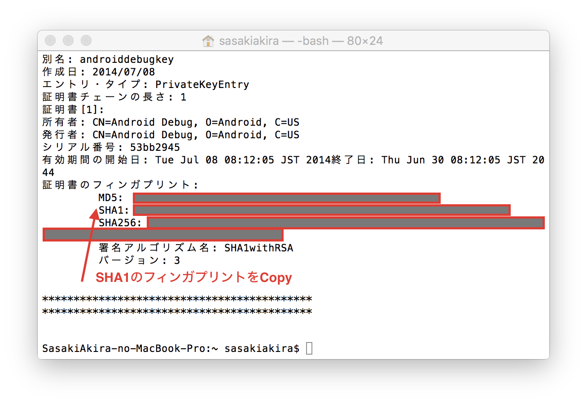

# API Keyの取得

## 証明書のフィンガプリントの取得

まず、Googke Maps API Keyを発行するために、開発で使用しているMacのフィンガプリントの取得をおこないます。

    $  keytool -list -v -keystore ~/.android/debug.keystore

## Google API Consoleでプロジェクトを作成

https://code.google.com/apis/console/?pli=1

にログインします。

プロジェクト作成をクリックします。

