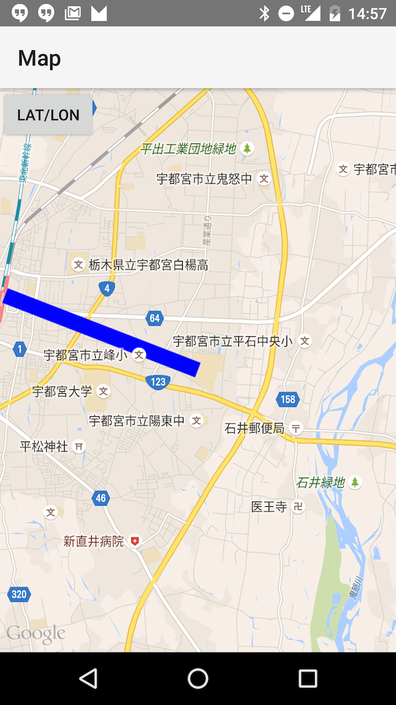
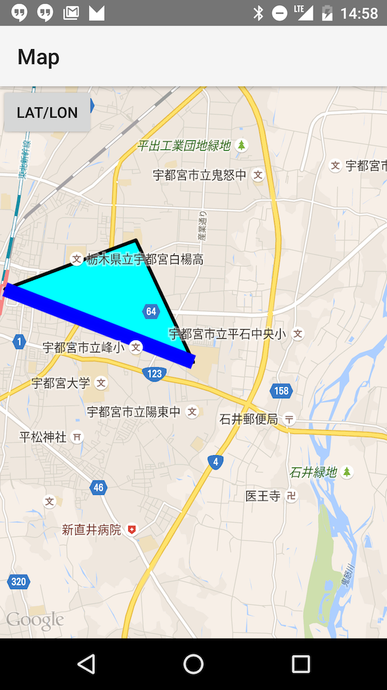
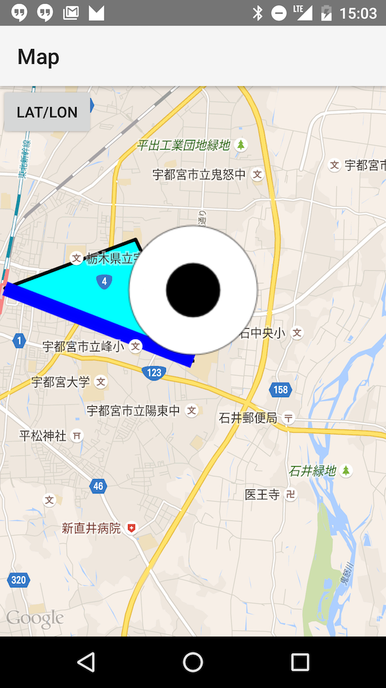

# Mapsの装飾

##　線を引く

```java
    private void setUpMap() {

        mMap.addMarker(new MarkerOptions().position(new LatLng(0, 0)).title("Marker"));

        LatLng startPos = new LatLng(36.550796, 139.929061);
        LatLng endPos = new LatLng(36.560147, 139.898935);

        mMap.addPolyline(new PolylineOptions()
                .add(startPos, endPos)
                .width(40)
                .color(Color.BLUE));

        mMap.moveCamera(CameraUpdateFactory.newLatLng(startPos));
        mMap.animateCamera(CameraUpdateFactory.zoomTo(13));
        
    }
```



## 三角形

```
   private void setUpMap() {

        mMap.addMarker(new MarkerOptions().position(new LatLng(0, 0)).title("Marker"));

        LatLng startPos = new LatLng(36.550796, 139.929061);
        LatLng endPos = new LatLng(36.560147, 139.898935);

        mMap.addPolyline(new PolylineOptions()
                .add(startPos, endPos)
                .width(40)
                .color(Color.BLUE));

        LatLng pos1 = new LatLng(36.550796, 139.929061);
        LatLng pos2 = new LatLng(36.566421, 139.919877);
        LatLng pos3 = new LatLng(36.560147, 139.898935);

        mMap.addPolygon(new PolygonOptions()
                .add(pos1, pos2, pos3)
                .fillColor(Color.CYAN));

        mMap.moveCamera(CameraUpdateFactory.newLatLng(startPos));
        mMap.animateCamera(CameraUpdateFactory.zoomTo(13));

    }
```



## 画像マーカーの追加

```
   private void setUpMap() {

        mMap.addMarker(new MarkerOptions().position(new LatLng(0, 0)).title("Marker"));

        LatLng startPos = new LatLng(36.550796, 139.929061);
        LatLng endPos = new LatLng(36.560147, 139.898935);

        mMap.addPolyline(new PolylineOptions()
                .add(startPos, endPos)
                .width(40)
                .color(Color.BLUE));

        LatLng pos1 = new LatLng(36.550796, 139.929061);
        LatLng pos2 = new LatLng(36.566421, 139.919877);
        LatLng pos3 = new LatLng(36.560147, 139.898935);

        mMap.addPolygon(new PolygonOptions()
                .add(pos1, pos2, pos3)
                .fillColor(Color.CYAN));

        LatLng eyePos = new LatLng(36.550796, 139.929061);
        Marker eyeMarker = mMap.addMarker(new MarkerOptions()
                .position(eyePos)
                .title("Eye")
                .snippet("Image of Eye")
                .icon(BitmapDescriptorFactory.fromResource(R.drawable.eye)));

        mMap.moveCamera(CameraUpdateFactory.newLatLng(startPos));
        mMap.animateCamera(CameraUpdateFactory.zoomTo(13));

    }
```

