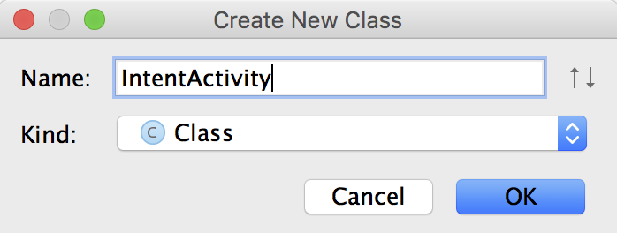
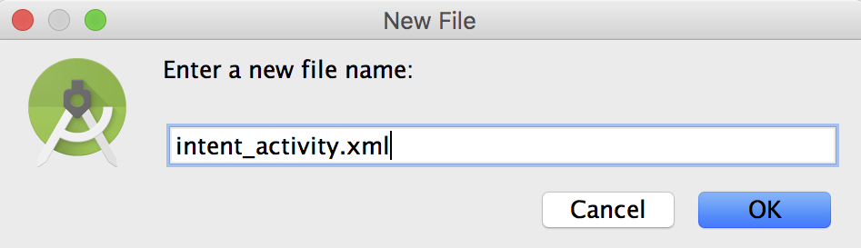

# Intentを作成する


Intentを呼び出す手段

- 明示的なIntent起動
- 暗黙的なIntent起動

があります。明示的なIntent起動では、パッケージ名とクラス名を指定します。明示的なIntentでは、アクション名を指定します。

明示的
```java
Intent selectIntent = new Intent();
selectIntent.setClassName("com.example.intentcooperationsample","com.example.intentcooperationsample.MyActivity");
startActivityForResult(selectIntent, 1);
```
暗黙的
```java
Uri uri = Uri.parse("http://www.gclue.com/");
Intent browserIntent = new Intent(Intent.ACTION_VIEW,uri);
startActivity(browserIntent);
```

AndroidManifest.xml
```xml
<?xml version="1.0" encoding="utf-8"?>
<manifest xmlns:android="http://schemas.android.com/apk/res/android"
    package="utsunomiya.gclue.com.intentsample" >

    <uses-feature android:name="android.hardware.camera" android:required="true" />

    <application
        android:allowBackup="true"
        android:icon="@mipmap/ic_launcher"
        android:label="@string/app_name"
        android:theme="@style/AppTheme" >
        <activity
            android:name=".MainActivity"
            android:label="@string/app_name" >
            <intent-filter>
                <action android:name="android.intent.action.MAIN" />

                <category android:name="android.intent.category.LAUNCHER" />
            </intent-filter>
        </activity>
    </application>

</manifest>
```


Intenr-filterタグでフィルターをかける

            <intent-filter>
                <action android:name="android.intent.action.MAIN" />

                <category android:name="android.intent.category.LAUNCHER" />
            </intent-filter>


# 呼び出し時に呼ばれるメソッド

## 呼び出し側

Intentの記述
```
Intent mIntent = new Intent();
mIntent.setAction("アクション名");
```

Activityを呼び出す
- startActivity(インテント)
- startActivityForResult(インテント)

Serviceを呼び出す
- startService(インテント)

Broadcast
- sendBroadcast(インテント)


# 受信側Activityを作成する




IntentActivity.java
```java
package utsunomiya.gclue.com.intentsample;

import android.app.Activity;
import android.content.Intent;
import android.os.Bundle;
import android.view.View;
import android.widget.Button;

public class IntentActivity extends Activity implements View.OnClickListener {

    /** 戻るボタン. */
    private Button mButtonBack;

    @Override
    public void onCreate(Bundle savedInstanceState) {
        super.onCreate(savedInstanceState);
        setContentView(R.layout.intent_activity);

        mButtonBack = (Button) findViewById(R.id.buttonBack);
        mButtonBack.setOnClickListener(this);
    }

    @Override
    public void onClick(View v) {

        if(v.equals(mButtonBack)){

            Intent myIntent = new Intent();
            myIntent.putExtra("RESULT", "result of Intent");

            setResult(1, myIntent);
            this.finish();
        }
    }
}
```




intent_activity.xml
```
<RelativeLayout xmlns:android="http://schemas.android.com/apk/res/android"
    xmlns:tools="http://schemas.android.com/tools" android:layout_width="match_parent"
    android:layout_height="match_parent" android:paddingLeft="@dimen/activity_horizontal_margin"
    android:paddingRight="@dimen/activity_horizontal_margin"
    android:paddingTop="@dimen/activity_vertical_margin"
    android:paddingBottom="@dimen/activity_vertical_margin" tools:context=".MainActivity">

    <Button
        android:layout_width="wrap_content"
        android:layout_height="wrap_content"
        android:text="Back"
        android:id="@+id/buttonBack"
        android:layout_alignParentTop="true"
        android:layout_alignParentStart="true" />

</RelativeLayout>

```

## 送信側

MainActivity.java
```java
package utsunomiya.gclue.com.intentsample;

import android.app.Activity;
import android.content.ContentResolver;
import android.content.ContentValues;
import android.content.Intent;
import android.graphics.Bitmap;
import android.graphics.BitmapFactory;
import android.net.Uri;
import android.os.Bundle;
import android.os.Environment;
import android.provider.MediaStore;
import android.util.Log;
import android.view.Menu;
import android.view.MenuItem;
import android.view.View;
import android.widget.Button;
import android.widget.ImageView;
import android.widget.Toast;
import android.widget.VideoView;

import java.io.File;
import java.io.IOException;
import java.text.SimpleDateFormat;
import java.util.Date;

public class MainActivity extends Activity implements View.OnClickListener {

    /** Button. */
    private Button mButton;

    /** インテント呼び出し時のRquestCode(任意の値). */
    static final int REQUEST_INTENT_SAMPLE = 1;

    /** TAG. */
    private final String TAG = "INTENT";

    @Override
    protected void onCreate(Bundle savedInstanceState) {
        super.onCreate(savedInstanceState);
        setContentView(R.layout.activity_main);

        // xmlからButtonを取り込む
        mButton = (Button) findViewById(R.id.button);
        mButton.setOnClickListener(this);
    }

    @Override
    public boolean onCreateOptionsMenu(Menu menu) {
        // Inflate the menu; this adds items to the action bar if it is present.
        getMenuInflater().inflate(R.menu.menu_main, menu);
        return true;
    }

    @Override
    public boolean onOptionsItemSelected(MenuItem item) {
        // Handle action bar item clicks here. The action bar will
        // automatically handle clicks on the Home/Up button, so long
        // as you specify a parent activity in AndroidManifest.xml.
        int id = item.getItemId();

        //noinspection SimplifiableIfStatement
        if (id == R.id.action_settings) {
            return true;
        }

        return super.onOptionsItemSelected(item);
    }

    @Override
    public void onClick(View v) {

        if (v.equals(mButton)) {

            Intent mIntent = new Intent();
            mIntent.putExtra("MYVALUE", "Value of mine");
            mIntent.setClassName("utsunomiya.gclue.com.intentsample",
                    "utsunomiya.gclue.com.intentsample.IntentActivity");
            startActivityForResult(mIntent, REQUEST_INTENT_SAMPLE);
        }
    }

    @Override
    protected void onActivityResult(int requestCode, int resultCode, Intent data) {

        if (requestCode == REQUEST_INTENT_SAMPLE && resultCode == RESULT_OK) {
            String result = data.getStringExtra("RESULT");
            Toast.makeText(this, "Result:"+result, Toast.LENGTH_LONG).show();
        }
    }
}
```

activity_main.xml
```xml
<RelativeLayout xmlns:android="http://schemas.android.com/apk/res/android"
    xmlns:tools="http://schemas.android.com/tools" android:layout_width="match_parent"
    android:layout_height="match_parent" android:paddingLeft="@dimen/activity_horizontal_margin"
    android:paddingRight="@dimen/activity_horizontal_margin"
    android:paddingTop="@dimen/activity_vertical_margin"
    android:paddingBottom="@dimen/activity_vertical_margin" tools:context=".MainActivity">

    <Button
        android:layout_width="wrap_content"
        android:layout_height="wrap_content"
        android:text="Intent Sample"
        android:id="@+id/button"
        android:layout_alignParentTop="true"
        android:layout_alignParentStart="true" />

</RelativeLayout>
```

## AndroidManifestの設定

AndroidManifest.xml
```xml
<?xml version="1.0" encoding="utf-8"?>
<manifest xmlns:android="http://schemas.android.com/apk/res/android"
    package="utsunomiya.gclue.com.intentsample" >

    <uses-feature android:name="android.hardware.camera" android:required="true" />

    <application
        android:allowBackup="true"
        android:icon="@mipmap/ic_launcher"
        android:label="@string/app_name"
        android:theme="@style/AppTheme" >
        <activity
            android:name=".MainActivity"
            android:label="@string/app_name" >
            <intent-filter>
                <action android:name="android.intent.action.MAIN" />

                <category android:name="android.intent.category.LAUNCHER" />
            </intent-filter>
        </activity>

        <activity
            android:name=".IntentActivity"
            android:label="@string/app_name" >
            <intent-filter>
                <action android:name="android.intent.action.MAIN" />

                <category android:name="android.intent.category.DEFAULT" />
            </intent-filter>
        </activity>

    </application>

</manifest>

```