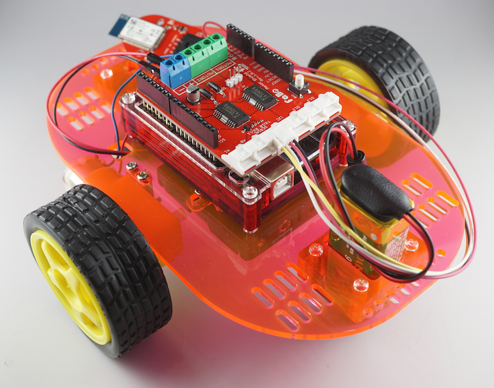

# ロボットカー制御

<center>

ここではロボットカーキットの組み立てと、Android端末から走行の制御をしてみたいと思います。


## ロボットカー組み立て

ロボットカーの組み立て方法、および配線はこちらをご参照下さい。
<br>
https://sites.google.com/a/gclue.jp/roboka-zuo-cheng/home


## 使用するシールド
今回はFaBoのモーターシールドを使用します。
<br>
使用方法はこちらをご参照下さい。

モーターシールド
<br>
https://fabo.gitbooks.io/module/content/shield_motor/shield_motor.html

## 使用するBrick
Bluetooth
<br>
https://fabo.gitbooks.io/module/content/brick_serial_bluetooth/brick_serial_bluetooth.html


## Arduino

Arduino側では、Android端末から受信したデータにより前進、後退、停止するプログラムを書きます。
```c
#include <SoftwareSerial.h>

#define led1 A0     // A0番ピンにてLEDを制御
#define led2 A1     // A1番ピンにてLEDを制御

#define right_f 4   // 右タイヤのモーター前進用ピン
#define right_pow 3 // 右タイヤのモーター出力設定用ピン
#define right_b 2   // 右タイヤのモーター後退用ピン

#define left_f 5    // 左タイヤのモーター用ピン(前進用)
#define left_pow 6  // 左タイヤのモーター出力設定用ピン
#define left_b 7    // 左タイヤのモーター用ピン(後退用)

SoftwareSerial android(12, 13); // Bluetooth用シリアル通信ピン

char readData = 0;  // androidからのテキスト取得用

void setup() {
  // 右側のタイヤ制御用
  pinMode(right_f, OUTPUT);
  pinMode(right_b, OUTPUT);
  pinMode(right_pow, OUTPUT);

  // 左側のタイヤ制御用
  pinMode(left_f, OUTPUT);
  pinMode(left_b, OUTPUT);
  pinMode(left_pow, OUTPUT);

  // Bluetooth用のシリアルのポートを設定
  android.begin(115200);
  
  // arduinoのシリアルモニタ用
  Serial.begin(9600);

  Serial.println("start");
}

void loop() {

  if (android.available()) {
    // Androidからデータ受信
    readData = android.read();
    Serial.write(readData);
    Serial.write(10);

    // 受信データによりロボカーの制御を行う
    // 前進
    if (readData == '1') {
      // 右タイヤ前進(H/L)
      digitalWrite(right_f, HIGH);
      digitalWrite(right_b, LOW);
      analogWrite(right_pow, 255); // 0-255 強さ

      // 左タイヤ前進(H/L)
      digitalWrite(left_f, HIGH);
      digitalWrite(left_b, LOW);
      analogWrite(left_pow, 255);  // 0-255 強さ
    }
    // 後退
    else if ( readData == '2') {
      // 右タイヤ後退(L/H)
      digitalWrite(right_f, LOW);
      digitalWrite(right_b, HIGH);
      analogWrite(right_pow, 255); // 0-255 強さ

      // 左タイヤ後退(L/H)
      digitalWrite(left_f, LOW);
      digitalWrite(left_b, HIGH);
      analogWrite(left_pow, 255);  // 0-255 強さ
    }
    // 停止
    else {
      // 右タイヤ停止(L/L)
      digitalWrite(right_f, LOW);
      digitalWrite(right_b, LOW);
      analogWrite(right_pow, 0);   // 0-255 強さ

      // 左タイヤ後退(L/L)
      digitalWrite(left_f, LOW);
      digitalWrite(left_b, LOW);
      analogWrite(left_pow, 0);    // 0-255 強さ
    }
  }
}
```
## Android
### Bluetooth認識設定

Bluetoothの認識設定を行います。
<br>
[app]>[src]>[main]>[res]内のAndroidManifest.xmlを開き、下記の内容を追加します。

```xml
<uses-permission android:name="android.permission.BLUETOOTH" />
<uses-permission android:name="android.permission.BLUETOOTH_ADMIN" />
```
    
#### AndroidManifest.xml
変更後はこのような状態になります。
```xml
<?xml version="1.0" encoding="utf-8"?>
<manifest xmlns:android="http://schemas.android.com/apk/res/android"
    package="gclue.com.mybluetooth" >

    <uses-permission android:name="android.permission.BLUETOOTH" />
    <uses-permission android:name="android.permission.BLUETOOTH_ADMIN" />

    <application
        android:allowBackup="true"
        android:icon="@drawable/ic_launcher"
        android:label="@string/app_name"
        android:theme="@style/AppTheme" >
        <activity
            android:name=".MainActivity"
            android:label="@string/app_name" >
            <intent-filter>
                <action android:name="android.intent.action.MAIN" />

                <category android:name="android.intent.category.LAUNCHER" />
            </intent-filter>
        </activity>
    </application>

</manifest>
```
###画面レイアウト
ロボカー操作用に↑ボタン、Stopボタン、↓ボタンを配置します。

activity_main.xml
```xml
<?xml version="1.0" encoding="utf-8"?>

<LinearLayout xmlns:android="http://schemas.android.com/apk/res/android"
    android:layout_width="fill_parent"
    android:layout_height="fill_parent"
    android:orientation="vertical" >

    <Button android:id="@+id/connectButton"
        android:layout_width="fill_parent"
        android:layout_height="wrap_content"
        android:text="Connect" />

    <TextView
        android:id="@+id/statusValue"
        android:layout_width="fill_parent"
        android:layout_height="wrap_content"
        />

    <TextView
        android:id="@+id/inputValue"
        android:layout_width="fill_parent"
        android:layout_height="wrap_content"
        />

    <Button android:id="@+id/forwardButton"
        android:layout_width="wrap_content"
        android:layout_height="wrap_content"
        android:layout_gravity="center_horizontal"
        android:text="↑" />

    <Button android:id="@+id/stopButton"
        android:layout_width="wrap_content"
        android:layout_height="wrap_content"
        android:layout_gravity="center_horizontal"
        android:text="stop" />

    <Button android:id="@+id/backButton"
        android:layout_width="wrap_content"
        android:layout_height="wrap_content"
        android:layout_gravity="center_horizontal"
        android:text="↓" />

</LinearLayout>
```

次にメインの処理を作成します。

MainActivity.java
```java
package sample.robo;

import android.bluetooth.BluetoothAdapter;
import android.bluetooth.BluetoothDevice;
import android.bluetooth.BluetoothSocket;
import android.os.Bundle;
import android.os.Handler;
import android.os.Message;
//import android.support.v7.app.ActionBarActivity;
import android.support.v7.app.AppCompatActivity;

import android.util.Log;
import android.view.View;
import android.widget.Button;
import android.widget.TextView;

import java.io.IOException;
import java.io.InputStream;
import java.io.OutputStream;
import java.util.Set;
import java.util.UUID;

//public class MainActivity extends ActionBarActivity implements Runnable, View.OnClickListener {
public class MainActivity extends AppCompatActivity implements Runnable, View.OnClickListener {

    /* tag */
    private static final String TAG = "BluetoothSample";

    /* Bluetooth Adapter */
    private BluetoothAdapter mAdapter;

    /* Bluetoothデバイス */
    private BluetoothDevice mDevice;

    /* Bluetooth UUID (固定）*/
    private final UUID MY_UUID = UUID.fromString("00001101-0000-1000-8000-00805F9B34FB");

    /* デバイス名 環境に合ったものに変更*/
    private final String DEVICE_NAME = "RNBT-71EE";

    /* Soket */
    private BluetoothSocket mSocket;

    /* Thread */
    private Thread mThread;

    /* Threadの状態を表す */
    private boolean isRunning;

    /** 接続ボタン. */
    private Button connectButton;

    /** 前進ボタン. */
    private Button forwardButton;

    /** 後退ボタン. */
    private Button backButton;

    /** STOPボタン. */
    private Button stopButton;

    /** ステータス. */
    private TextView mStatusTextView;

    /** Bluetoothから受信した値. */
    private TextView mInputTextView;

    /** Action(ステータス表示). */
    private static final int VIEW_STATUS = 0;

    /** Action(取得文字列). */
    private static final int VIEW_INPUT = 1;

    /** BluetoothのOutputStream. */
    OutputStream mmOutputStream = null;

    /** Connect状態確認用フラグ. */
    private boolean connectFlg = false;

    @Override
    public void onCreate(Bundle savedInstanceState){
        super.onCreate(savedInstanceState);
        // Layoutにて設定したビューを表示
        setContentView(R.layout.activity_main);

        // TextViewの設定(Layoutにて設定したものを関連付け)
        mInputTextView = (TextView)findViewById(R.id.inputValue);
        mStatusTextView = (TextView)findViewById(R.id.statusValue);

        // Buttonの設定(Layoutにて設定したものを関連付け)
        connectButton = (Button)findViewById(R.id.connectButton);
        forwardButton = (Button)findViewById(R.id.forwardButton);
        backButton  = (Button)findViewById(R.id.backButton);
        stopButton  = (Button)findViewById(R.id.stopButton);

        // ボタンのイベント設定
        connectButton.setOnClickListener(this);
        forwardButton.setOnClickListener(this);
        backButton.setOnClickListener(this);
        stopButton.setOnClickListener(this);

        // Bluetoothのデバイス名を取得
        // デバイス名は、RNBT-XXXXになるため、
        // DVICE_NAMEでデバイス名を定義
        mAdapter = BluetoothAdapter.getDefaultAdapter();
        mStatusTextView.setText("SearchDevice");
        Set< BluetoothDevice > devices = mAdapter.getBondedDevices();
        for ( BluetoothDevice device : devices){

            if(device.getName().equals(DEVICE_NAME)){
                mStatusTextView.setText("find: " + device.getName());
                mDevice = device;
            }
        }
    }

    // 別のアクティビティが起動した場合の処理
    @Override
    protected void onPause(){
        super.onPause();

        isRunning  = false;
        connectFlg = false;

        try{
            mSocket.close();
        }
        catch(Exception e){}
    }

    // スレッド処理(connectボタン押下後に実行)
    @Override
    public void run() {
        InputStream mmInStream = null;

        Message valueMsg = new Message();
        valueMsg.what = VIEW_STATUS;
        valueMsg.obj = "connecting...";
        mHandler.sendMessage(valueMsg);

        try{
            // 取得したデバイス名を使ってBluetoothでSocket接続
            mSocket = mDevice.createRfcommSocketToServiceRecord(MY_UUID);
            mSocket.connect();
            mmInStream = mSocket.getInputStream();
            mmOutputStream = mSocket.getOutputStream();

            // InputStreamのバッファを格納
            byte[] buffer = new byte[1024];

            // 取得したバッファのサイズを格納
            int bytes;
            valueMsg = new Message();
            valueMsg.what = VIEW_STATUS;
            valueMsg.obj = "connected.";
            mHandler.sendMessage(valueMsg);

            connectFlg = true;

            while(isRunning){

                // InputStreamの読み込み
                bytes = mmInStream.read(buffer);
                Log.i(TAG,"bytes="+bytes);
                // String型に変換
                String readMsg = new String(buffer, 0, bytes);

                // null以外なら表示
                if(readMsg.trim() != null && !readMsg.trim().equals("")){
                    Log.i(TAG,"value="+readMsg.trim());

                    valueMsg = new Message();
                    valueMsg.what = VIEW_INPUT;
                    valueMsg.obj = readMsg;
                    mHandler.sendMessage(valueMsg);
                }
            }
        }
        // エラー処理
        catch(Exception e){

            valueMsg = new Message();
            valueMsg.what = VIEW_STATUS;
            valueMsg.obj = "Error1:" + e;
            mHandler.sendMessage(valueMsg);

            try{
                mSocket.close();
            }catch(Exception ee){}
            isRunning  = false;
            connectFlg = false;
        }
    }

    // ボタン押下時の処理
    @Override
    public void onClick(View v) {
        // Connectボタン
        if(v.equals(connectButton)) {
            if(!connectFlg) {

                mStatusTextView.setText("try connect");

                mThread = new Thread(this);
                // Threadを起動し、Bluetooth接続
                isRunning = true;
                mThread.start();
            }
        }
        // ↑ボタン
        else if(v.equals(forwardButton)) {
            if(connectFlg) {
                try {
                    // ↑ボタン押下時、'1'を送信
                    mmOutputStream.write("1".getBytes());
                    // 画面上に'↑:'を表示
                    mStatusTextView.setText("↑:");
                } catch (IOException e) {
                    Message valueMsg = new Message();
                    valueMsg.what = VIEW_STATUS;
                    valueMsg.obj = "Error1:" + e;
                    mHandler.sendMessage(valueMsg);
                }
            }
            // Connectボタンにより接続されていない場合
            else {
                mStatusTextView.setText("Please push the connect button");
            }
        }
        // ↓ボタン
        else if(v.equals(backButton)) {
            if(connectFlg) {
                try {
                    // ↓ボタン押下時、'2'を送信
                    mmOutputStream.write("2".getBytes());
                    // 画面上に'↓:'を表示
                    mStatusTextView.setText("↓:");
                } catch (IOException e) {
                    Message valueMsg = new Message();
                    valueMsg.what = VIEW_STATUS;
                    valueMsg.obj = "Error2:" + e;
                    mHandler.sendMessage(valueMsg);
                }
            }
            // Connectボタンにより接続されていない場合
            else {
                mStatusTextView.setText("Please push the connect button");
            }
        }
        // stopボタン
        else if(v.equals(stopButton)) {
            if(connectFlg) {
                try {
                    // stopボタン押下時、'0'を送信
                    mmOutputStream.write("0".getBytes());
                    // 画面上に'STOP:'を表示
                    mStatusTextView.setText("STOP:");
                } catch (IOException e) {
                    Message valueMsg = new Message();
                    valueMsg.what = VIEW_STATUS;
                    valueMsg.obj = "Error5:" + e;
                    mHandler.sendMessage(valueMsg);
                }
            }
            // Connectボタンにより接続されていない場合
            else {
                mStatusTextView.setText("Please push the connect button");
            }
        }
    }

    /**
     * 描画処理はHandlerでおこなう
     */
    Handler mHandler = new Handler() {
        @Override
        public void handleMessage(Message msg) {
            int action = msg.what;
            String msgStr = (String)msg.obj;
            if(action == VIEW_INPUT){
                mInputTextView.setText(msgStr);
            }
            else if(action == VIEW_STATUS){
                mStatusTextView.setText(msgStr);
            }
        }
    };
}
```

これでプログラムは完了です。

まず、ロボットカーに単三電池４本(モーター用)、9V電池(Arduino電源用)を接続します。

AndroidとBluetooth接続し、画面のボタンからロボットカーを操作してみてください。


ここまで出来ましたら以下の内容を試してみましょう。

１．右旋回、左旋回機能を追加
<br>
２．速度変更
<br>
３．センサーを接続し、取得した値をAndroid端末に送信
<br>
４．センサーの値により動作変更（暗くなったら遅くなるなど）