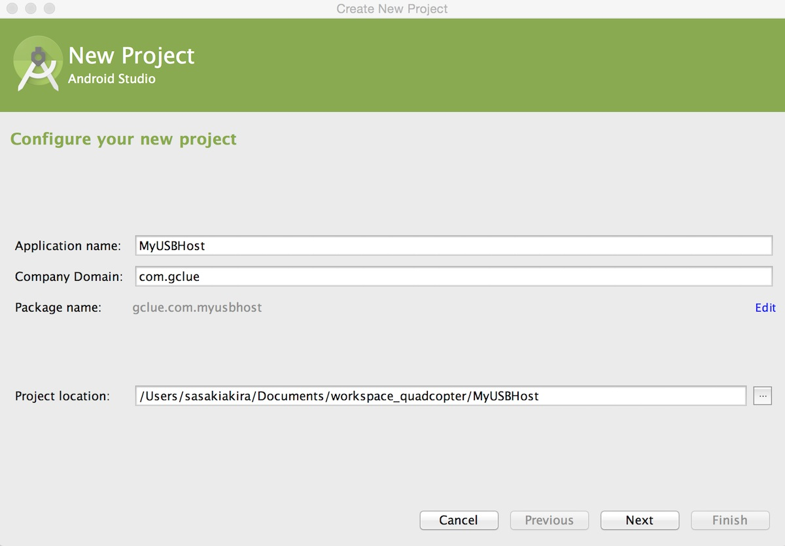
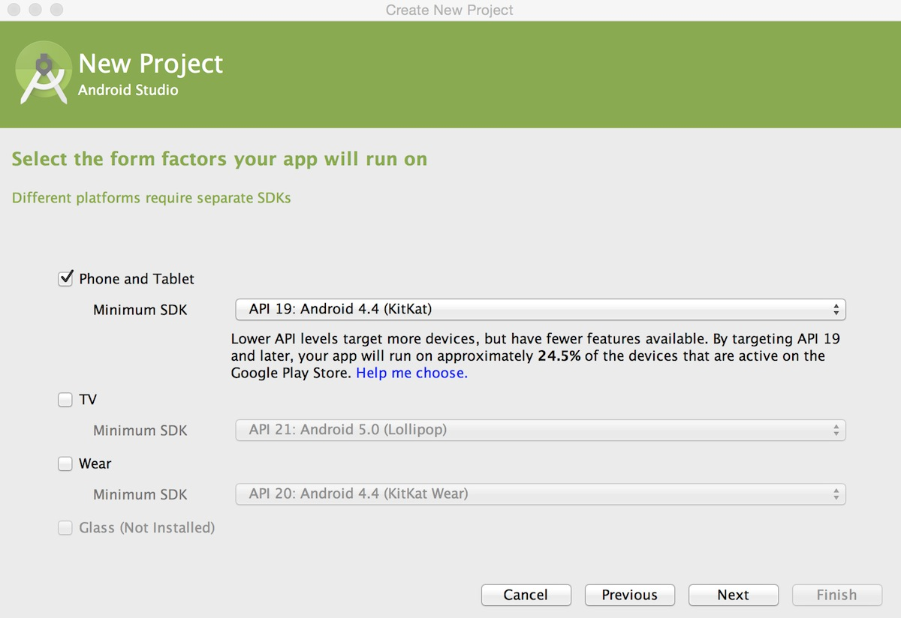
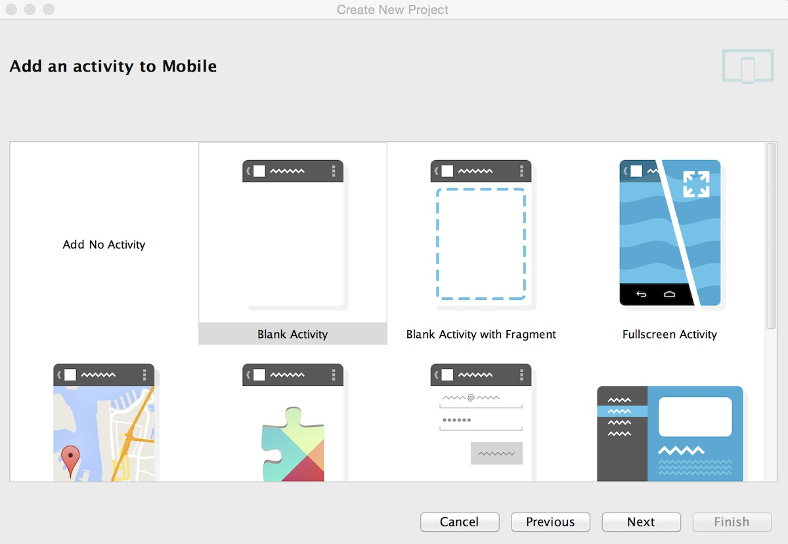
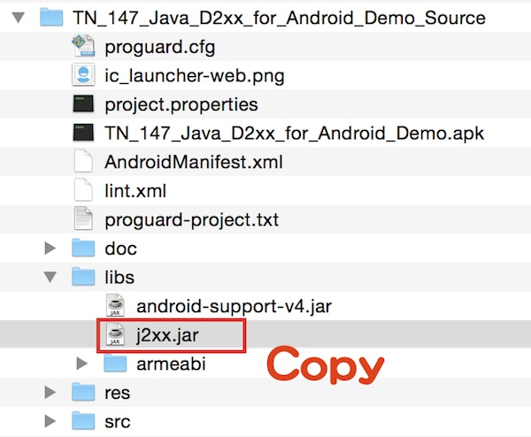
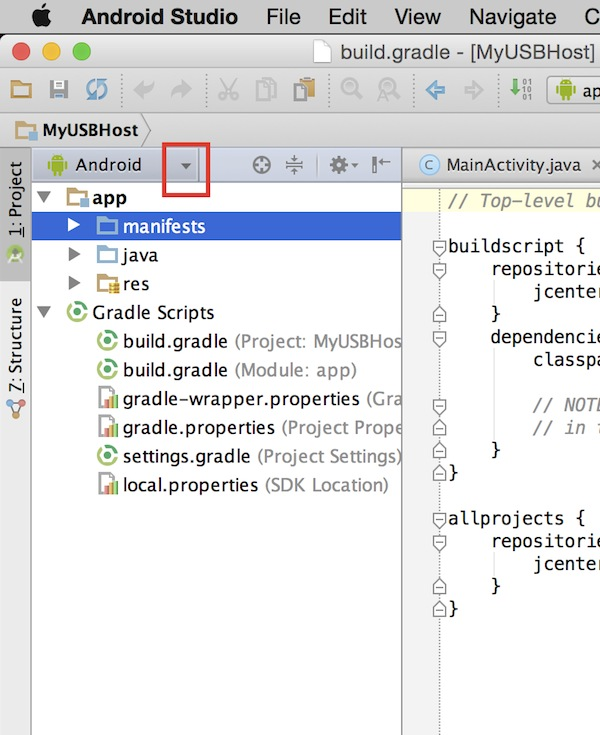
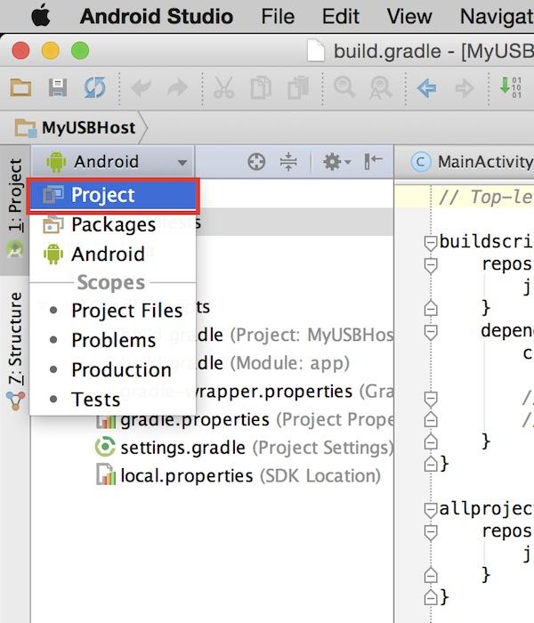
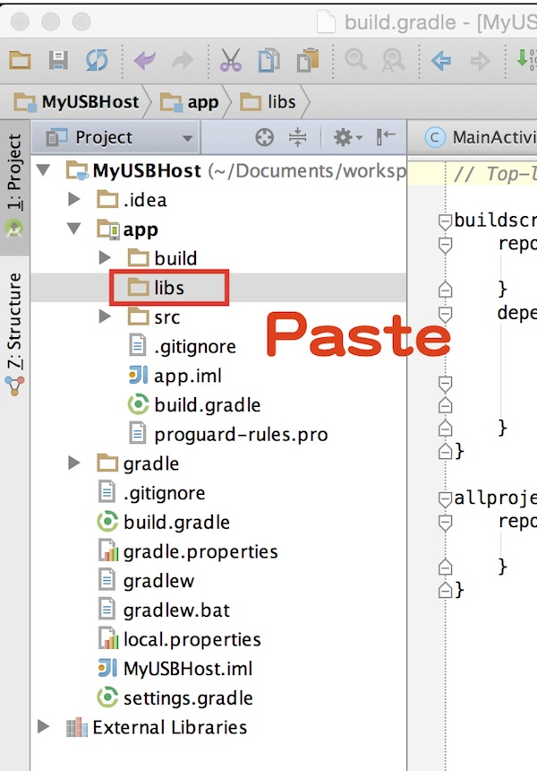
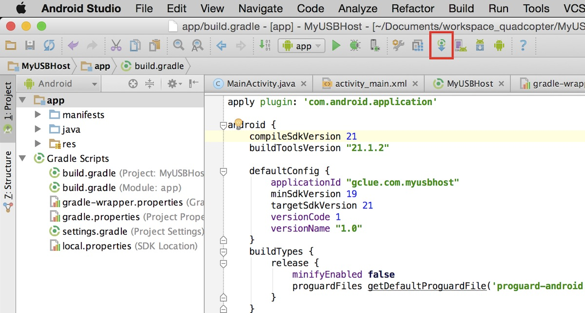

# 事前準備

## USB Hostとは

USB Hostとは、USBで端末と周辺機器を繋ぎ、片方が親となり周辺機器を制御する機能です。

ここではスマートフォンとArduinoをUSBケーブルで接続し、シリアル通信でテキスト送信やLED制御を行って行きます。

## 準備するもの

・Android開発環境 (Android Studio)

・スマートフォン(Android端末)

・USB(microB to A)変換アダプター

・USBケーブル(A - miniB)

・Arduino Uno
 
http://arduino.cc/en/Main/ArduinoBoardUno

## Android側のドライバ設定

新規にプロジェクトを作成します。
 
メニューより、[File] - [New] - [project...]を選択します。

New Project のウィンドウが表示されますので、「Application name」、「Company Domain」を入力し「Next」ボタンを押下します。
 

必要なAPIを選択し、「Next」ボタンを押下します。
 

「Blank Activity」を選択し、「Next」ボタンを押下します。
 

「Finish」ボタンを押下します。
 

次にライブラリーの追加を行います。
 
FTDI社のFT232RL用ドライバーを組み込みます。
 
※ドライバーの組み込みはプロジェクト単位で行うため、新しいプロジェクトを作成する場合は同様の操作が必要になります。

http://www.ftdichip.com/Support/SoftwareExamples/Android/TN_147_Java_D2xx_for_Android_Demo_Source.zip

上記をダウンロードし、解凍します。
解凍後、対象フォルダの中にはいっているj2xx.jarをコピーします。
 

Android StudioのExplorerの表示を変えます。
 
Androidの横の下三角を選択し、表示モードをProjectに変更します。
 

「Project」を選択します。
 

先ほど、コピーしたj2xx.jar をlibsフォルダにペーストします。
 

Syncボタンを押して、同期します。
 

ドライバの設定は以上で完了です。