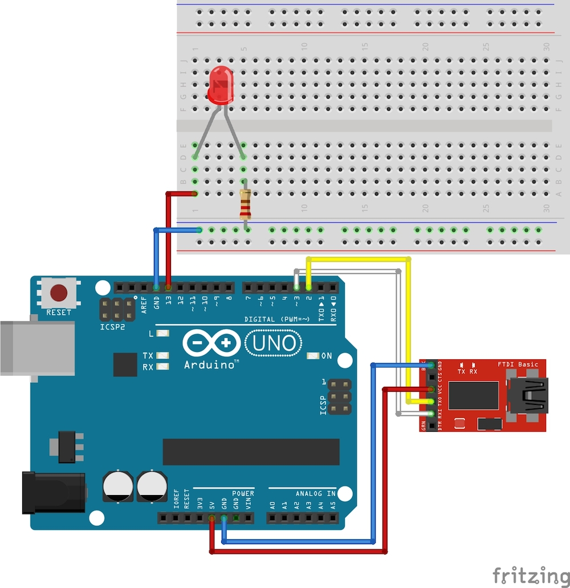
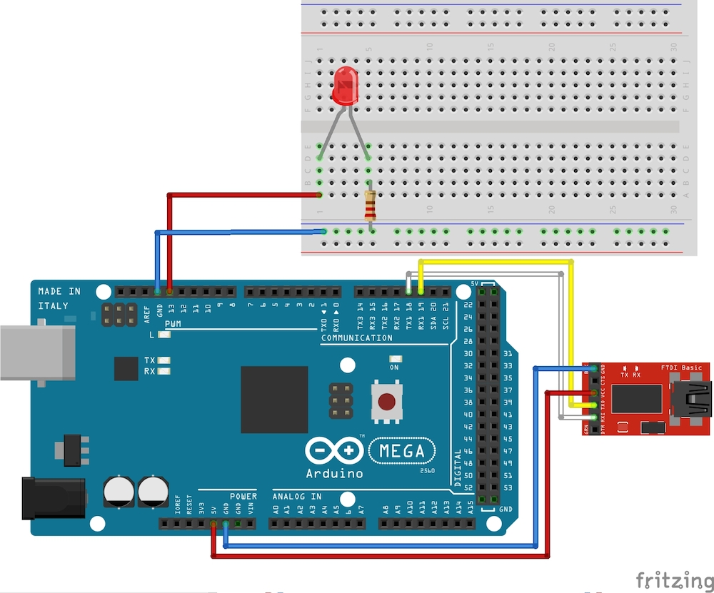

# AndroidからLED制御

最後に、ボタンによりLEDの点灯、消灯を制御してみましょう。

USBシリアルアダプタは変更せず、LEDを点灯させる回路の追加になります。
<br>
LEDはプラスマイナスがありますので注意して下さい。
<br>
13番ピン側(下の図で左側)に、LEDの足の長い方を接続します。

次にスケッチを入力します。
<br>
先ほどのスケッチに青で記述した箇所を追加します。

## Arduino側の設定

### Arduino UNO

#### 回路 (Arduino Uno)


#### スケッチ (Arduino Uno)

```
#include <SoftwareSerial.h>

//androidで使用するピンを指定
SoftwareSerial android(2,3);

int led = 13;
char get_serial = 0;

void setup(){
  //android用のシリアルのポートを設定
  android.begin(9600);
  // arduinoのシリアルモニタ用
  Serial.begin(19200); 
  pinMode(led,OUTPUT); // ledピンを出力用に設定 
  Serial.write("init");
}

void loop(){
  
  if(android.available()){
    get_serial = android.read();

    Serial.write(get_serial);

    if(get_serial == '1'){
      digitalWrite(led,HIGH); //led点灯
    } else {
      digitalWrite(led,LOW);  //led消灯
    }  
  } 
  
  if(Serial.available()){
    android.write(Serial.read());
  } 
  
}```


### Arduino Mega


#### 回路　(Arduino Mega)


#### スケッチ　(Arduino Mega)

```
#include <SoftwareSerial.h>

int led = 13;
char get_serial = 0;

void setup(){
  //android用のシリアルのポートを設定
  android.begin(9600);
  // arduinoのシリアルモニタ用
  Serial.begin(19200); 
  pinMode(led,OUTPUT); // ledピンを出力用に設定 
  Serial.write("init");
}

void loop(){
  
  if(Serial1.available()){
    get_serial = Serial1.read();

    Serial.write(get_serial);

    if(get_serial == '1'){
      digitalWrite(led,HIGH); //led点灯
    } else {
      digitalWrite(led,LOW);  //led消灯
    }  
  } 
  
  if(Serial.available()){
    android.write(Serial.read());
  } 
  
}
```

## Android側の設定

今回は「MainActivity.java」と「main_activity.xml」を修正します。

#### MainActivity.java
```
package gclue.com.myusbhost;

import android.content.BroadcastReceiver;
import android.content.Context;
import android.content.Intent;
import android.hardware.usb.UsbManager;
import android.os.Bundle;
import android.os.Handler;
import android.os.Message;
import android.support.v7.app.ActionBarActivity;
import android.util.Log;
import android.view.Menu;
import android.view.MenuItem;
import android.view.View;
import android.widget.Button;
import android.widget.TextView;
import android.widget.Toast;

import com.ftdi.j2xx.D2xxManager;
import com.ftdi.j2xx.FT_Device;

public class MainActivity extends ActionBarActivity {

    private FT_Device ftDev = null;
    private static Context mContext;
    private D2xxManager ftdid2xx;
    private static final String TAG = "USB";
    private boolean isReading = false;
    private ReadThread mReadThread;
    private int iavailable = 0;
    private static final int readLength = 512;
    byte[] readData;
    char[] readDataToText;
    private TextView mInputValue;
    private Button mLedOnButton;  // ONボタン
    private Button mLedOffButton; // OFFボタン

    @Override
    protected void onCreate(Bundle savedInstanceState) {
        super.onCreate(savedInstanceState);
        setContentView(R.layout.activity_main);

        try {
            ftdid2xx = D2xxManager.getInstance(this);
        } catch (D2xxManager.D2xxException ex) {
            Log.e(TAG,ex.toString());
        }

        mContext = this.getBaseContext();

        openUsb();

        mInputValue = (TextView)findViewById(R.id.inputValue);

        // ボタンが押されたらUSBに値を送り込む(LED ON)
        mLedOnButton = (Button)findViewById(R.id.ledOnButton);
        mLedOnButton.setOnClickListener(new View.OnClickListener() {
            @Override
            public void onClick(View v) {
                SendMessage("1");
            }
        });
        // ボタンが押されたらUSBに値を送り込む(LED OFF)
        mLedOffButton = (Button)findViewById(R.id.ledOffButton);
        mLedOffButton.setOnClickListener(new View.OnClickListener() {
            @Override
            public void onClick(View v) {
                SendMessage("0");
            }
        });
    }

    public void openUsb(){
        int devCount = 0;
        devCount = ftdid2xx.createDeviceInfoList(this);
        if (devCount <= 0)
        {
            Toast.makeText(this, "デバイスが発見できません。" + Integer.toString(devCount), Toast.LENGTH_LONG).show();
            Log.i(TAG,"デバイスが発見できましせんでした。");
            return;
        }
        else{
            Toast.makeText(this, "" + devCount + "個のデバイスを発見しました。", Toast.LENGTH_LONG).show();
            Log.i(TAG,"" + devCount + "個のデバイスを発見しました。");
        }

        if(null == ftDev)
        {
            ftDev = ftdid2xx.openByIndex(mContext, 0);
        }
        else
        {
            synchronized(ftDev)
            {
                ftDev = ftdid2xx.openByIndex(mContext, 0);
            }
        }

        //ftDev.setBitMode((byte) 0, D2xxManager.FT_BITMODE_RESET);
        ftDev.setBaudRate(9600);
        ftDev.setDataCharacteristics(D2xxManager.FT_DATA_BITS_8, D2xxManager.FT_STOP_BITS_1, D2xxManager.FT_PARITY_NONE);
        ftDev.setFlowControl(D2xxManager.FT_FLOW_NONE, (byte) 0x0b, (byte) 0x0d);
        ftDev.purge((byte) (D2xxManager.FT_PURGE_TX | D2xxManager.FT_PURGE_RX));
        ftDev.restartInTask();

        readData = new byte[readLength];
        readDataToText = new char[readLength];
        mReadThread = new ReadThread(mHandler);
        mReadThread.start();
        isReading = true;
    }


    @Override
    public boolean onCreateOptionsMenu(Menu menu) {
        // Inflate the menu; this adds items to the action bar if it is present.
        getMenuInflater().inflate(R.menu.menu_main, menu);
        return true;
    }

    @Override
    public boolean onOptionsItemSelected(MenuItem item) {
        // Handle action bar item clicks here. The action bar will
        // automatically handle clicks on the Home/Up button, so long
        // as you specify a parent activity in AndroidManifest.xml.
        int id = item.getItemId();

        //noinspection SimplifiableIfStatement
        if (id == R.id.action_settings) {
            return true;
        }

        return super.onOptionsItemSelected(item);
    }

    public void SendMessage(String msg) {

        if(ftDev == null){
            return;
        }

        synchronized (ftDev) {
            if (ftDev.isOpen() == false) {
                Log.e("j2xx", "SendMessage: device not open");
                return;
            }

            ftDev.setLatencyTimer((byte) 16);

            if (msg != null) {
                byte[] OutData = msg.getBytes();
                ftDev.write(OutData, msg.length());
            }
        }
    }

    private class ReadThread  extends Thread
    {
        Handler mHandler;

        ReadThread(Handler h){
            mHandler = h;
            this.setPriority(Thread.MIN_PRIORITY);
        }

        @Override
        public void run()
        {
            int i;

            while(true == isReading)
            {
                try {
                    Thread.sleep(50);
                } catch (InterruptedException e) {
                }

                synchronized(ftDev)
                {
                    iavailable = ftDev.getQueueStatus();
                    if (iavailable > 0) {

                        if(iavailable > readLength){
                            iavailable = readLength;
                        }

                        ftDev.read(readData, iavailable);
                        String mData = new String(readData);
                        Message msg = mHandler.obtainMessage();
                        msg.obj = mData;
                        mHandler.sendMessage(msg);
                    }
                }
            }
        }

    }

    /**
     * 描画処理はHandlerでおこなう
     */
    Handler mHandler = new Handler() {
        @Override
        public void handleMessage(Message msg) {
            String mData = (String)msg.obj;
            mInputValue.setText(mData);
        }
    };

    BroadcastReceiver mUsbReceiver = new BroadcastReceiver() {
        public void onReceive(Context context, Intent intent) {
            String action = intent.getAction();
            if (UsbManager.ACTION_USB_DEVICE_ATTACHED.equals(action)) {
                // never come here(when attached, go to onNewIntent)
                openUsb();
            } else if (UsbManager.ACTION_USB_DEVICE_DETACHED.equals(action)) {
                if(ftDev != null) {
                    ftDev.close();
                    isReading = false;
                }
            }
        }
    };
}
```


#### activity_main.xml

```
<?xml version="1.0" encoding="utf-8"?>
<LinearLayout xmlns:android="http://schemas.android.com/apk/res/android"
    android:layout_width="fill_parent"
    android:layout_height="fill_parent"
    android:orientation="vertical" >

    <TextView
        android:id="@+id/inputValue"
        android:layout_width="fill_parent"
        android:layout_height="wrap_content"/>

    <Button android:id="@+id/ledOnButton"
        android:layout_width="wrap_content"
        android:layout_height="wrap_content"
        android:text="ON"
        android:layout_gravity="center_horizontal" />

    <Button android:id="@+id/ledOffButton"
        android:layout_width="wrap_content"
        android:layout_height="wrap_content"
        android:text="OFF"
        android:layout_gravity="center_horizontal" />

</LinearLayout>
```


PCとAndroid端末を接続してプログラム実行し、Android端末側に実行ファイルを作成します。
今回もArduino側はシリアルモニタを表示した状態で待機します。 


Android側の「ON」ボタンをタップします。


LEDが点灯しました。
OFFを押して消えることを確認してみましょう。