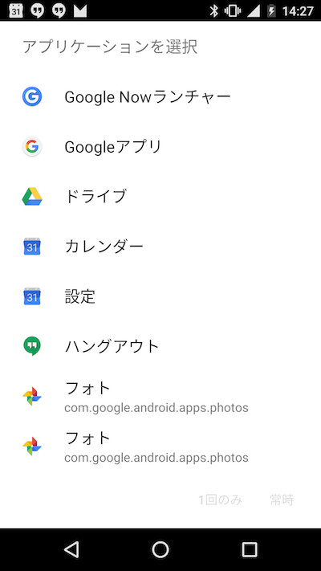

# 暗示的Intent

暗示的Intentでは、下記の4項目を指定する事で、それに関連するActivityを起動する事が可能になります。

* ACTION
* CATEGORY
* DATA
* TYPE


MainActivity.java
```java
package utsunomiya.gclue.com.intentsample;

import android.app.Activity;
import android.content.Intent;
import android.os.Bundle;
import android.view.Menu;
import android.view.MenuItem;
import android.view.View;
import android.widget.Button;

public class MainActivity extends Activity implements View.OnClickListener {

    /** Button. */
    private Button mButton;

    @Override
    protected void onCreate(Bundle savedInstanceState) {
        super.onCreate(savedInstanceState);
        setContentView(R.layout.activity_main);

        // xmlからButtonを取り込む
        mButton = (Button) findViewById(R.id.button);
        mButton.setOnClickListener(this);
    }

    @Override
    public boolean onCreateOptionsMenu(Menu menu) {
        // Inflate the menu; this adds items to the action bar if it is present.
        getMenuInflater().inflate(R.menu.menu_main, menu);
        return true;
    }

    @Override
    public boolean onOptionsItemSelected(MenuItem item) {
        // Handle action bar item clicks here. The action bar will
        // automatically handle clicks on the Home/Up button, so long
        // as you specify a parent activity in AndroidManifest.xml.
        int id = item.getItemId();

        //noinspection SimplifiableIfStatement
        if (id == R.id.action_settings) {
            return true;
        }

        return super.onOptionsItemSelected(item);
    }

    @Override
    public void onClick(View v) {

        if (v.equals(mButton)){
            Intent testIntent = new Intent();
            testIntent.setAction(Intent.ACTION_MAIN);
            startActivity(testIntent);
        }
    }
}

```

activity_main.xml
```xml
<RelativeLayout xmlns:android="http://schemas.android.com/apk/res/android"
    xmlns:tools="http://schemas.android.com/tools" android:layout_width="match_parent"
    android:layout_height="match_parent" android:paddingLeft="@dimen/activity_horizontal_margin"
    android:paddingRight="@dimen/activity_horizontal_margin"
    android:paddingTop="@dimen/activity_vertical_margin"
    android:paddingBottom="@dimen/activity_vertical_margin" tools:context=".MainActivity">

    <Button
        android:layout_width="wrap_content"
        android:layout_height="wrap_content"
        android:text="Intent Sample"
        android:id="@+id/button"
        android:layout_alignParentTop="true"
        android:layout_alignParentStart="true" />

</RelativeLayout>
```




## Intent.ACTION_VIEW

MainActivity.java
```java

            Intent testIntent = new Intent();
            testIntent.setAction(Intent.ACTION_VIEW);
            startActivity(testIntent);
```

## ACTION_DIAL

MainActivity.java
```java

            Intent testIntent = new Intent();
            testIntent.setAction(Intent.ACTION_DIAL);
            startActivity(testIntent);
```

## ActionとCategoryを指定

MainActivity.java
```java
            Intent testIntent = new Intent();
            testIntent.setAction(Intent.ACTION_MAIN);
            testIntent.addCategory(Intent.CATEGORY_DEFAULT);
            startActivity(testIntent);
```

## ActionとCategoryを指定

MainActivity.java
```java
            Intent testIntent = new Intent();
            testIntent.setAction(Intent.ACTION_MAIN);
            testIntent.addCategory(Intent.CATEGORY_LAUNCHER);
            startActivity(testIntent);
```

## ACTIONとDATAを指定

### Browserを起動

MainActivity.java
```java
            Intent testIntent = new Intent();
            testIntent.setAction(Intent.ACTION_VIEW);
            Uri uri = Uri.parse("http://www.gclue.com/");
            testIntent.setData(uri);
            startActivity(testIntent);
```

### Mapを起動(緯度/経度)

MainActivity.java
```java
            Intent testIntent = new Intent();
            testIntent.setAction(Intent.ACTION_VIEW);
            Uri uri = Uri.parse("geo:35.658625,139.745415");
            testIntent.setData(uri);
            startActivity(testIntent);
```

### Mapを起動(検索ワード)

MainActivity.java
```java
            Intent testIntent = new Intent();
            testIntent.setAction(Intent.ACTION_VIEW);
            Uri uri = Uri.parse("geo:0,0?q=sendai");
            testIntent.setData(uri);
            startActivity(testIntent);

```
### 削除
自分自身をパッケージを指定して削除する

MainActivity.java
```java
            Intent testIntent = new Intent();
            testIntent.setAction(Intent.ACTION_DELETE);
            Uri uri = Uri.fromParts("package", "utsunomiya.gclue.com.intentsample", null);
            testIntent.setData(uri);
            startActivity(testIntent);
```

### 電話をかける

MainActivity.java
```java
            Intent testIntent = new Intent();
            testIntent.setAction(Intent.ACTION_DIAL);
            Uri uri = Uri.parse("tel:11111111111111");
            testIntent.setData(uri);
            startActivity(testIntent);
```

### メールを送る
MainActivity.java
```java
            Intent testIntent = new Intent();
            testIntent.setAction(Intent.ACTION_SENDTO);
            Uri uri=Uri.parse("mailto:test@gclue.jp");
            testIntent.setData(uri);
            testIntent.putExtra(Intent.EXTRA_SUBJECT,"Subject");
            testIntent.putExtra(Intent.EXTRA_TEXT,"Text of main");
            startActivity(testIntent);
```
    

### 検索の機能をもったアプリを探す

MainActivity.java
```java
            Intent testIntent = new Intent();
            testIntent.setAction(Intent.ACTION_SEARCH);
            testIntent.putExtra("query","Android");
            startActivity(testIntent);
```

### 文字列を他のアプリに渡す

MainActivity.java
```java
            Intent testIntent = new Intent();
            testIntent.setAction(Intent.ACTION_SEND);
            testIntent.setType("text/plain");
            testIntent.putExtra(Intent.EXTRA_TEXT, "Data sending");
            startActivity(testIntent);
```


## Reference

http://developer.android.com/intl/ja/reference/android/content/Intent.html