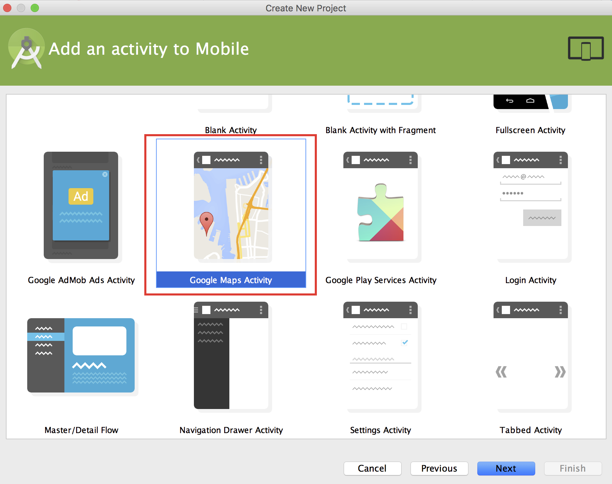
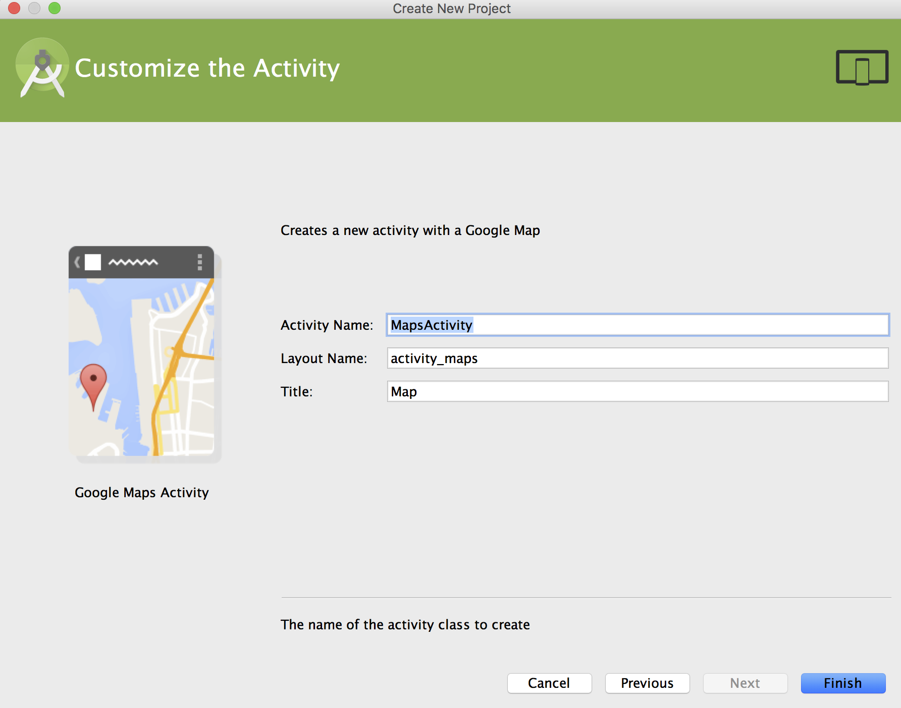

# Google Maps用プロジェクトの生成

## プロジェクトの生成






## 生成されるソースコード

### MapActivity.java

```java
package utsunomiya.gclue.com.mapsample;

import android.support.v4.app.FragmentActivity;
import android.os.Bundle;

import com.google.android.gms.maps.GoogleMap;
import com.google.android.gms.maps.SupportMapFragment;
import com.google.android.gms.maps.model.LatLng;
import com.google.android.gms.maps.model.MarkerOptions;

public class MapsActivity extends FragmentActivity {

    private GoogleMap mMap; // Might be null if Google Play services APK is not available.

    @Override
    protected void onCreate(Bundle savedInstanceState) {
        super.onCreate(savedInstanceState);
        setContentView(R.layout.activity_maps);
        setUpMapIfNeeded();
    }

    @Override
    protected void onResume() {
        super.onResume();
        setUpMapIfNeeded();
    }

    /**
     * Sets up the map if it is possible to do so (i.e., the Google Play services APK is correctly
     * installed) and the map has not already been instantiated.. This will ensure that we only ever
     * call {@link #setUpMap()} once when {@link #mMap} is not null.
     * <p/>
     * If it isn't installed {@link SupportMapFragment} (and
     * {@link com.google.android.gms.maps.MapView MapView}) will show a prompt for the user to
     * install/update the Google Play services APK on their device.
     * <p/>
     * A user can return to this FragmentActivity after following the prompt and correctly
     * installing/updating/enabling the Google Play services. Since the FragmentActivity may not
     * have been completely destroyed during this process (it is likely that it would only be
     * stopped or paused), {@link #onCreate(Bundle)} may not be called again so we should call this
     * method in {@link #onResume()} to guarantee that it will be called.
     */
    private void setUpMapIfNeeded() {
        // Do a null check to confirm that we have not already instantiated the map.
        if (mMap == null) {
            // Try to obtain the map from the SupportMapFragment.
            mMap = ((SupportMapFragment) getSupportFragmentManager().findFragmentById(R.id.map))
                    .getMap();
            // Check if we were successful in obtaining the map.
            if (mMap != null) {
                setUpMap();
            }
        }
    }

    /**
     * This is where we can add markers or lines, add listeners or move the camera. In this case, we
     * just add a marker near Africa.
     * <p/>
     * This should only be called once and when we are sure that {@link #mMap} is not null.
     */
    private void setUpMap() {
        mMap.addMarker(new MarkerOptions().position(new LatLng(0, 0)).title("Marker"));
    }
}
```

### activity_maps.xml

```xml
<fragment xmlns:android="http://schemas.android.com/apk/res/android"
    xmlns:tools="http://schemas.android.com/tools" android:layout_width="match_parent"
    android:layout_height="match_parent" android:id="@+id/map" tools:context=".MapsActivity"
    android:name="com.google.android.gms.maps.SupportMapFragment" />

```

### AndroidManifest.xml

```xml
<?xml version="1.0" encoding="utf-8"?>
<manifest xmlns:android="http://schemas.android.com/apk/res/android"
    package="utsunomiya.gclue.com.mapsample" >

    <uses-permission android:name="android.permission.INTERNET" />
    <uses-permission android:name="android.permission.ACCESS_NETWORK_STATE" />
    <uses-permission android:name="android.permission.WRITE_EXTERNAL_STORAGE" />
    <uses-permission android:name="com.google.android.providers.gsf.permission.READ_GSERVICES" />
    <!--
 The ACCESS_COARSE/FINE_LOCATION permissions are not required to use
         Google Maps Android API v2, but are recommended.
    -->
    <uses-permission android:name="android.permission.ACCESS_COARSE_LOCATION" />
    <uses-permission android:name="android.permission.ACCESS_FINE_LOCATION" />

    <application
        android:allowBackup="true"
        android:icon="@mipmap/ic_launcher"
        android:label="@string/app_name"
        android:theme="@style/AppTheme" >
        <meta-data
            android:name="com.google.android.gms.version"
            android:value="@integer/google_play_services_version" />
        <meta-data
            android:name="com.google.android.maps.v2.API_KEY"
            android:value="@string/google_maps_key" />

        <activity
            android:name=".MapsActivity"
            android:label="@string/title_activity_maps" >
            <intent-filter>
                <action android:name="android.intent.action.MAIN" />

                <category android:name="android.intent.category.LAUNCHER" />
            </intent-filter>
        </activity>
    </application>

</manifest>

```

