# API Keyの取得

## 証明書のフィンガプリントの取得

まず、Googke Maps API Keyを発行するために、開発で使用しているMacのフィンガプリントの取得をおこないます。

    $  keytool -list -v -keystore ~/.android/debug.keystore

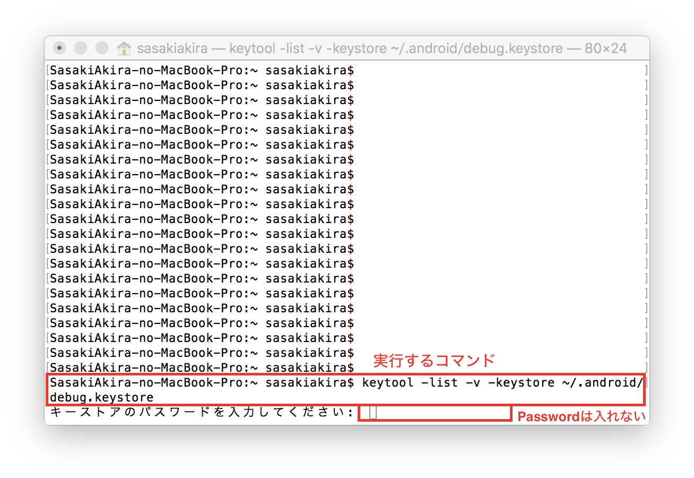

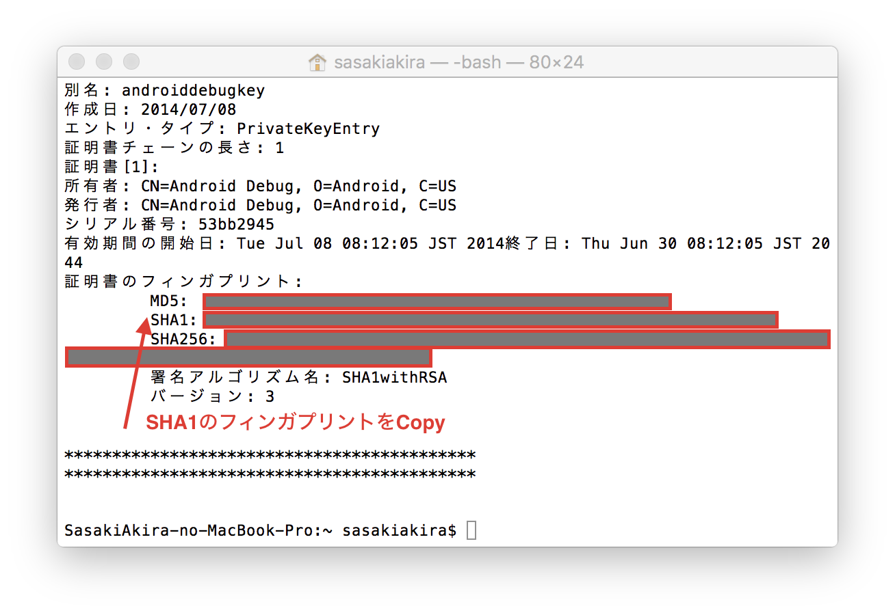

## Google API Consoleでプロジェクトを作成

https://code.google.com/apis/console/?pli=1

にログインします。

プロジェクト作成をクリックします。

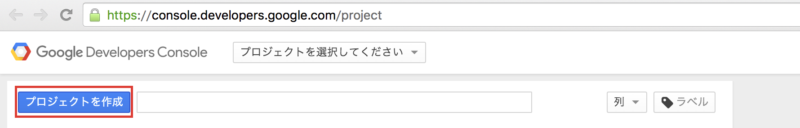

プロジェクト名を入力し、Nearby Message APIの利用規約に同意し、[作成]をクリックします。

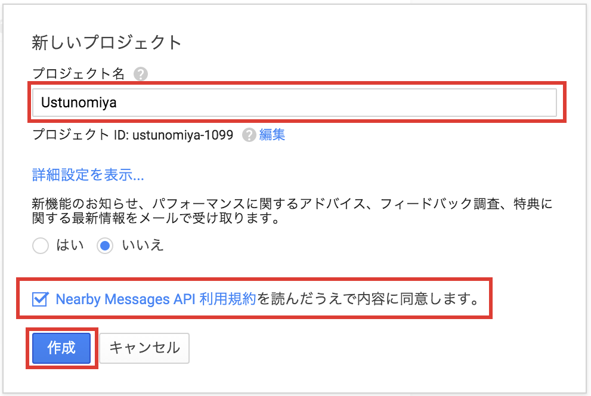

## Google Map APIを有効にする

[APIと認証]-[API]を選択します。項目の中からGoogle Maps Android APIをクリックします。

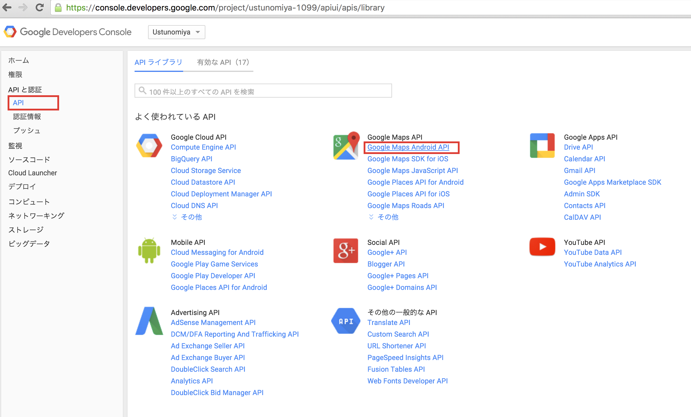

[APIを有効にする]ボタンをクリックします。

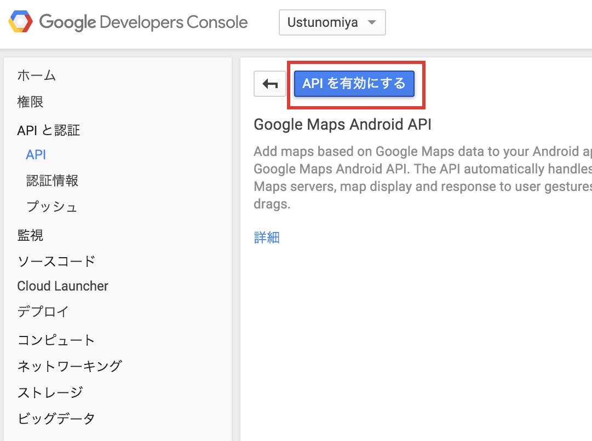

## APIキーの作成

[APIと認証]-[認証情報]を選択し、認証情報を追加をクリックします。

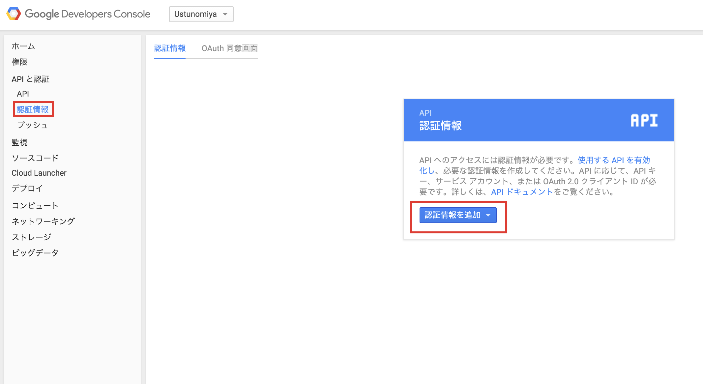

APIキーをクリックします。

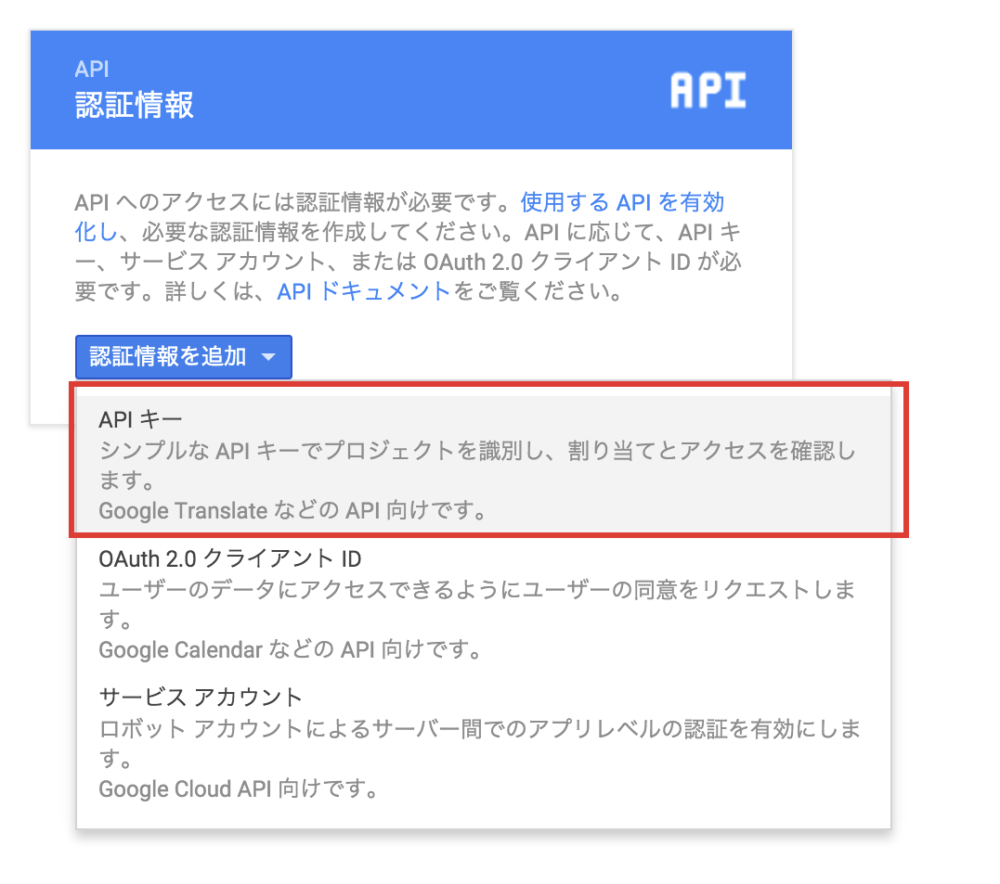

APIキーの作成に必要なものは、SHA-1 認証フィンガプリントとアプリのパッケージ名です。

アプリのパッケージ名は、ソースコードの一番上に書かれています。
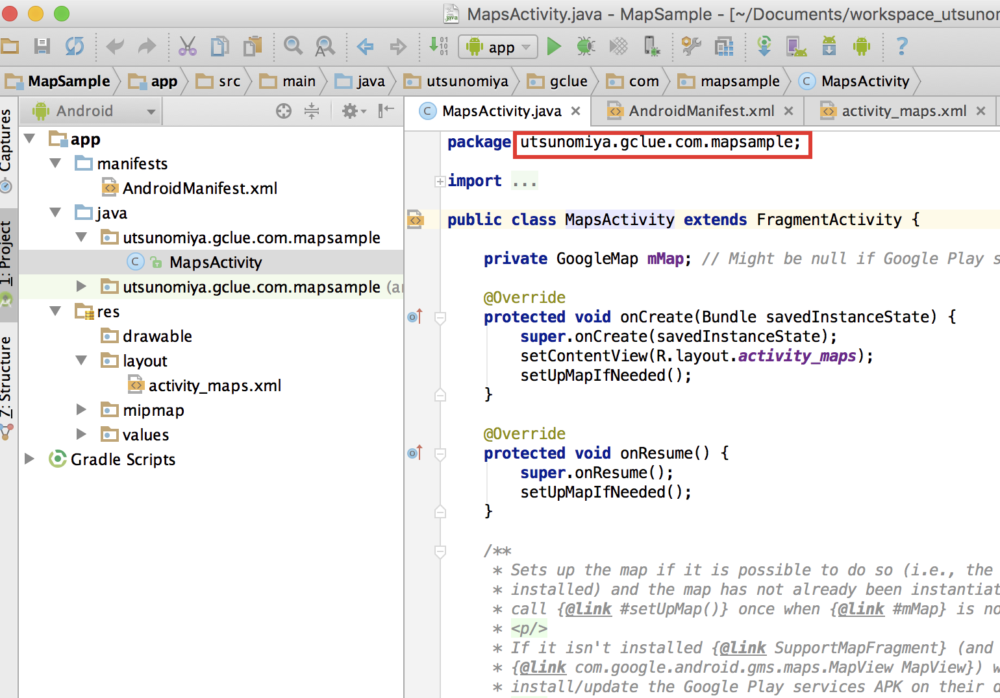

パッケージ名と、SHA-1 認証フィンガプリントを入力し、[作成]をクリックします。
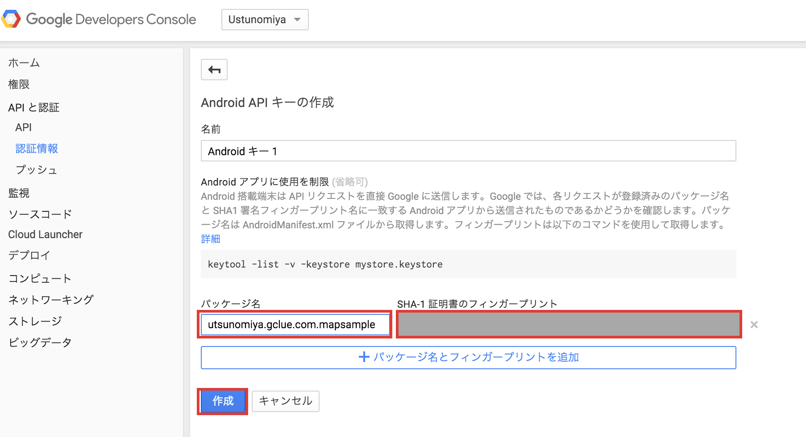

これでAPIキーの生成が完了です。APIキーをコピーしておきます。
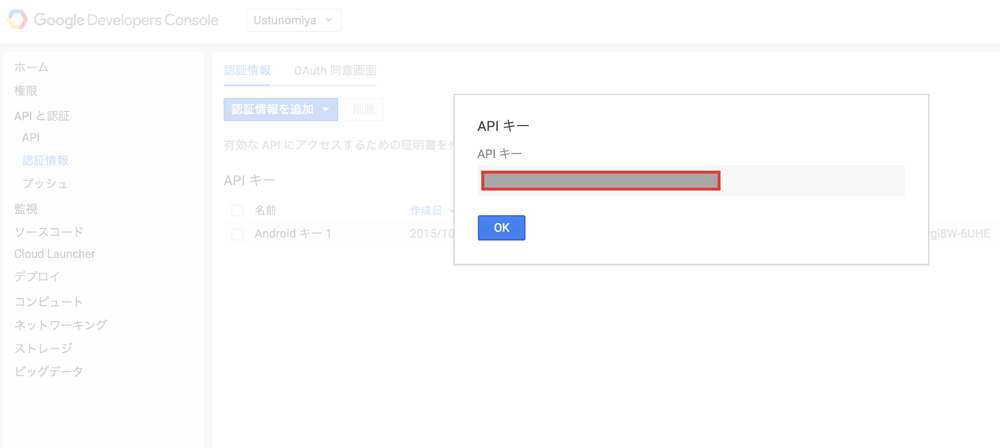