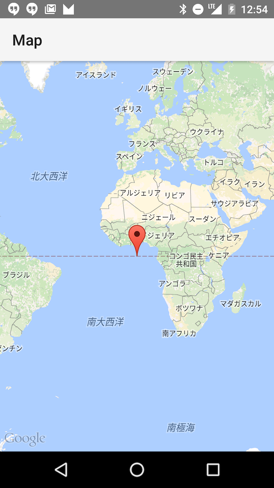
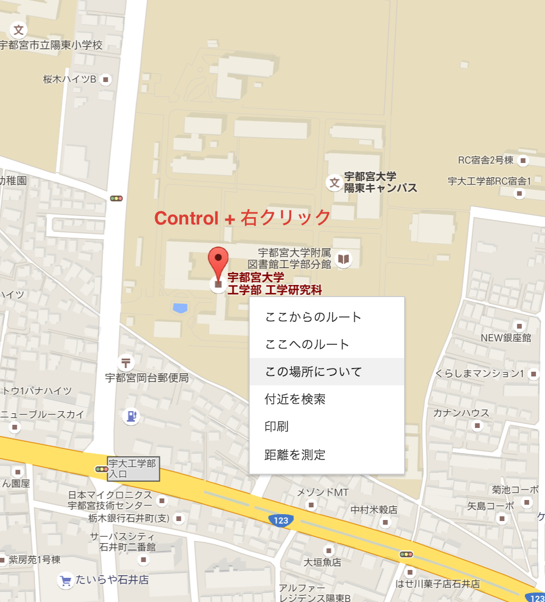
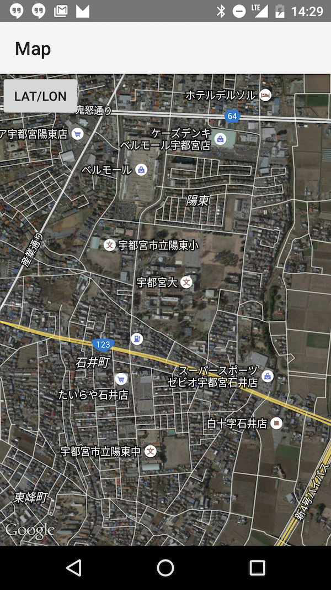
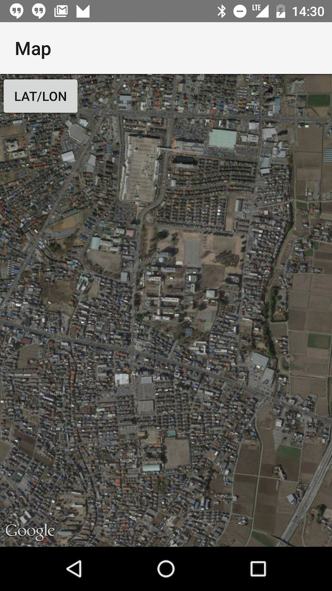
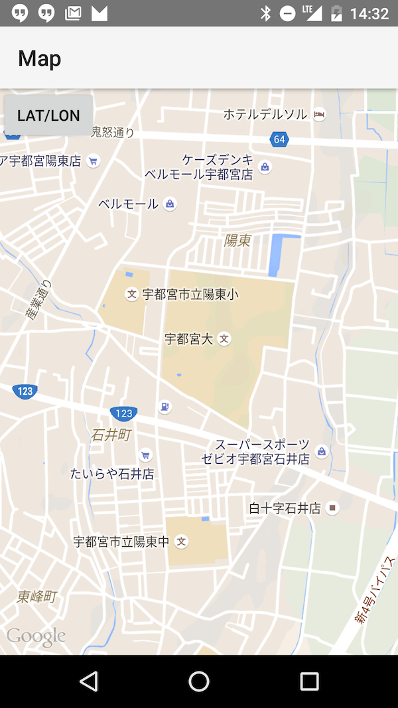

# Mapsのカスタマイズ

## Mapsにキーを埋め込む

AndroidManifest.xmlにキーをコピーします。


キーの実態は、res/values/google_maps_api.xmlに記載します。


アプリを実行するとGoogle Mapsが表示されます。



## 宇都宮大学に座標を移動


MapsActivity.java

```java
package utsunomiya.gclue.com.mapsample;

import android.support.v4.app.FragmentActivity;
import android.os.Bundle;

import com.google.android.gms.maps.CameraUpdate;
import com.google.android.gms.maps.CameraUpdateFactory;
import com.google.android.gms.maps.GoogleMap;
import com.google.android.gms.maps.SupportMapFragment;
import com.google.android.gms.maps.model.LatLng;
import com.google.android.gms.maps.model.MarkerOptions;

public class MapsActivity extends FragmentActivity {

    private GoogleMap mMap; // Might be null if Google Play services APK is not available.

    @Override
    protected void onCreate(Bundle savedInstanceState) {
        super.onCreate(savedInstanceState);
        setContentView(R.layout.activity_maps);
        setUpMapIfNeeded();
    }

    @Override
    protected void onResume() {
        super.onResume();
        setUpMapIfNeeded();
    }

    /**
     * Sets up the map if it is possible to do so (i.e., the Google Play services APK is correctly
     * installed) and the map has not already been instantiated.. This will ensure that we only ever
     * call {@link #setUpMap()} once when {@link #mMap} is not null.
     * <p/>
     * If it isn't installed {@link SupportMapFragment} (and
     * {@link com.google.android.gms.maps.MapView MapView}) will show a prompt for the user to
     * install/update the Google Play services APK on their device.
     * <p/>
     * A user can return to this FragmentActivity after following the prompt and correctly
     * installing/updating/enabling the Google Play services. Since the FragmentActivity may not
     * have been completely destroyed during this process (it is likely that it would only be
     * stopped or paused), {@link #onCreate(Bundle)} may not be called again so we should call this
     * method in {@link #onResume()} to guarantee that it will be called.
     */
    private void setUpMapIfNeeded() {
        // Do a null check to confirm that we have not already instantiated the map.
        if (mMap == null) {
            // Try to obtain the map from the SupportMapFragment.
            mMap = ((SupportMapFragment) getSupportFragmentManager().findFragmentById(R.id.map))
                    .getMap();
            // Check if we were successful in obtaining the map.
            if (mMap != null) {
                setUpMap();
            }
        }
    }

    /**
     * This is where we can add markers or lines, add listeners or move the camera. In this case, we
     * just add a marker near Africa.
     * <p/>
     * This should only be called once and when we are sure that {@link #mMap} is not null.
     */
    private void setUpMap() {

        mMap.addMarker(new MarkerOptions().position(new LatLng(0, 0)).title("Marker"));

        LatLng mLatLon = new LatLng(36.549792, 139.929513);
        CameraUpdate mCameraUpdate = CameraUpdateFactory.newLatLngZoom(mLatLon, 15);
        mMap.moveCamera(mCameraUpdate);
    }
}
```
宇都宮大学の座標は、Google Mapで取得します。



setUpMap()の中を改良する
```java
    LatLng mLatLon = new LatLng(36.549792, 139.929513);
    CameraUpdate mCameraUpdate =     CameraUpdateFactory.newLatLngZoom(mLatLon, 15);
    mMap.moveCamera(mCameraUpdate);
```


## Google Mapの中心点の座標を表示　

maps_activity.xml
```
<fragment xmlns:android="http://schemas.android.com/apk/res/android"
    xmlns:tools="http://schemas.android.com/tools" android:layout_width="match_parent"
    android:layout_height="match_parent" android:id="@+id/map" tools:context=".MapsActivity"
    android:name="com.google.android.gms.maps.SupportMapFragment">

    <Button
        android:id="@+id/Button01"
        android:layout_width="wrap_content"
        android:layout_height="wrap_content"
        android:text="Lat/Lon" >
    </Button>

</fragment>

```

MapsActivity.java
```java
package utsunomiya.gclue.com.mapsample;

import android.support.v4.app.FragmentActivity;
import android.os.Bundle;
import android.view.View;
import android.widget.Button;
import android.widget.Toast;

import com.google.android.gms.maps.CameraUpdate;
import com.google.android.gms.maps.CameraUpdateFactory;
import com.google.android.gms.maps.GoogleMap;
import com.google.android.gms.maps.SupportMapFragment;
import com.google.android.gms.maps.model.LatLng;
import com.google.android.gms.maps.model.MarkerOptions;

public class MapsActivity extends FragmentActivity implements View.OnClickListener {

    private GoogleMap mMap; // Might be null if Google Play services APK is not available.

    /** 緯度、経度を表示するボタン. */
    private Button mButton01;

    @Override
    protected void onCreate(Bundle savedInstanceState) {
        super.onCreate(savedInstanceState);
        setContentView(R.layout.activity_maps);
        setUpMapIfNeeded();

        // 緯度・経度を表示するボタン。押すと緯度経度のToastを表示する
        mButton01 = (Button) findViewById(R.id.Button01);
        mButton01.setOnClickListener(this);
    }

    @Override
    protected void onResume() {
        super.onResume();
        setUpMapIfNeeded();
    }

    /**
     * Sets up the map if it is possible to do so (i.e., the Google Play services APK is correctly
     * installed) and the map has not already been instantiated.. This will ensure that we only ever
     * call {@link #setUpMap()} once when {@link #mMap} is not null.
     * <p/>
     * If it isn't installed {@link SupportMapFragment} (and
     * {@link com.google.android.gms.maps.MapView MapView}) will show a prompt for the user to
     * install/update the Google Play services APK on their device.
     * <p/>
     * A user can return to this FragmentActivity after following the prompt and correctly
     * installing/updating/enabling the Google Play services. Since the FragmentActivity may not
     * have been completely destroyed during this process (it is likely that it would only be
     * stopped or paused), {@link #onCreate(Bundle)} may not be called again so we should call this
     * method in {@link #onResume()} to guarantee that it will be called.
     */
    private void setUpMapIfNeeded() {
        // Do a null check to confirm that we have not already instantiated the map.
        if (mMap == null) {
            // Try to obtain the map from the SupportMapFragment.
            mMap = ((SupportMapFragment) getSupportFragmentManager().findFragmentById(R.id.map))
                    .getMap();
            // Check if we were successful in obtaining the map.
            if (mMap != null) {
                setUpMap();
            }
        }
    }

    /**
     * This is where we can add markers or lines, add listeners or move the camera. In this case, we
     * just add a marker near Africa.
     * <p/>
     * This should only be called once and when we are sure that {@link #mMap} is not null.
     */
    private void setUpMap() {

        mMap.addMarker(new MarkerOptions().position(new LatLng(0, 0)).title("Marker"));

        LatLng mLatLon = new LatLng(36.549792, 139.929513);
        CameraUpdate cu = CameraUpdateFactory.newLatLngZoom(mLatLon, 15);
        mMap.moveCamera(cu);
    }

    @Override
    public void onClick(View v) {
        if (v.equals(mButton01)) {
            LatLng latLng = mMap.getCameraPosition().target;
            // 地図の中心点の緯度・経度を取得
            double lat = latLng.latitude;
            double lon = latLng.longitude;
            Toast.makeText(this, "lat:" + lat + " lon:" + lon, Toast.LENGTH_LONG).show();
        }
    }
}

```

変数追加
```java
    /** 緯度、経度を表示するボタン. */
    private Button mButton01;
```

onCreate()追記
```java
    @Override
    protected void onCreate(Bundle savedInstanceState) {
        super.onCreate(savedInstanceState);
        setContentView(R.layout.activity_maps);
        setUpMapIfNeeded();

        // 緯度・経度を表示するボタン。押すと緯度経度のToastを表示する
        mButton01 = (Button) findViewById(R.id.Button01);
        mButton01.setOnClickListener(this);
    }

```

onClick(View v)追加
```java
@Override
    public void onClick(View v) {
        if (v.equals(mButton01)) {
            LatLng latLng = mMap.getCameraPosition().target;
            // 地図の中心点の緯度・経度を取得
            double lat = latLng.latitude;
            double lon = latLng.longitude;
            Toast.makeText(this, "lat:" + lat + " lon:" + lon, Toast.LENGTH_LONG).show();
        }
    }
```

## 地図のタイプ

```java
  private void setUpMap() {

        mMap.addMarker(new MarkerOptions().position(new LatLng(0, 0)).title("Marker"));

        LatLng mLatLon = new LatLng(36.549792, 139.929513);
        CameraUpdate cu = CameraUpdateFactory.newLatLngZoom(mLatLon, 15);
        mMap.moveCamera(cu);

        mMap.setMapType(GoogleMap.MAP_TYPE_HYBRID);
    }
```




```java
    private void setUpMap() {

        mMap.addMarker(new MarkerOptions().position(new LatLng(0, 0)).title("Marker"));

        LatLng mLatLon = new LatLng(36.549792, 139.929513);
        CameraUpdate cu = CameraUpdateFactory.newLatLngZoom(mLatLon, 15);
        mMap.moveCamera(cu);

        mMap.setMapType(GoogleMap.MAP_TYPE_SATELLITE);
    }
```



```
    private void setUpMap() {

        mMap.addMarker(new MarkerOptions().position(new LatLng(0, 0)).title("Marker"));

        LatLng mLatLon = new LatLng(36.549792, 139.929513);
        CameraUpdate cu = CameraUpdateFactory.newLatLngZoom(mLatLon, 15);
        mMap.moveCamera(cu);

        mMap.setMapType(GoogleMap.MAP_TYPE_TERRAIN);
    }

```




## 現在位置ボタンを表示


```java
    private void setUpMap() {

        mMap.addMarker(new MarkerOptions().position(new LatLng(0, 0)).title("Marker"));

        LatLng mLatLon = new LatLng(36.549792, 139.929513);
        CameraUpdate cu = CameraUpdateFactory.newLatLngZoom(mLatLon, 15);
        mMap.moveCamera(cu);

        mMap.setMapType(GoogleMap.MAP_TYPE_TERRAIN);

        mMap.setMyLocationEnabled(true);

    }
```

