# Android Wearの環境設定

今回の環境構築の前提条件。

| 種類 | Version |
| -- | -- |
| Android Studio | 1.5 |
| デバイス側OS | 5.0 |
| Wear側OS  | 5.0 |

## プロジェクトの新規作成

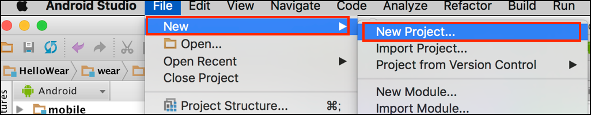

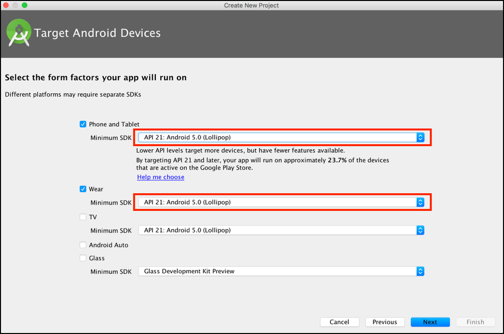

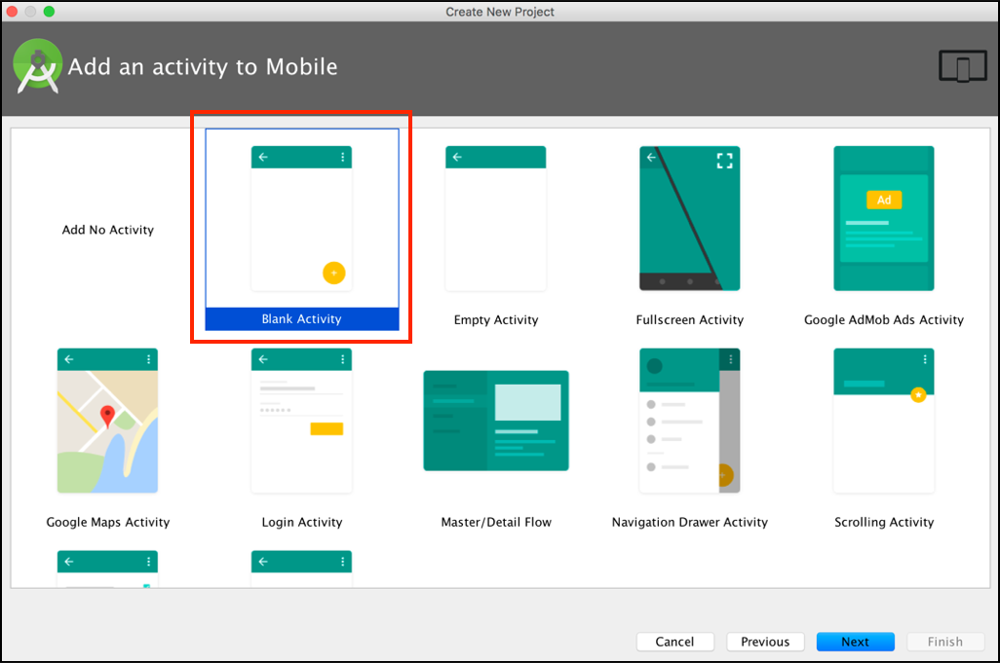

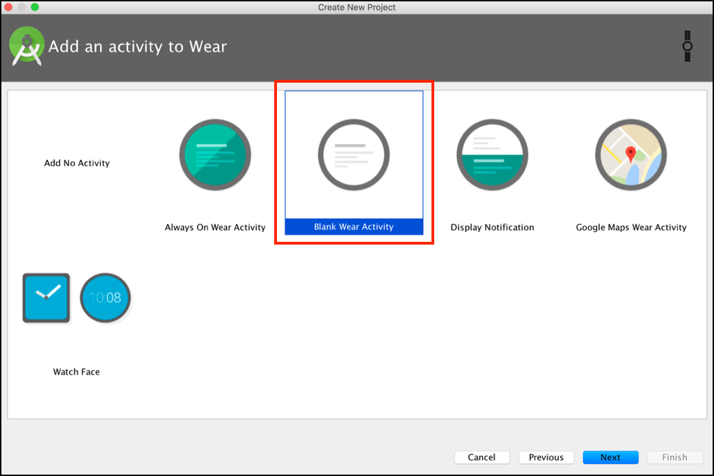

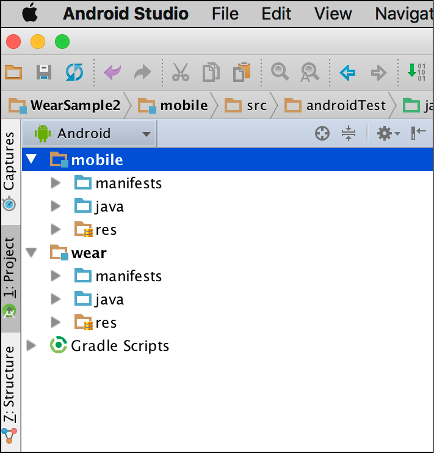

## 環境設定

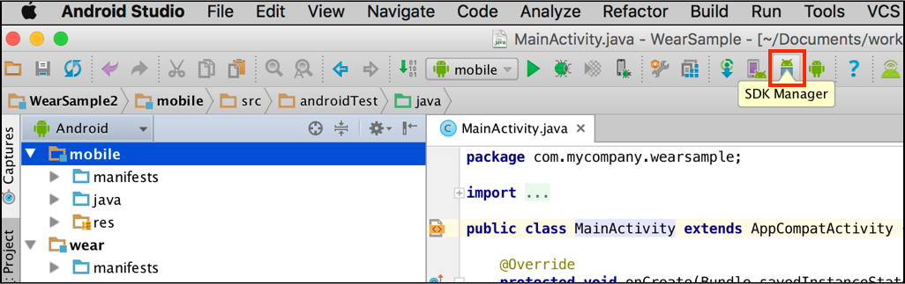

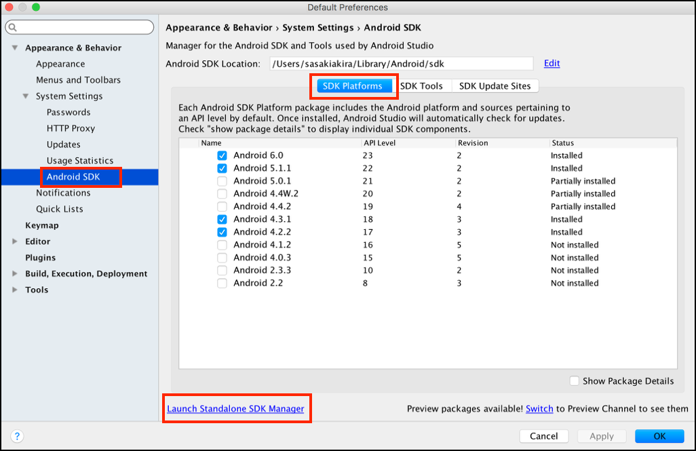

| Tools | Tools Preview Channel|
| -- | -- | 
| 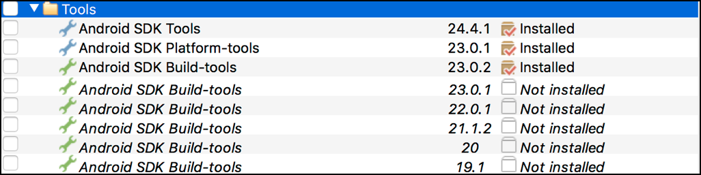 |  | 

| Android 6.0(API23)| Android 5.0.1(API21) |
| -- | -- | 
|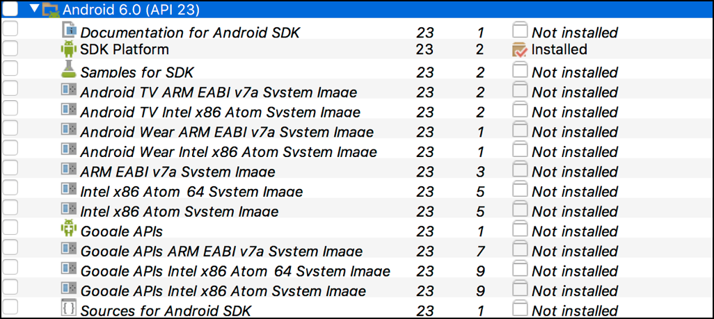 | 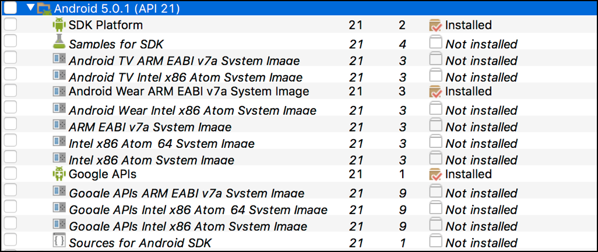 | 

|Extras | |
| -- | -- | 
|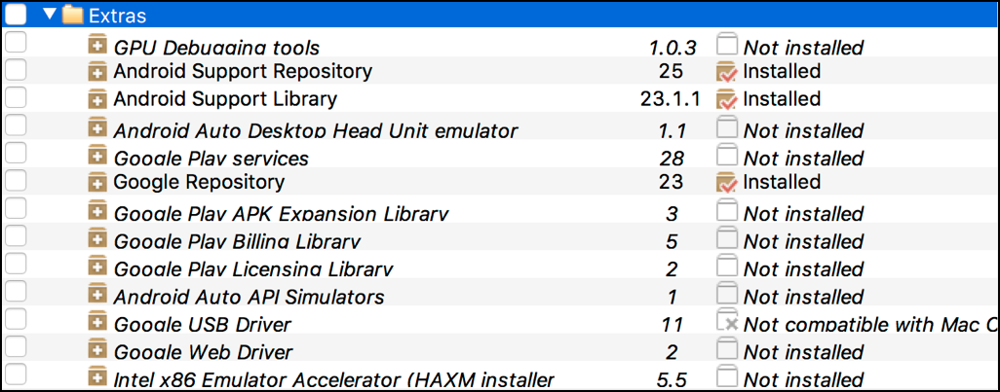 | |

## エミュレーターの作成

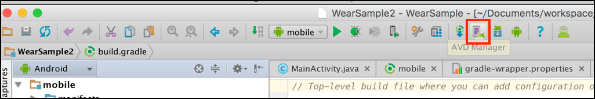

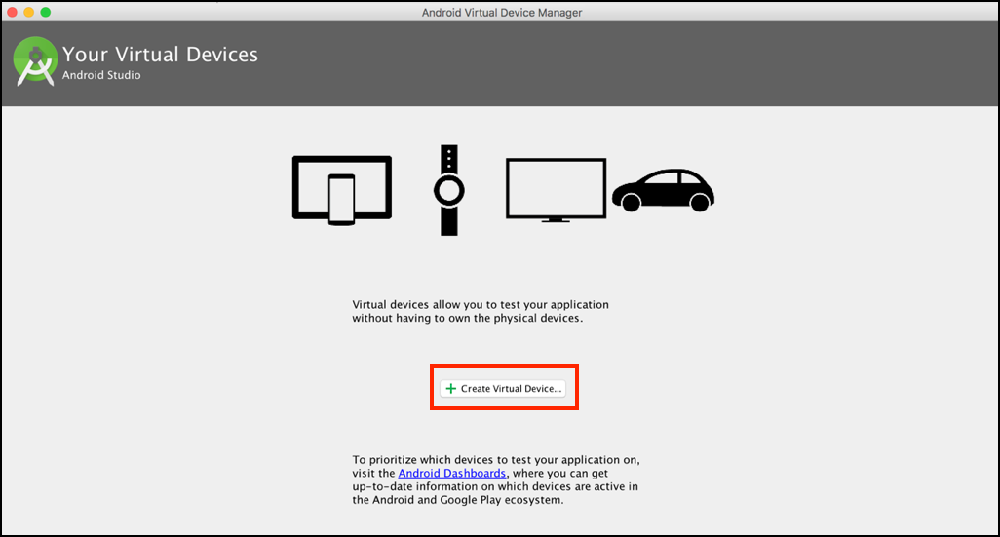

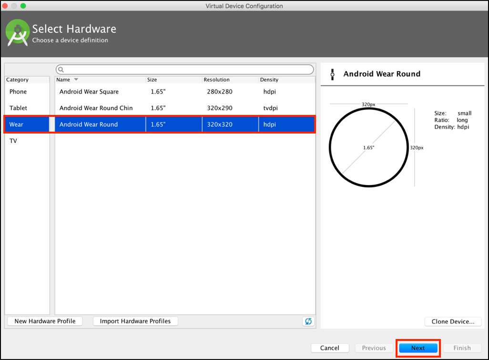

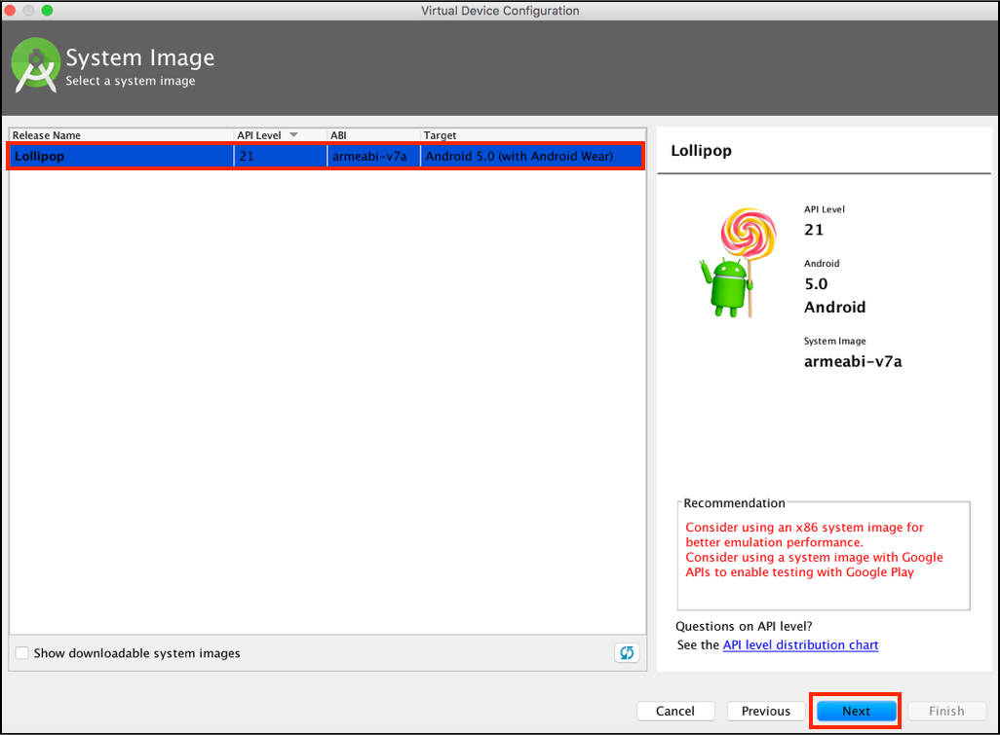

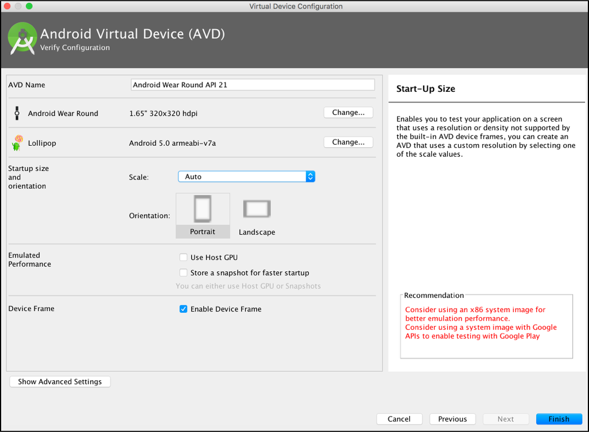

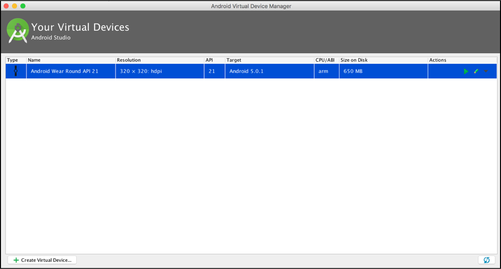

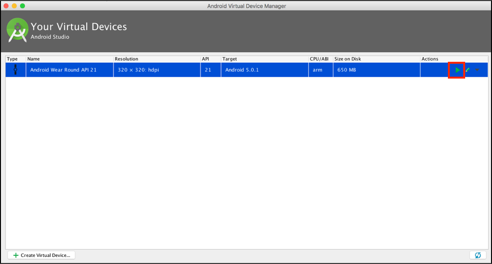

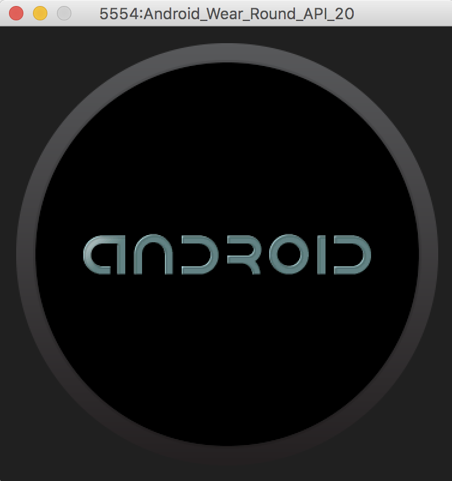

