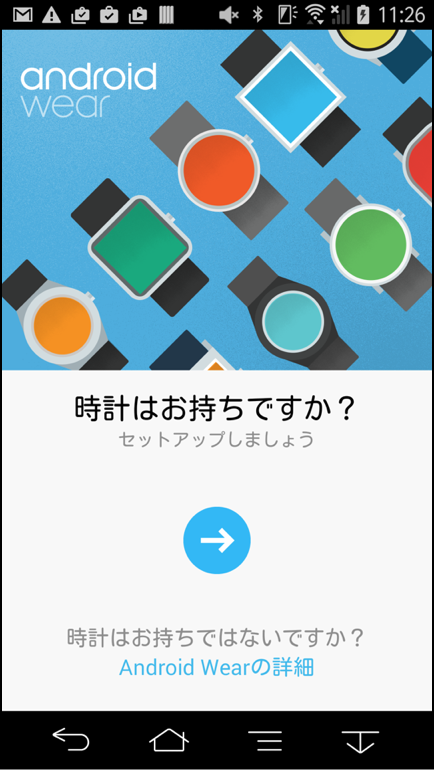
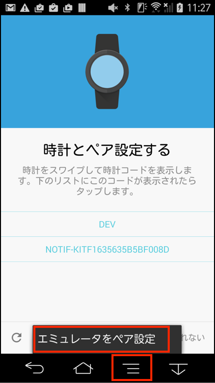
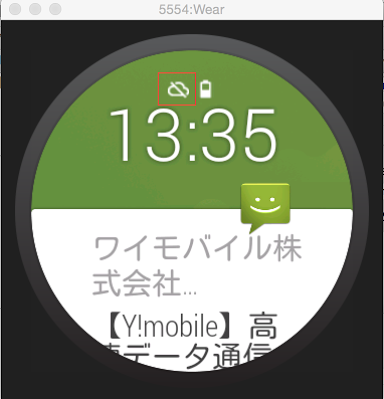
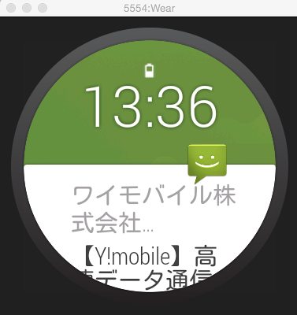
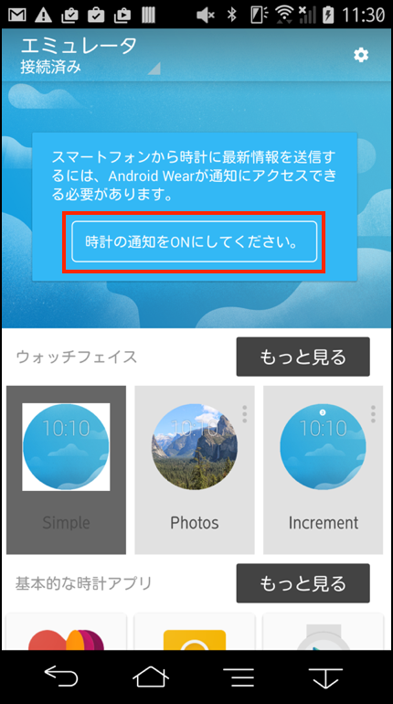
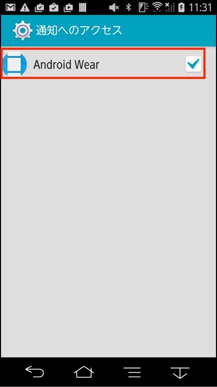
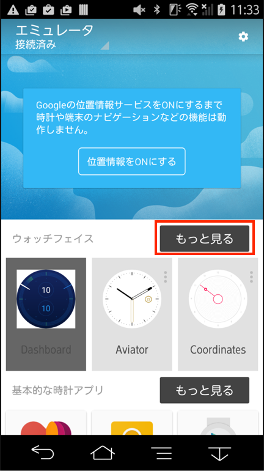
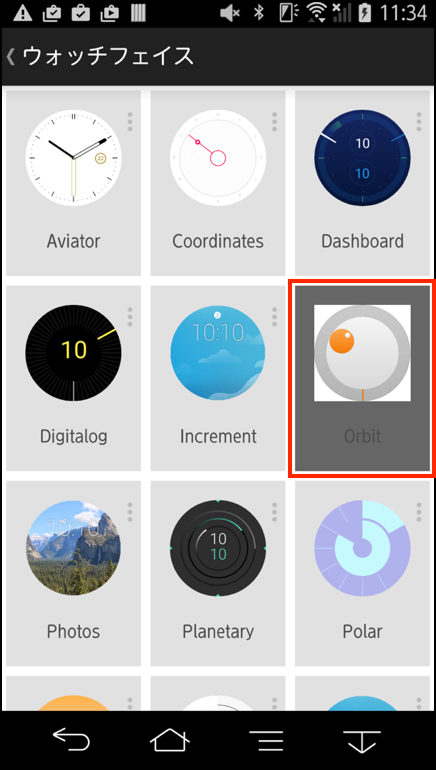
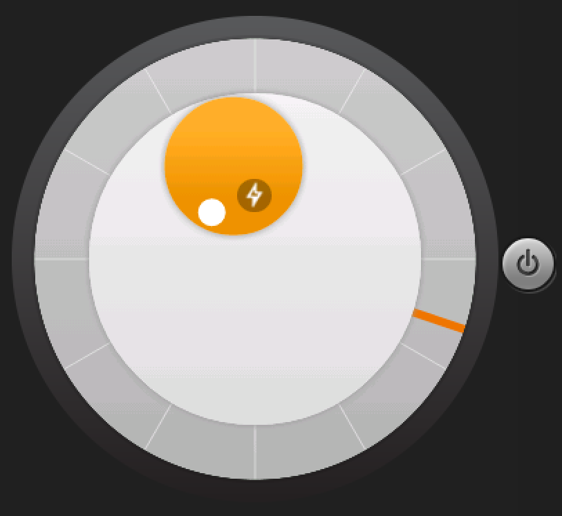

# Android Wearと実機の接続

## 実機の事前準備

実機とエミュレータが起動している開発用マシンを接続します。

platform-toolsに含まれるadbのコマンドを用います。
adbは、Android Studio 5.0では、下記フォルダに存在しています。

	/Users/ユーザ名/Library/Android/sdk/platform-tools

コマンドコンソールを起動し、platform-toolsフォルダに移動し、adbコマンドを実行します。

	$ cd /Users/ユーザ名/Library/Android/sdk/platform-tools
	$ ./adb -d forward tcp:5601 tcp:5601

## Google PlayからAndroid Wearをインストール

Android実機に、Android Wearアプリをインストールします。

https://play.google.com/store/apps/details?id=com.google.android.wearable.app

## エミュレータとの接続

エミュレータのAndroid Wearの表記が下記のように変化すれば、接続成功です。

## 連携

## 動作確認

連携がうまくいってるかを確認するためにウォッチファイルを変更します。

