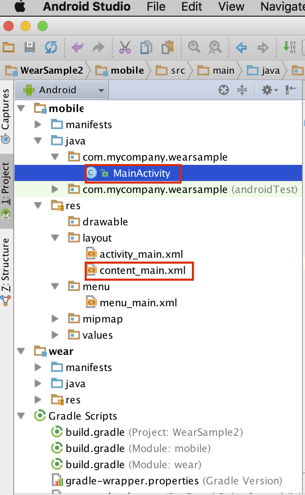
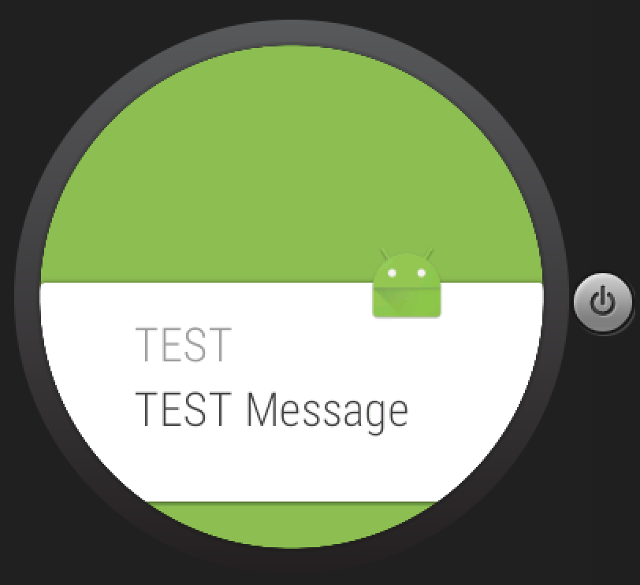

# Android Wearとのデータ連携

Android WearとAndroid間では様々なデータ連携が可能です。

|連携|内容| 
|--| --|
|Notification| 実機に届いたNotificationがWearにも共有される|
|MessageAPI| |
|DataAPI|Android WearとAndroidデバイス|

## Notificationサンプル

それでは、Notificationのサンプルを作成します。Androidデバイス側もプログラムをいじります。
(注: Android Studio 1.5で初期に生成されるテンプレートやXML Layoutに大きく変更されています)



`MainActivity.java`

```java
package com.mycompany.wearsample;

import android.app.Notification;
import android.app.NotificationManager;
import android.content.Context;
import android.os.Bundle;
import android.support.design.widget.FloatingActionButton;
import android.support.design.widget.Snackbar;
import android.support.v7.app.AppCompatActivity;
import android.support.v7.widget.Toolbar;
import android.view.View;
import android.view.Menu;
import android.view.MenuItem;
import android.widget.Button;

public class MainActivity extends AppCompatActivity {

    @Override
    protected void onCreate(Bundle savedInstanceState) {
        super.onCreate(savedInstanceState);
        setContentView(R.layout.activity_main);

        Button mButton = (Button) findViewById(R.id.Button01);
        final Context mContext = this;
        mButton.setOnClickListener(new View.OnClickListener() {
            public void onClick(View v) {
                int notificationId = 1;
                int visivility = 1;
                Notification notification = new Notification.Builder(mContext)
                        .setCategory(Notification.CATEGORY_MESSAGE)
                        .setContentTitle("TEST")
                        .setContentText("TEST Message")
                        .setSmallIcon(R.mipmap.ic_launcher)
                        .setAutoCancel(true)
                        .setVisibility(visivility).build();

                NotificationManager notificationManager =
                        (NotificationManager) getSystemService(NOTIFICATION_SERVICE);
                notificationManager.notify(notificationId, notification);
            }

        });
    }

        @Override
    public boolean onCreateOptionsMenu(Menu menu) {
        // Inflate the menu; this adds items to the action bar if it is present.
        getMenuInflater().inflate(R.menu.menu_main, menu);
        return true;
    }

    @Override
    public boolean onOptionsItemSelected(MenuItem item) {
        // Handle action bar item clicks here. The action bar will
        // automatically handle clicks on the Home/Up button, so long
        // as you specify a parent activity in AndroidManifest.xml.
        int id = item.getItemId();

        //noinspection SimplifiableIfStatement
        if (id == R.id.action_settings) {
            return true;
        }

        return super.onOptionsItemSelected(item);
    }
}
```

`content_main.xml`

```xml
<?xml version="1.0" encoding="utf-8"?>
<RelativeLayout xmlns:android="http://schemas.android.com/apk/res/android"
    xmlns:app="http://schemas.android.com/apk/res-auto"
    xmlns:tools="http://schemas.android.com/tools"
    android:layout_width="match_parent"
    android:layout_height="match_parent"
    android:paddingBottom="@dimen/activity_vertical_margin"
    android:paddingLeft="@dimen/activity_horizontal_margin"
    android:paddingRight="@dimen/activity_horizontal_margin"
    android:paddingTop="@dimen/activity_vertical_margin"
    app:layout_behavior="@string/appbar_scrolling_view_behavior"
    tools:context="com.mycompany.wearsample.MainActivity"
    tools:showIn="@layout/activity_main">

    <Button
        android:text="Wear Notification"
        android:id="@+id/Button01"
        android:layout_width="wrap_content"
        android:layout_height="wrap_content"
        android:layout_gravity="center" />

</RelativeLayout>

```

Androidデバイス側にアプリをインストールし、Notificationを実行すると、それに同期しWear側にもNotificationが同期されます。



